# 1장 블로그 서비스 최적화

## 실습 내용

- 이미지 사이즈 최적화
- 코드 분할
- 텍스트 압축
- 병목 코드 최적화
- 개발자 도구 Network, Lighthouse, Performance 패널 분석
- webpack-bundle-analyzer 번들링 분석

## 서비스 실행 방법

```bash
npm install
npm run start
```

```bash
npm run server
```

## Lighthouse 분석

### Mode

- Navigation: LightHouse 기본 값으로, 초기 페이지 로딩 시 발생하는 성능 문제 분석
- Timespan: 사용자가 정의한 시간 동안 발생한 성능 문제를 분석
- Snapshot: 현재 상태의 성능 문제를 분석

### Categories

- Performance: 웹 페이지의 로딩 과정에서 발생하는 성능 문제를 분석
- Accessibility: 웹 페이지의 접근성 문제를 분석
- Best Practices: 웹사이트의 보안 측명과 웹 개발의 최신 표준에 중점을 두고 분석
- SEO: 검색 엔진에서 얼마나 잘 크롤링되고 검색 결과에 표시되는지 분석
- Progressive Web App: 서비스 워커와 오프라인 동작 등, PWA와 관련된 문제를 분석

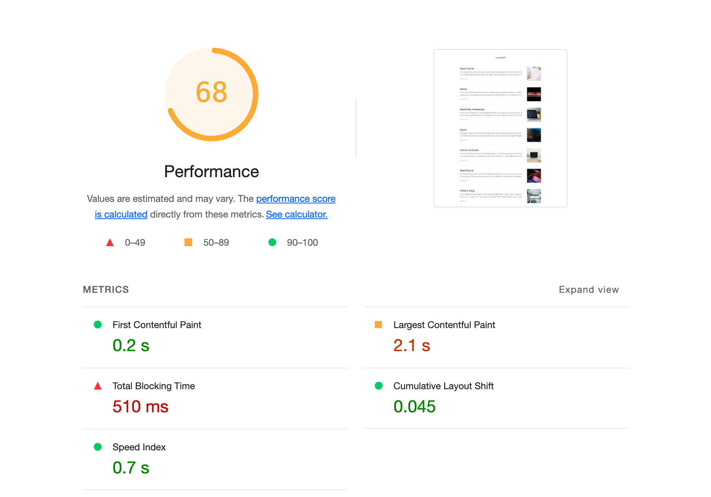

### Metrics(지표)

- First Contentful Paint(FCP): 웹 페이지의 콘텐츠가 처음 렌더링되는 시간. `10% 가중치`
- Largest Contentful Paint(LCP): 웹 페이지의 가장 큰 요소가 렌더링되는 시간. `25% 가중치`
- Total Blocking Time(TBT): 웹 페이지의 렌더링을 방해하는 자바스크립트 실행 시간. `30% 가중치`
- Cumulative Layout Shift(CLS): 웹 페이지의 레이아웃이 변경되는 시간. `25% 가중치`
- Speed Index(SI): 웹 페이지의 콘텐츠가 렌더링되는 시간. `10% 가중치`

### Lighthouse 하단

- Emulated Desktop: CPU 성능을 어느정도 제한해서 검사했는지 나타냄.
- Network Throttling: 네트워크 속도를 어느정도 제한해서 검사했는지 나타냄.

## 이미지 사이즈 최적화

### 고려사항

- Lighthouse의 `Properly size images` 추천 사항을 따라 이미지 사이즈를 최적화함.
- 이미지는 레티나 디스플레이를 고려해서 보이는 사이즈의 2배 크기로 저장함.

### 문제점

현재 프로젝트에서는 이미지를 `https://images.unsplash.com`에서 가져오고 있음. 이미지를 직접 저장해서 쓰는 것이 아니기 때문에 사이즈를 어떻게 조절해야할지 고민이 됨.

### 이미지 CDN

CDN(Content Delivery Network)은 웹 사이트의 콘텐츠를 빠르게 전송하기 위해 여러 대의 서버를 분산해서 운영하는 시스템입니다. 이미지 서버를 분산해서 운영하면 웹 사이트의 콘텐츠를 빠르게 전송할 수 있습니다.

**일반적인 이미지 CDN은 사이즈를 조절할 수 있는 기능을 제공함.**

```
http://cdn.image.com?src=[img src]&width=[width]&height=[height]
```

### 해결 방법

`Article/index.js` 파일의 `getParametersForUnsplash` 함수는 이미지 사이즈를 조절할 수 있는 기능을 제공함.

이미지 사이즈 240px x 240px로 조절하면 레티나 디스플레이에서도 빠르게 로딩되고 성능이 좋아짐.

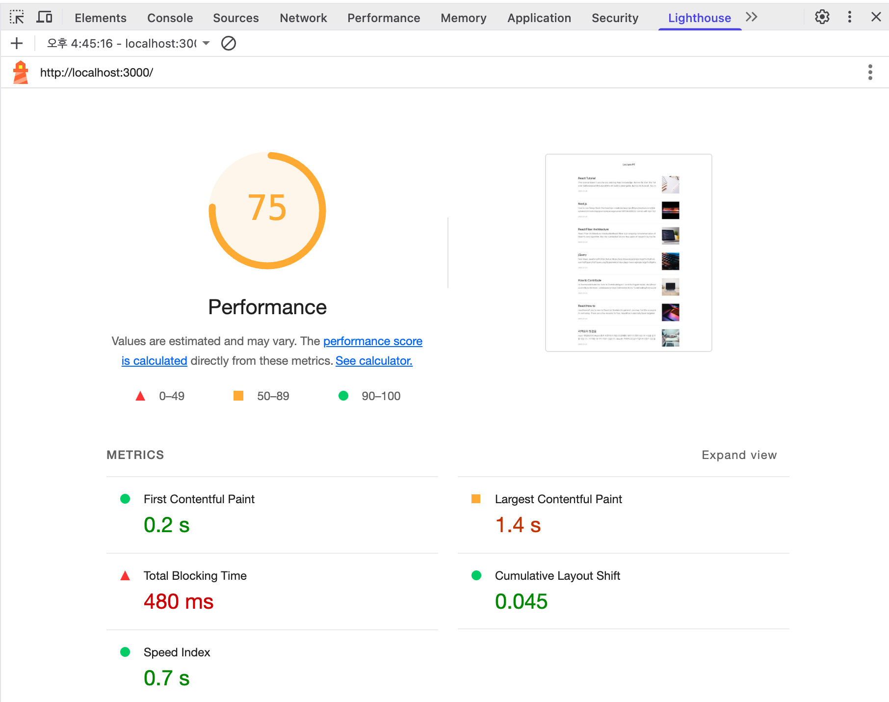

## 병목 코드 최적화

`Reduce JavaScript execution time` 추천 사항을 따라 병목 코드를 최적화함. 하지만, 이걸로는 정확히 어디를 최적화해야할지 알 수 없음.

### Performance 패널 분석


성능 패널을 통해 검사를 해보자.
`Network: Slow 4G` 조건으로 `Record and reload`를 수행했다.

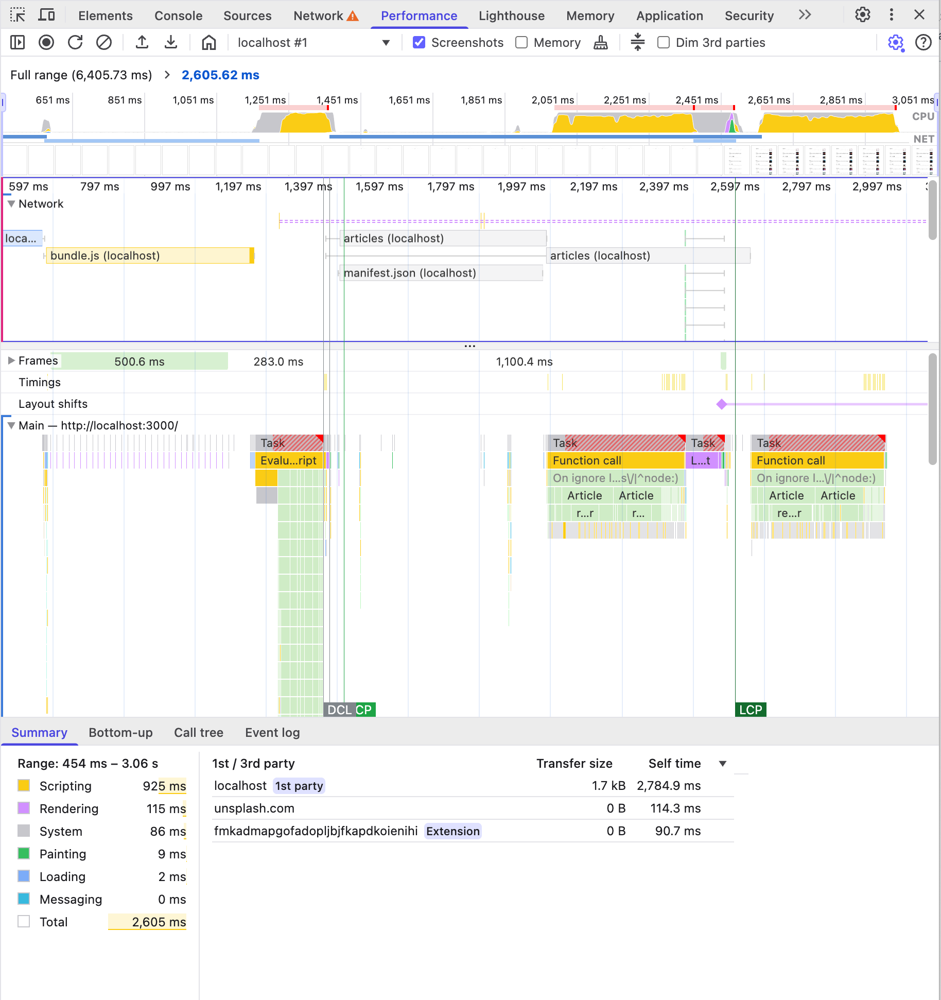

1. CPU 차트, Network 차트, 스크린샷

- **노랑**: 자바스크립트 실행 작업
- **보라**: 렌더링/레이아웃 작업
- **초록**: 페인팅 작업
- **회색**: 기타 시스템 작업

네트워크에서 위쪽의 진한 막대는 우선순위가 높은 네트워크 리소스를 나타냄.

2. 네트워크 타임라인

각 네트워크 막대 설명

- 왼쪽 회색 선: 초기 연결 시간
- 막대의 옅은 색 영역: 요청을 보낸 시점부터 응답을 기다리는 시점까지의 시간(TTFB: Time To First Byte)
- 막대의 진한 색 영역: 콘텐츠 다운로드 시간
- 오른쪽 회색 선: 해당 요청에 대한 메인 스레드의 작업 시간

3. Frames, Timings, Main

- Frames: 화면 변화가 있을 때마다 스크린샷 찍음.
- Timings: User Timing API를 통해 기록된 정보를 기록(리액트 버전 17 이후로 정확성 및 유지 보수 문제로 지원 종료됨)
- Main: 메인 스레드의 작업을 플레임 차트로 보여줌

4. 하단 탭

- Summary: 선택 영역에서 발생한 작업 시간의 총합과 각 작업이 차지하는 비중
- Bottom-Up: 최상위 작업부터 하위 작업까지 순서대로 보여줌
- Call Tree: 작업 내용을 트리뷰로 보여줌
- Event Log: 발생한 이벤트를 보여줌
  - Loading
  - Experience Scripting
  - Rendering
  - Painting

### 페이지 로드 과정 살펴보기

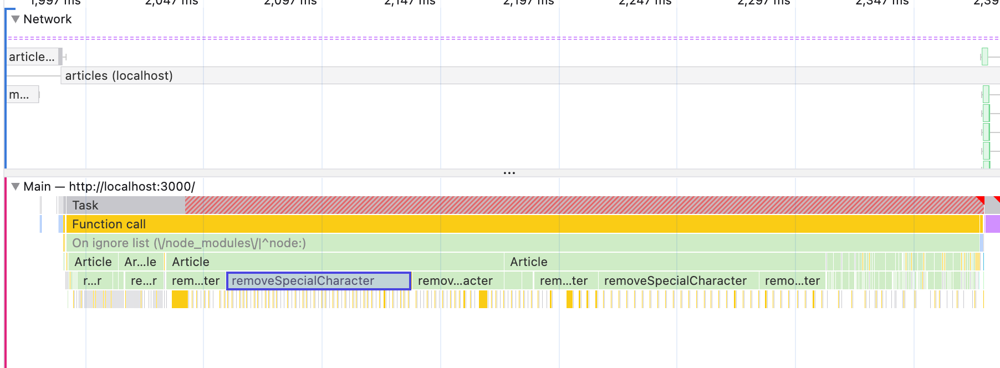

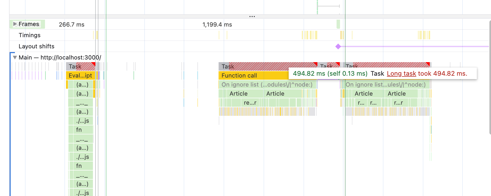

메인 스레드 구간을 보면 removeSpecialCharacter 함수가 자주 사용되는 것을 알 수 있음. 특히 Task 구간을 보면 빨간색으로 Long Task가 있는 것을 알 수 있음. 이 부분을 최적화해야함.

#### removeSpecialCharacter 함수 최적화

- 특수 문자를 효율적으로 제거:
  - substring, concat 메서드 대신에 `replace` 메서드 사용
- 작업량 줄이기:
  - 가장 긴 글은 9만자가 넘음, 하지만 서비스에서 사용되는 건 대략 200자 정도임. 앞 200자만 처리하도록 함.

```js
function removeSpecialCharacter(str) {
  const removeCharacters = [
    /* 특수문자 생략 */
  ];
  let _str = str;
  let i = 0,
    j = 0;

  for (i = 0; i < removeCharacters.length; i++) {
    j = 0;
    while (j < _str.length) {
      if (_str[j] === removeCharacters[i]) {
        _str = _str.substring(0, j).concat(_str.substring(j + 1));
        continue;
      }
      j++;
    }
  }

  return _str;
}
```

### 최적화 후

```js
function removeSpecialCharacter(str) {
  let _str = str.substring(0, 300);
  _str = _str.replace(/[#_*~&;![\]`>\n=-]/g, "");
  return _str;
}
```

- 반복문 줄이기
- 문자열 최대 길이 제한
- 정규 표현식 사용

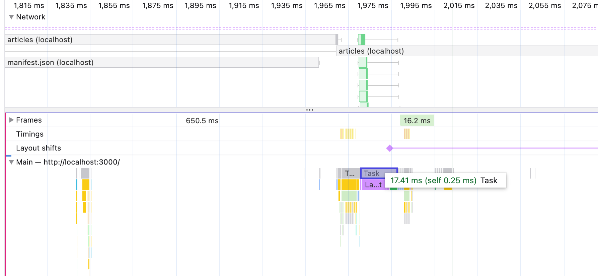

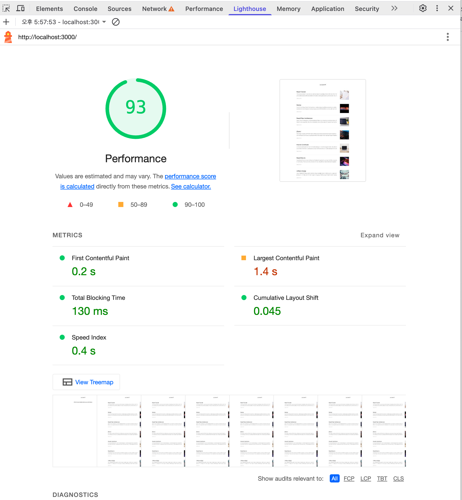

## 코드 분할 & 지연 로딩

### 번들 파일 분석

Webpack Bundle Analyzer와 유사한 cra-bundle-analyzer를 사용해서 번들 파일을 분석해보자.

```bash
npm install cra-bundle-analyzer
```


lighthouse의 View Treemap을 통해서도 구조를 볼 수 있다.

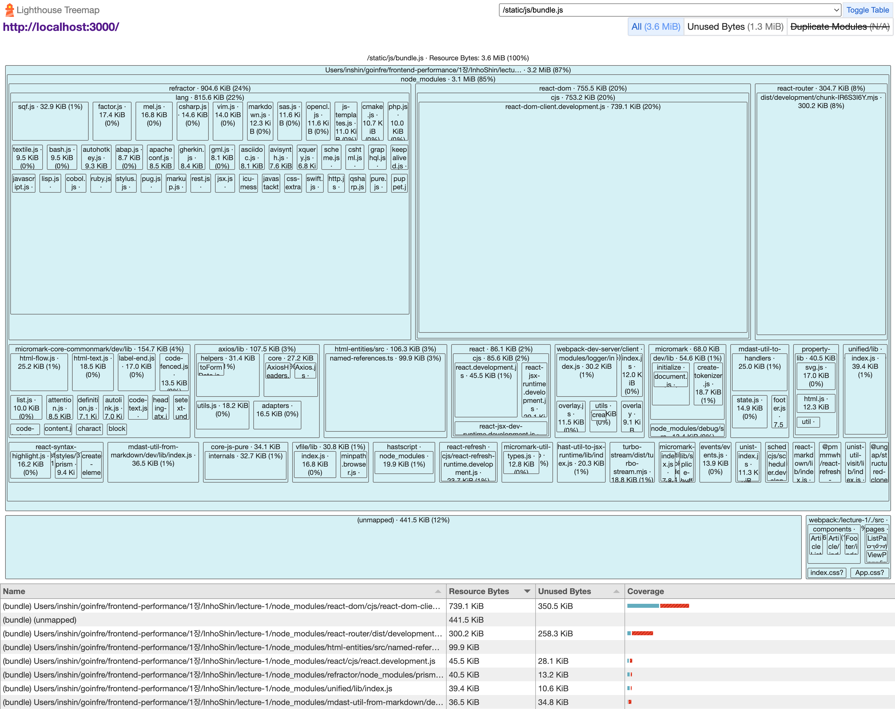

### 코드 분할

코드 분할을 하는 가장 좋은 방법은 동적 import를 사용하는 것이다.

```js
// import 문의 기본 사용 법
import { add } from "./math.js";

console.log(add(1, 2));

// 동적 import
import("add").then((module) => {
  const { add } = module;

  console.log(add(1, 2));
});
```

하지만, 동적 import 구문은 비동기 작업이라 Promise 형태로 모듈을 반환한다. 리액트에서는 lazy, Suspense 컴포넌트를 사용해서 동적 import를 사용할 수 있다.

```js
const SomeComponent = React.lazy(() => import("./SomeComponent"));

function App() {
  return (
    <Suspense fallback={<div>Loading...</div>}>
      <SomeComponent />
    </Suspense>
  );
}
```

#### App.js 코드 개선

```js
import React, { lazy, Suspense } from "react";
import { Route, Routes } from "react-router-dom";
import "./App.css";
// import ListPage from './pages/ListPage/index';
// import ViewPage from './pages/ViewPage/index';
const ListPage = lazy(() => import("./pages/ListPage/index"));
const ViewPage = lazy(() => import("./pages/ViewPage/index"));

function App() {
  return (
    <div className="App">
      <Suspense fallback={<div>Loading...</div>}>
        <Routes>
          <Route path="/" element={<ListPage />} />
          <Route path="/view/:id" element={<ViewPage />} />
        </Routes>
      </Suspense>
    </div>
  );
}

export default App;
```

Suspense 컴포넌트는 비동기 작업을 처리하는 컴포넌트이다. 비동기 작업이 끝나기 전까지 로딩 상태를 유지하고, 비동기 작업이 끝나면 결과를 보여준다.

Suspense로 감싸지 않으면, 컴포넌트가 제대로 로드되지 않는 순간 에러가 발생한다.

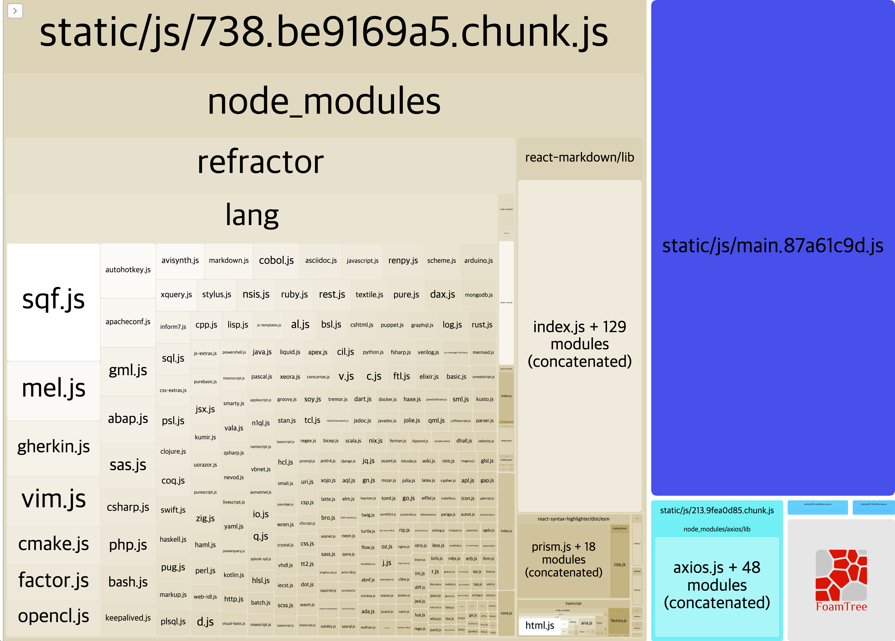

번들 구조가 더 나눠졌음을 알 수 있다.

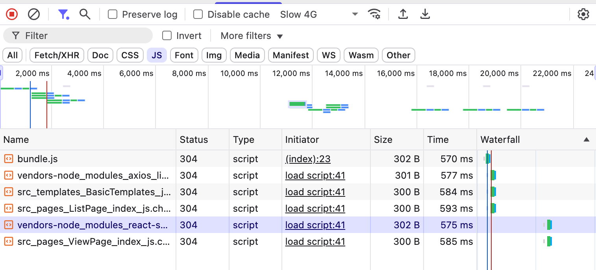

네트워크 탭에서도 나눠진 js 파일이 블로그 상세 페이지를 첫 진입했을 때 로드되는 것을 확인할 수 있다.

## 텍스트 압축

### Production, Development 환경

최종 서비스의 성능을 측정할 때는 실제 사용자에게 제공되는 환경에서 측정해야한다.

- Production: 실제 사용자에게 제공되는 환경
- Development: 개발 환경

```bash
npm run build # 프로덕션 빌드
```

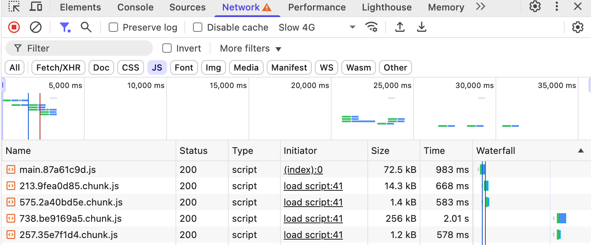

프로덕션 빌드 후 파일은 번들링을 통해 파일 이름이 변경되며, 텍스트 압축이 적용된다.

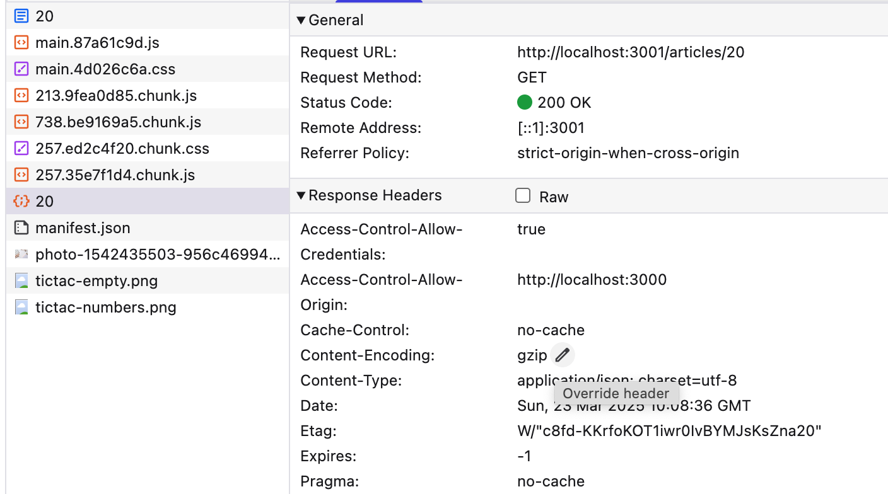

API 요청에 대한 headers를 보면 `Content-Encoding: gzip` 헤더가 추가되었음을 알 수 있다.

하지만, js 번들 파일에는 텍스트 압축이 적용되지 않았음을 알 수 있다.

`serve` 라이브러리는 `-u` 옵션을 통해 텍스트 압축을 유무를 결정할 수 있다. `-u` 옵션을 제거하면 텍스트 압축을 할 수 있다.

```bash
npm run serve
```

기존 코드가 제대로 동작하지 않아서 serve를 설치하고 코드를 수정해줬다.

```bash
npm install -g serve
serve -s build
```

`package.json` 파일에서 `serve` 스크립트를 수정해서 텍스트 압축을 적용할 수 있다.

```json
{
  "scripts": {
    // 이전 코드
    "serve": "npm run build && node ./node_modules/serve/bin/serve.js -u -s build",
    // 수정 코드
    "serve": "npm run build && serve -s build"
  }
}
```

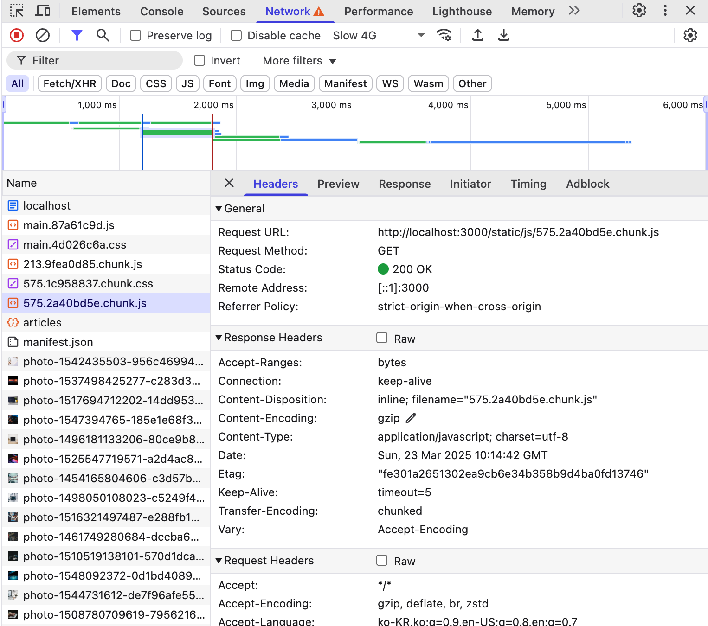

js 번들 파일에도 텍스트 압축이 적용되었음을 알 수 있다.
