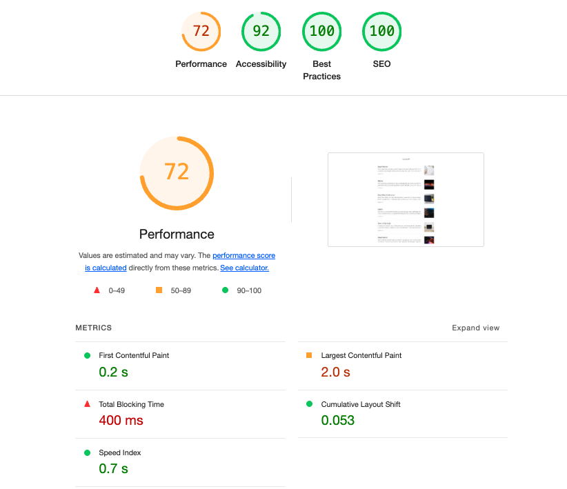

# 1장 블로그 서비스 최적화

## 최적화 하기에 앞서

### 최적화 종류

#### 로딩 성능 최적화

- 이미지 사이즈 최적화
- 코드 분할
- 텍스트 압축

### 렌더링 성능 최적화

- 병목 코드 최적화

## 1. 이미지 사이즈 최적화

웹서비스에 사용되는 다양한 이미지

## 2. 코드 분할

코드 분할하는 기법

## 3. 텍스트 압축

웹페이지에서 접속하게 될시 다양한 리소스를 내려받게 됨.

리소스

- HTML

* CSS
* JS

다운로드 전에 미리 압축할 수 있음.

## 4. 병목 코드 최적화

**병목 코드란?**
서비스를 운영하는데에 있어서 느리게 만드는 특정 자바스크립트 코드

## Chrome 개발자 도구

> **개발자 도구란?**
>
> 크롬에서 제공하는 웹개발에 도움되는 다양한 툴

**Network패널**

리소스가 어느 시점에 로드되는지 리소스의 크기를 확인할 수 있음.

**Performance 패널**

웹 페이지가 로드될 때, 실행되는 모든 작업을 보여줌.
리소스가 로드되는 타이밍 뿐만 아니라, 브라우저의 메인 스레드에서 실행되는 자바스크립트를 차트 형태로 볼 수 있음.

**Lighthouse 패널**

웹사이트의 성능을 측정하고 개선 방향을 제시해주는 자동화 툴.

### webpack-bundle-analyzer

webpack을 통해 번들링된 파일이 어떤 코드, 즉 어떤 라이브러리를 담고 있는지 보여줌.
최종적으로 완성된 번들 파일 중 불필요한 코드가 어떤 코드이고 번들 파일에서 어느 정도의 비중을 차지하고 있는지 확인할 수 있음.

## 블로그 웹 서비스 최적화

### Lighthouse 사용해보기

> **if Mobile로 선택해서 검사할 시**
>
> 좀더 느림 CPU와 네트워크 환경에서 검사하게됨.

**Mode**

- Navigation: Lighthouse의 기본값,
- Timespan: 사용자가 정의한 시간 동안 발생한 성능 문제를 분석
- Snapshot: 현재 상태의 성능 문제를 분석

**Categories**

- Performance: 웹 페이지의 로딩 과정에서 발생하는 성능 문제 분석
- Accessibility: 서비스의 사용자 접근성 문제를 분석
- Best Practices: 웹 사이트의 보안 측면과 웹 개발의 최신 표준에 중점을 두고 분석
- SEO: 검색 엔진에서 얼마나 잘 크롤링되고 검색 결과에 표시되는지 분석
- Progressive Web App: 서비스 워커와 오프라인 동작 등, PWA와 관련된 문제를 분석한다.

#### 성능최적화를 통해서 확인해야될 지표들

1. FCP(First Contentful Paint)

- 페이지가 로드될 때 브라우저가 DOM 콘텐츠의 첫 번째 부분을 렌더링하는 데 걸리는 시간

2. LCP(Largest ContentFul Paint)
