# 1️⃣ 블로그 서비스 최적화

## **1-1) 서비스 실행**

```tsx
npm install
npm run start
```

```tsx
npm run server
```

---

## **1-2) Lighthouse**

### **Mode**

- **Navigation**
  - 초기 페이지 로딩 시 성능 문제 분석
- **Timespan**
  - 특정 시간 동안 발생한 성능 문제 분석
- **Snapshot**
  - 현재 상태의 성능 문제 분석

### **Categories**

- **Performance**
  - 로드 속도 및 성능 문제 분석
- **Accessibility**
  - 사용자 접근성 문제 분석
- **Best Practices**
  - 웹 표준 및 보안 문제 분석
- **SEO**
  - 검색 엔진 최적화 분석
- **Progressive Web App**
  - PWA 관련 문제(서비스 워커, 오프라인 동작 등) 분석

---

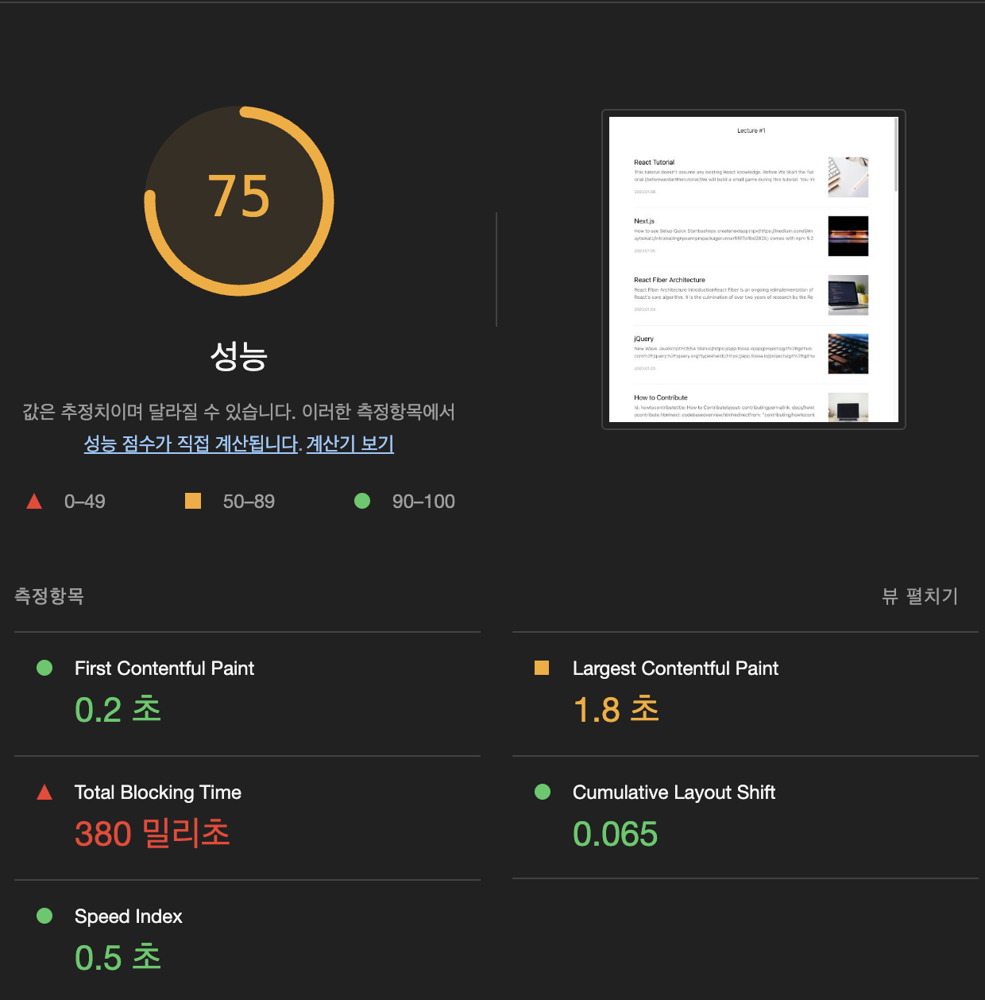

### **Metrics**

> 웹 바이탈 (Web Vitals) : 각 지표에 가중치 적용하여 평균 낸 점수

| 지표명                            | 설명                                               | 가중치 |
| :-------------------------------- | :------------------------------------------------- | :----- |
| **First Contentful Paint(FCP)**   | DOM 콘텐츠의 첫 번째 부분 렌더링 시간              | 10%    |
| **Speed Index(SI)**               | 페이지 로드 중에 콘텐츠가 시각적으로 표시되는 속도 | 10%    |
| **Largest Contentful Paint(LCP)** | 가장 큰 요소 렌더링 시간                           | 25%    |
| **Total Blocking Time(TBT)**      | 메인 스레드 차단 시간 총합                         | 30%    |
| **Cumulative Layout Shift(CLS)**  | 레이아웃 이동 측정                                 | 15%    |

---

<br/>


### Opportunities

- 빠른 페이지 로드를 위한 제안 추천

### Diagnostics

- 성능과 관련한 기타 정보 제공

---

### Emulated Desktop

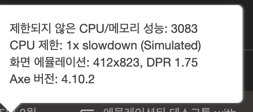
기기 성능을 어느 정도로 제한하여 검사하였는지

- 1x : 성능 제한 X
- 4x : 모바일 환경

### Custom throttling

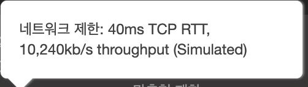
고정된 네트워크 환경에서 성능 측정

## **1-3) 이미지 사이즈 최적화**

### **비효율적 이미지 분석**

- Lighthouse > Opportunities > Properly size images 분석
- 실제 이미지 크기보다 화면에 그려지는 크기가 작아서 최적화를 위해 화면에 그려지는 크기로 맞추는 게 적절할지?
  → 레티나 디스플레이는 더 많은 픽셀을 그릴 수 있기 때문에 **너비 기준 2배 크기**로 지정하는 것이 적절함.

<br />

> 문제 상황 : 정적 이미지가 아니라 이미지를 API를 통해 받아오는 경우에 이미지 사이즈를 어떻게 조절해야 하는가?

<br/>

### 이미지 CDN (Content Delivery Network)

- 사용자가 웹 콘텐츠에 빠르게 접근할 수 있도록 전 세계에 분산된 서버 네트워크
- 이미지 사이즈 줄이거나 특정 포맷으로 변경 가능

```
http://cdn.image.com?src=[img src]&width=[width 값]&height=[height 값]
```

### 적절한 이미지 사이즈로 최적화

Article/index.js

### **코드 개선**

```jsx
<div className={"Article__thumbnail"}>
  
</div>
```

현재 코드에서 getParametersForUnsplash 함수의 파라미터로 이미지 사이즈를 지정하고 있음.

이미지 사이즈의 너비 기준 2배 크기에 맞게 width, height를 240으로 변경하여 이미지 사이즈 최적화

### 이미지 최적화 결과

## 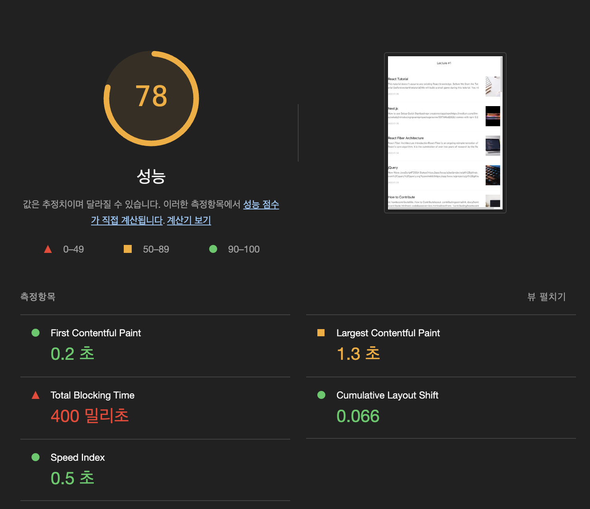

## **1-4) 병목 코드 최적화**

### Performance 패널

- Diagnotics > Reduce JavaScript execution time
  - 어떤 부분에서 최적화 해야할지 알 수 없음
    → Performance 패널 활용하여 분석

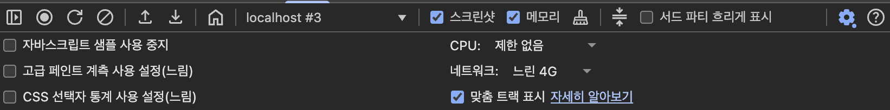
Network 를 느린 4G로 설정하여 분석을 진행하였음.

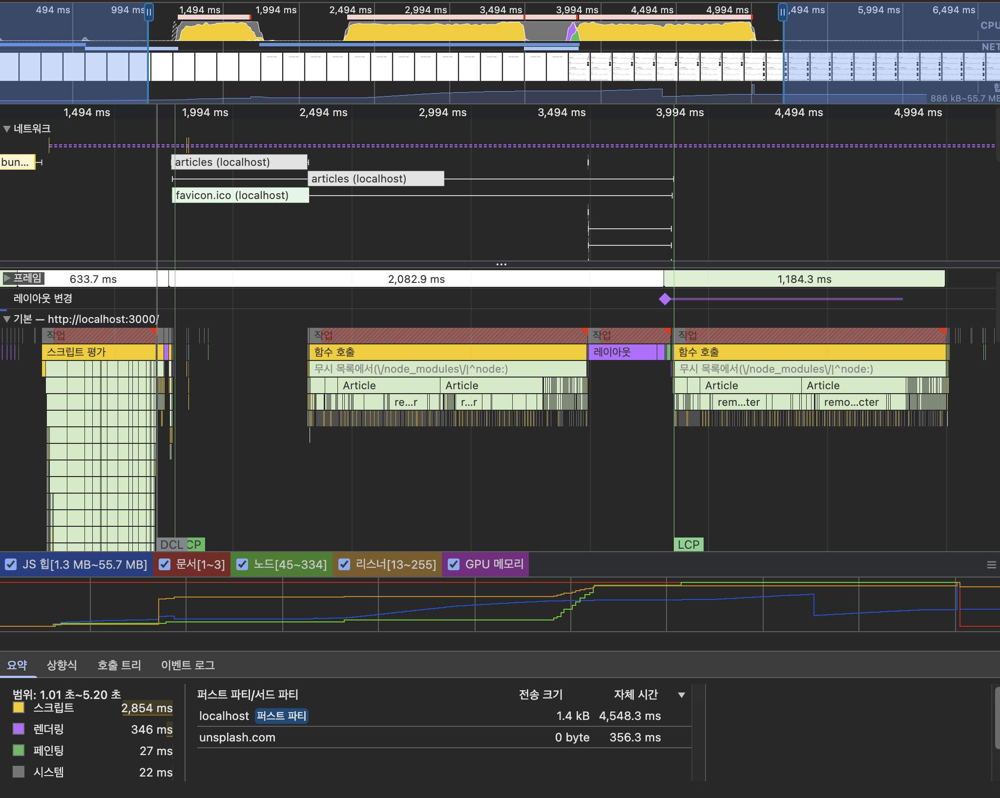

1. **CPU 차트, Network 차트, 스크린 샷**
   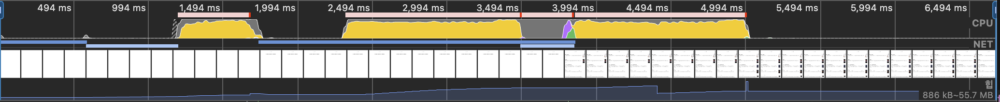

- CPU 차트
  - 노랑 : 자바스크립트 실행 작업
  - 보라 : 렌더링 / 레이아웃 작업
  - 초록 : 페인팅 작업
  - 회색 : 기타 시스템 작업
- Network 차트
  - (위) 진한 막대 : 우선순위가 높은 네트워크 리소스
  - (아래) 옅은 막대 : 우선순위가 낮은 네트워크 리소스
- 스크린 샷
  - 서비스 로드 과정

2. **Network 타임라인**
   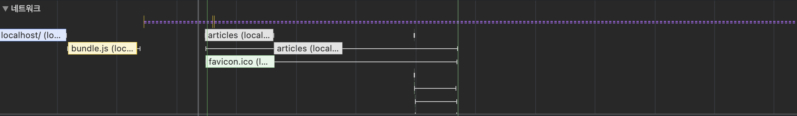

- 왼쪽 회색 선 : 초기 연결 시간
- 막대의 옅은 색 영역 : 요청 보낸 시점부터 응답을 기다리는 시점까지의 시간 (TTFB : Time to First Byte)
- 막대의 짙은 색 영역 : 콘텐츠 다운로드 시간
- 오른쪽 회색 선 : 해당 요청에 대한 메인 스레드 작업 시간

3. **Frames, Timings, Main**
   

- Frames
  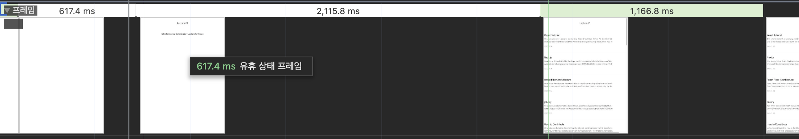

  - 화면의 변화가 있을 때마다 스크린샷을 찍음

- Timings

  - User Timing API를 통해 기록된 정보를 기록 (리액트 17 이후로 지원 종료)

- Main
  
  - 브라우저의 메인 스레드에서 실행되는 작업을 플레임 차트로 보여줌
    - 어떤 작업이 오래걸리는지 파악 가능

4. **하단 Summary, Bottom-Up, Call Tree, Event Log**

- Summary  
   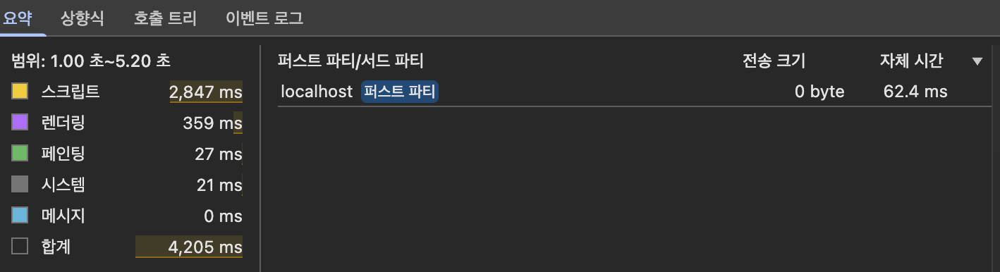

  - 선택 영역에서 발생한 작업 시간의 총합, 각 작업이 차지하는 비중 보여줌

- Bottom-Up

  - 최하위 작업 → 상위 작업까지 역순으로 보여줌

- Call Tree

  - 상위 작업 → 하위 작업까지 트리뷰로 보여줌

- Event Log
  - 발생한 이벤트 보여줌 (Loading, Experience, Scripting, Rendering, Painting)

---

### 페이지 로드 과정으로 문제 찾기

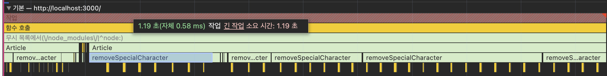
removeSpecialCharacter 함수 작업이 Article 컴포넌트 렌더링 시간을 길어지게 함.

✅ 해당 함수를 최적화 하여 로딩 시간 단축 하기

### **기존 코드**

```jsx
/*
 * 파라미터로 넘어온 문자열에서 일부 특수문자를 제거하는 함수
 * (Markdown으로 된 문자열의 특수문자를 제거하기 위함)
 * */
function removeSpecialCharacter(str) {
  const removeCharacters = [
    "#",
    "_",
    "*",
    "~",
    "&",
    ";",
    "!",
    "[",
    "]",
    "`",
    ">",
    "\n",
    "=",
    "-",
  ];
  let _str = str;
  let i = 0,
    j = 0;

  for (i = 0; i < removeCharacters.length; i++) {
    j = 0;
    while (j < _str.length) {
      if (_str[j] === removeCharacters[i]) {
        _str = _str.substring(0, j).concat(_str.substring(j + 1));
        continue;
      }
      j++;
    }
  }

  return _str;
}
```

- **기존 코드 로직**
  - 특수 문자 미리 정의
  - 특수 문자마다 반복문을 돌려 본문과 일치하는 내용을 탐색하여 제거
- **기존 코드의 문제점**
  - 반복문을 중첩하여 사용
  - substring과 concat을 사용하여 문자열 제거

### **병목 코드 개선**

```jsx
function removeSpecialCharacter(str) {
  let _str = str.substring(0, 300);
  _str = _str.replace(/[#_*~&;![\]`>\n=-]/g, "");
  return _str;
}
```

- **개선 방향**
  - 반복문 최소화
  - 정규 표현식을 작성하여 replace로 문자열 제거
  - 전체 데이터 중에서 실제로 사용되는 약 200자만 처리하도록 변경 (제거되는 문자열을 고려하여 300자로 처리)

### 병목 코드 최적화 결과 및 성능 점수


최적화 전 : 1.19초 → 최적화 후 : 245.23ms (약 79% 개선)

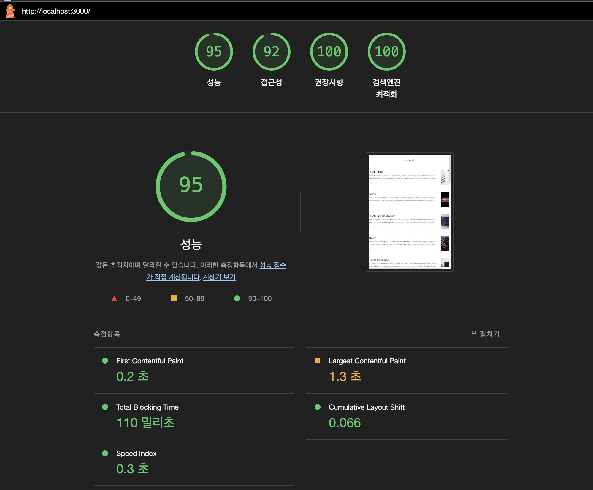

---

## **1-5) 코드 분할 & 지연 로딩**

### 번들 파일 분석

Webpack Bundle Analyzer 툴을 사용하여 청크 파일 분석

- 해당 툴을 사용하려면 npm run eject 를 통해 직접 webpack 을 수정해야 함.
- cra-bundle-analyzer 를 사용하여 eject 없이 툴 사용

```bash
npm install --save-dev cra-bundle-analyzer
npx cra-bundle-analyzer
```

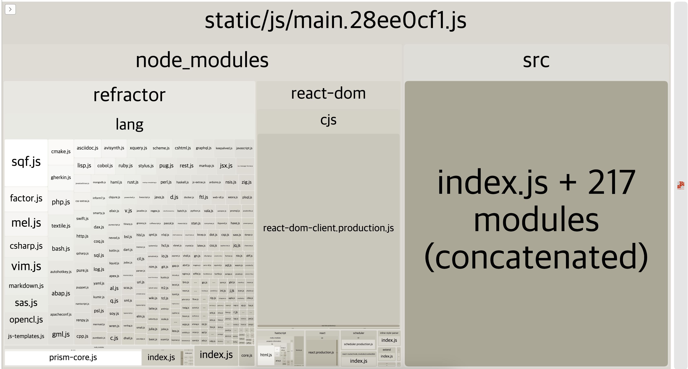

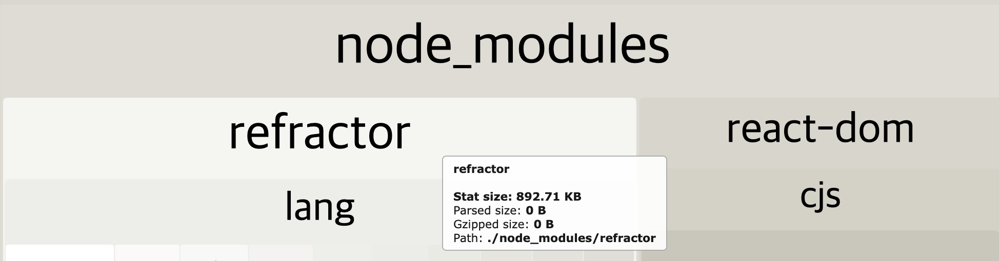

refractor 패키지가 큰 비중을 차지하고 있음.

- react-syntax-highlighter 패키지에서 refractor 참조
  - 페이지별로 필요한 내용만 분리하여 모듈이 사용되는 곳에서만 로드하는 방향으로 최적화 하기.

### 코드 분할

- 하나의 번들 파일을 여러 개의 작은 chunk 로 쪼갬
- 지연 로딩
  - 초기 로드 시 불필요한 리소스를 로드하지 않고, 사용자가 해당 기능을 필요로 할 때 로드
- 기존 코드
  - 블로그 글 목록, 상세 페이지 코드가 하나의 파일로 만들어짐
  - 당장 사용하지 않는 파일도 함께 다운로드 되기 때문에 페이지 로드 속도가 느려짐
- 개선 방향
  - ⭐ 불필요한 코드, 중복 코드 없이 적절한 사이즈 코드가 적절한 타이밍에 로드되도록 하기
  - 코드를 분할하여 해당 페이지에 접근할 때 관련 있는 코드만 로드
    - 페이지 별로 코드 분할
    - 모듈 별로 분할 (공통으로 사용하는 모듈이 많거나 사이즈가 큰 경우)

### **코드 분할 적용**

#### **정적 import (기본)**

```jsx
import { add } from "./math";
console.log("1 + 4 = ", add(1, 4));
```

🤔 빌드할 때 함께 모듈이 번들링 되기 때문에 실행은 빠르지만 불필요한 모듈까지 로드될 수 있음

#### **동적 import (Promise 사용)**

```jsx
import("./math").then((module) => {
  const { add } = module;
  console.log("1 + 2 =", add(1, 2));
});
```

✅ 초기에 번들에 포함하지 않고 런타임에 해당 모듈을 로드함

🤔 동적 import는 Promise를 반환하기 때문에 then 으로 처리해야 함.

#### **React.lazy() + Suspense 적용**

```jsx
import React, { Suspense } from "react";

const SomeComponent = React.lazy(() => import("./SomeComponent"));

function App() {
  return (
    <Suspense fallback={<div>Loading...</div>}>
      <SomeComponent />
    </Suspense>
  );
}
```

1. lazy 함수는 내부적으로 동적 import 호출하여 Promise를 반환하는 함수를 인자로 받음
2. Suspense는 컴포넌트가 로드될 때까지 fallback 으로 작성한 내용으로 렌더링
3. 컴포넌트가 온전히 로드되었을 때 정상적으로 컴포넌트 렌더링

### 개선 코드

```jsx
import React, { lazy, Suspense } from "react";
import { Route, Routes } from "react-router-dom";
import "./App.css";
// import ListPage from './pages/ListPage/index';
// import ViewPage from './pages/ViewPage/index';

const ListPage = lazy(() => import("./pages/ListPage/index"));
const ViewPage = lazy(() => import("./pages/ViewPage/index"));

function App() {
  return (
    <div className="App">
      <Suspense fallback={<div>Loading...</div>}>
        <Routes>
          <Route path="/" element={<ListPage />} />
          <Route path="/view/:id" element={<ViewPage />} />
        </Routes>
      </Suspense>
    </div>
  );
}

export default App;
```

- 페이지 별로 코드를 분할하기 위해 Router에 lazy 함수 적용
- 정적으로 import한 페이지 컴포넌트들을 동적으로 import 하고 lazy 함수로 감싸기

### 코드 분할 개선 결과

[1] 번들 구조가 더 세부적으로 나뉘어 짐
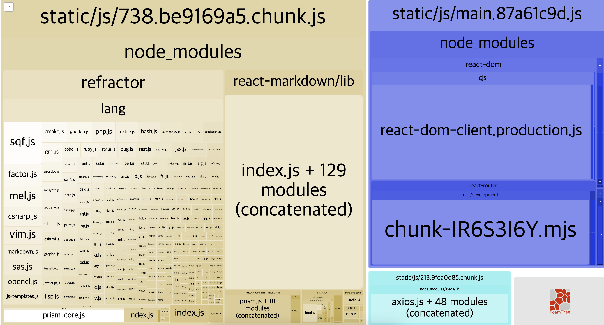

[2] 목록에서 상세페이지로 이동할 때, 분할된 코드 지연 로딩 확인
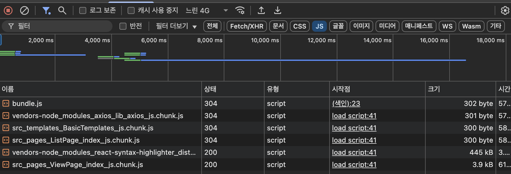

[3] 성능 점수
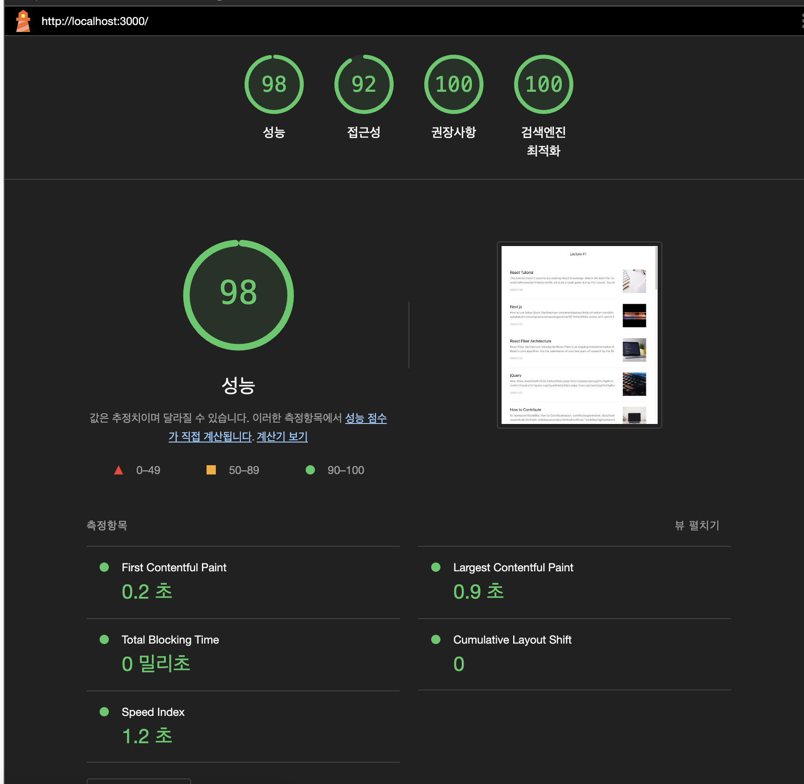

---

## 1-6) 텍스트 압축

### production 환경, development 환경

최종 서비스 성능 측정시 실제 사용자에게 제공되는 production 환경에서 서비스 성능을 측정해야 함.

( ↔ development 환경 : 개발 환경 )

```bash
# 배포용 파일로 빌드
npm run build
```

```bash
# 로컬에서 빌드 결과 확인
npm install -g serve
serve -s build
```

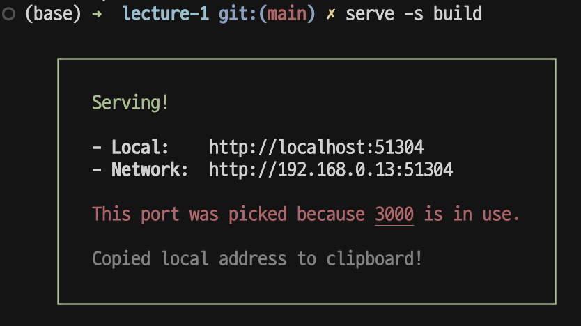

- 빌드 전
  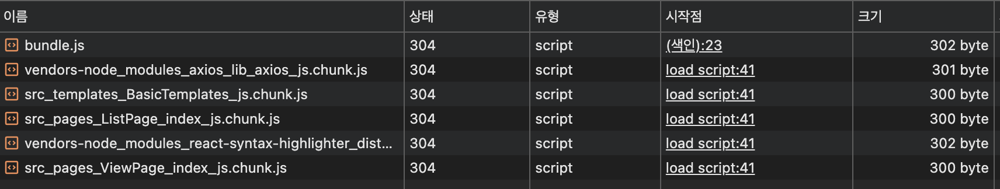

- 빌드 후
  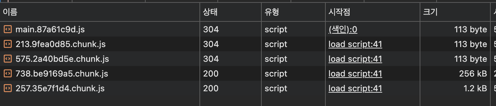
  → 빌드 후 chunk 파일의 크기가 전체적으로 작아짐.

- 성능 점수
  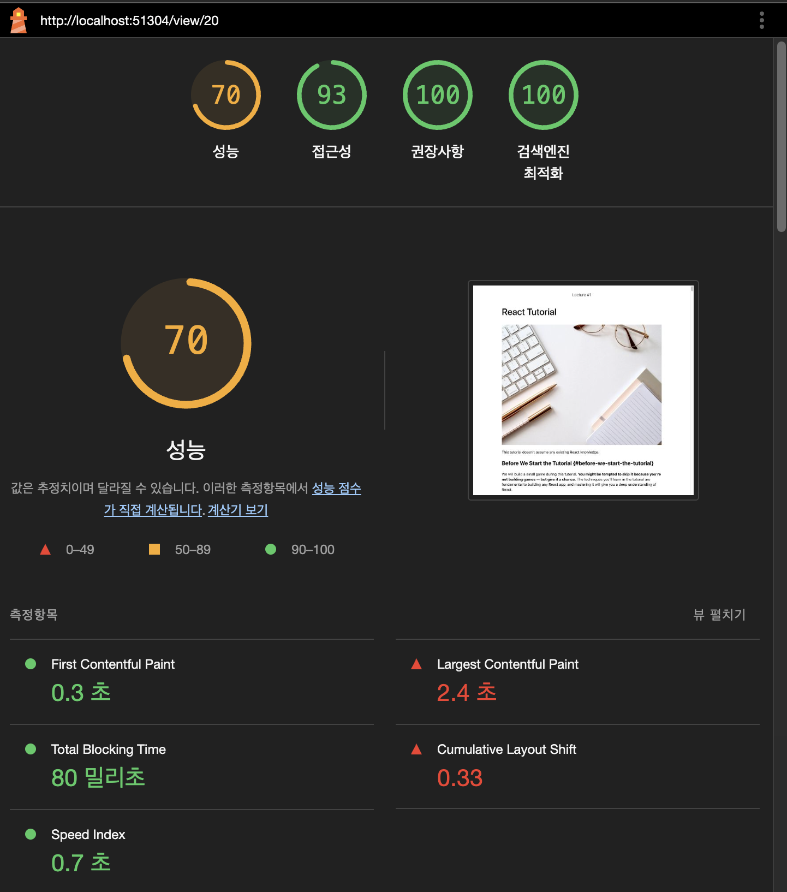

### 텍스트 압축

- 웹 사이트의 HTML, CSS, JavaScript, JSON 등 텍스트 기반 파일을 압축해 전송하는 기법
- 더 작은 크기로 빠르게 전송하고 → 사용 시점에 압축 해제

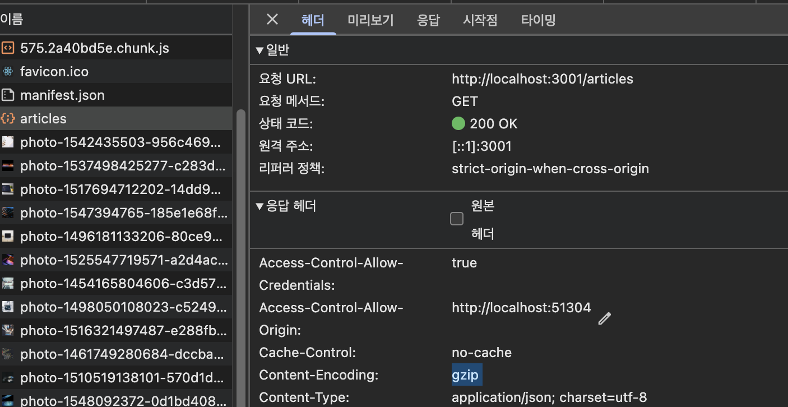
API의 응답헤더에 gzip 방식으로 압축되어 전송되는 것을 확인할 수 있음.

<br/>

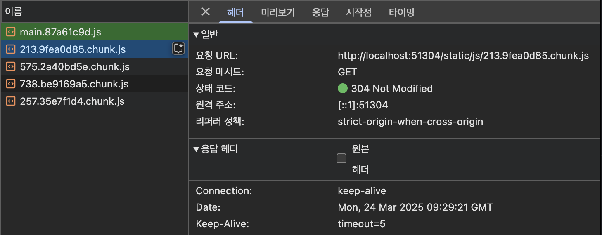
반면에, main 번들 파일의 응답헤더에는 Content-Encoding 항목이 없음 == 텍스트 압축이 적용되어 있지 않음

### 텍스트 압축 적용

serve -s : 매칭되지 않는 주소는 모두 index.html로 보냄

serve -u : 텍스트 압축을 하지 않음

**✅ 텍스트 압축을 위해 -u 옵션 제거**

### **package.json 수정**

```json
"scripts": {
    "start": "react-scripts start",
    "build": "react-scripts build",
    "serve": "npm run build && node ./node_modules/serve/bin/serve.js -s build",
    "server": "node ./node_modules/json-server/lib/cli/bin.js --watch ./server/database.json -c ./server/config.json"
  },
```

재실행 후, 다시 헤더를 살펴보면 응답 헤더에 gzip이 추가 되었음
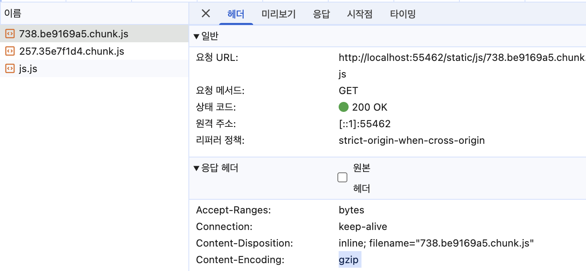
