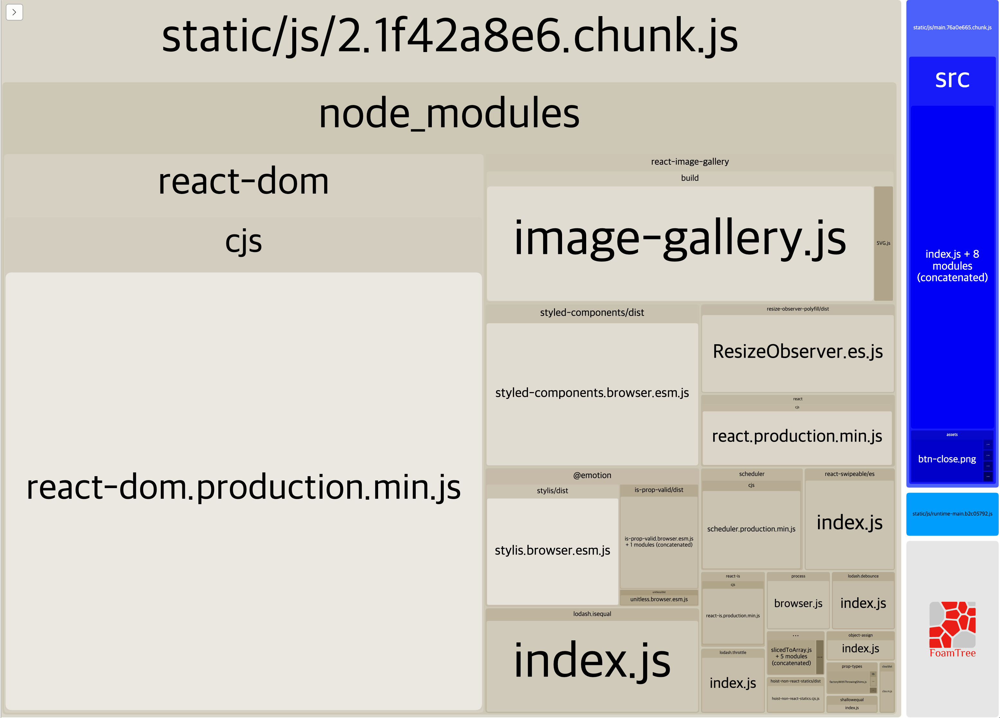
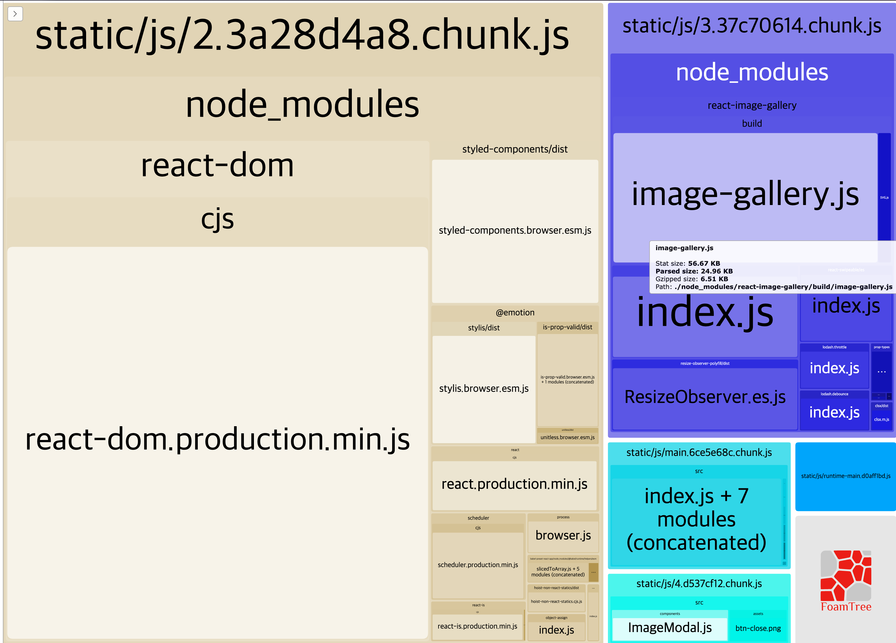
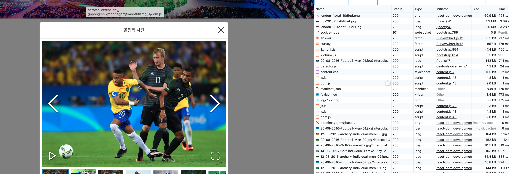

# 2장 올림픽 통계 서비스 최적화

**최적화 기법**

- CSS 애니메이션
- 컴포넌트 지연 로딩
- 컴포넌트 사전 로딩
- 이미지 사전 로딩

## 애니메이션 최적화

설문 영역의 막대 그래프의 애니메이션을 최적화 해보자.

### 브라우저 렌더링 과정

1. DOM, CSSOM 생성
2. 렌더링 트리 구축
3. 레이아웃: 렌더링 트리의 각 노드 위치와 크기 계산
4. 페인트: 레이어별로 그리기 준비
5. 컴포지트: 레이어를 합성하여 화면에 표시

### 리플로우, 리페인트

리플로우는 주요 렌더링 경로의 모든 단계를 모두 재실행함. 즉, 브라우저 리소스를 많이 사용함.

**리플로우와 리페인트를 발생시키는 속성**

- 리플로우: position, display, width, float, height, font-family, top, left, font-size, font-weight, line-height, min-height, margin, padding, border 등
- 리페인트: background, background-color, background-position, border-radius, border-style, box-shadow, color, line-style, outline 등

-> `transform`, `opacity` 속성은 **리플로우와 리페인트를 발생시키지 않음**.

-> 해당 요소를 **별도의 레이어로 분리하고 작업을 GPU에 위임하여 처리함**.

### 하드웨어 가속(GPU 가속)

- `transform: translate()` 는 변화가 일어나는 순간 레이어를 분리함.
- `transform: translate3d()`, `scale3d()` 와 같은 3d 속성들, 또는 will-change 속성은 처음부터 레이어를 분리해 두기 때문에 변화에 더욱 빠르게 대처 가능함. 레이어가 너무 많아지면 그만큼 메모리를 많이 사용하기 때문에 주의해야 함.

**Jank 현상**

- 애니메이션이 부드럽지 않은 현상
- 애니메이션이 부드럽게 작동하려면 60fps 이상의 속도가 필요함.
- 60fps 이상의 속도를 유지하려면 16.6ms 이하의 시간이 필요함.

: **리플로우 때문에 프레임 드랍이 생기고, 이로 인해 화면이 버벅거리거나 애니메이션이 매끄럽지 않은 것**을 의미함

### 애니메이션 최적화 예시

```js
const BarGraph = styled.div`
  position: absolute;
  left: 0;
  top: 0;
  /* width: ${({ width }) => width}%; */
  width: 100%;
  transform: scaleX(${({ width }) => width / 100});
  transform-origin: center left;
  transition: transform 1.5s ease;
  height: 100%;
  background: ${({ isSelected }) =>
    isSelected ? "rgba(126, 198, 81, 0.7)" : "rgb(198, 198, 198)"};
  z-index: 1;
`;
```

- `transform: scaleX(${({ width }) => width / 100})` 는 브라우저에게 요소의 너비를 100%로 설정하고, 이를 조정하여 요소의 너비를 조정함.
- `transform-origin: center left` 는 요소의 중앙을 기준으로 왼쪽을 기준으로 변환함.

## 컴포넌트 지연 로딩

코드를 분할하고 분할된 코드를 필요한 시점, 즉 페이지가 변경되는 시점에 로드하도록 하는 기법.

```bash
npm install --save-dev cra-bundle-analyzer
npx cra-bundle-analyzer
```

#### Node.js 버전이 높아서 생기는 오류 해결

```bash
# 노드 버전을 16으로 설정해서 해결
nvm install 16
nvm use 16
```



여기서 react-image-gallery라는 라이브러리는 25KB 정도인데, 서비스 첫 화면부터 필요하지 않다.
이 라이브러리가 필요한 시점은 사진 갤러리가 있는 모달 창을 띄울 때이다.

#### 모달 코드 분리하기

App.js 파일에서 모달 코드를 분리해 처리한다.

```js
// import ImageModal from './components/ImageModal'
const LazyImageModal = lazy(() => import("./components/ImageModal"));

function App() {
  const [showModal, setShowModal] = useState(false);

  return (
    <div className="App">
      {/* ... */}
      <Suspense fallback={null}>
        {showModal ? (
          <LazyImageModal
            closeModal={() => {
              setShowModal(false);
            }}
          />
        ) : null}
      </Suspense>
    </div>
  );
}
```

ImageModal 컴포넌트가 완전히 로드되지 않은 상태에서는 fallback에 넣어 준 null로 렌더링되고, 로드가 완료되면 모달이 렌더링된다.


Network 탭에서 모달 컴포넌트가 로드되는 시점을 확인할 수 있다. 2개의 청크 파일은 ImageModal 컴포넌트와 image-gallery 라이브러리 파일이다.



- 파란색 블록으로 react-image-gallery 라이브러리가 분리된 것을 확인할 수 있다.
- 하늘색 블록으로 ImageModal 컴포넌트가 분리된 것을 확인할 수 있다.

## 컴포넌트 사전 로딩

### 지연 로딩의 단점

모달을 띄우는 시점에서 라이브러리를 로드하며 로드가 완료 되어야 모달을 띄우기 때문에 초기 로딩 시간이 오래 걸린다.

이 문제를 해결하기 위해서 사전 로딩(Preloading) 기법을 사용한다.

**사용자가 버튼을 클릭하기 전에 모달 코드를 미리 로드해 두자.**

### 시점에 대한 고민

- 사용자가 버튼 위에 마우스를 올려놨을 때
- 최초에 페이지가 로드되고 모든 컴포넌트의 마운트가 끝났을 때

### 1. 마우스 오버 시 사전 로딩

```js
function App() {
  const [showModal, setShowModal] = useState(false);

  const handleMouseEnter = () => {
    const component = import("./components/ImageModal");
  };

  return (
    <div className="App">
      <Header />
      <InfoTable />
      <ButtonModal
        onMouseEnter={handleMouseEnter}
        onClick={() => {
          setShowModal(true);
        }}
      >
        올림픽 사진 보기
      </ButtonModal>
      <SurveyChart />
      <Footer />
      <Suspense fallback={null}>
        {showModal ? (
          <LazyImageModal
            closeModal={() => {
              setShowModal(false);
            }}
          />
        ) : null}
      </Suspense>
    </div>
  );
}
```

- Network 탭에서 사용자가 버튼 위에 마우스를 올려놨을 때, js 파일 2개를 받는 것을 확인 할 수 있다.

### 2. 컴포넌트의 마운트 완료 후 사전로딩

```js
function App() {
  const [showModal, setShowModal] = useState(false);

  useEffect(() => {
    const component = import("./components/ImageModal");
  }, []);
}
```

Waterfall 을 통해서 초기 페이지 로드 후 다운로드 되는 것을 확인할 수 있다.

이와 같이 어떤 타이밍에 사전 로드를 할 것인지 고민해야 한다.

## 이미지 사전 로딩

### 느린 이미지 로딩

모달 첫 로딩 시 레이아웃이 깨지는 현상을 최적화해보자.

이미지가 화면에 제때 뜰 수 있도록 미리 다운로드하는 기법인 이미지 사전 로딩 기법을 적용해보자.

### 이미지 사전 로딩

자바스크립트 Image 객체를 사용하여 이미지를 미리 로드할 수 있다.

```js
const image = new Image();
image.src = "{이미지 주소}";
```

```js
function App() {
  const [showModal, setShowModal] = useState(false);

  useEffect(() => {
    const component = import("./components/ImageModal");

    const img = new Image();
    img.src =
      "https://stillmed.olympic.org/media/Photos/2016/08/20/part-1/20-08-2016-Football-Men-01.jpg?interpolation=lanczos-none&resize=*:800";
  }, []);
  //...
}
```



첫 번째 이미지를 미리 로드하여 렌더링 시간을 줄일 수 있다.

- disk cache: 브라우저가 이미지를 캐시에 저장하여 빠르게 로드할 수 있도록 함. 6ms가 소요된 것을 확인할 수 있다.

몇 장의 이미지를 사전 로딩할 것인지, 정말 사전 로딩이 필요한지 고민해서 사용해야 한다.
