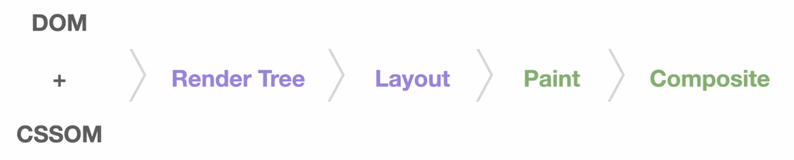
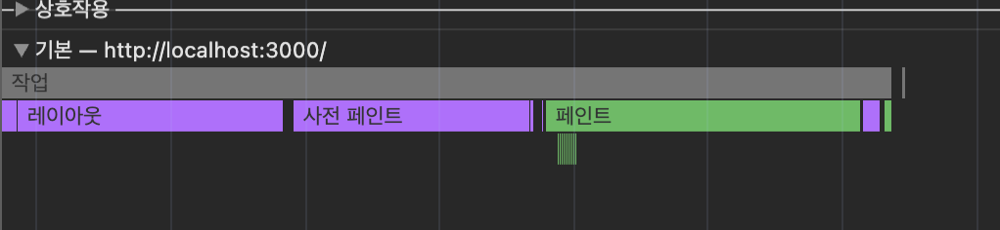
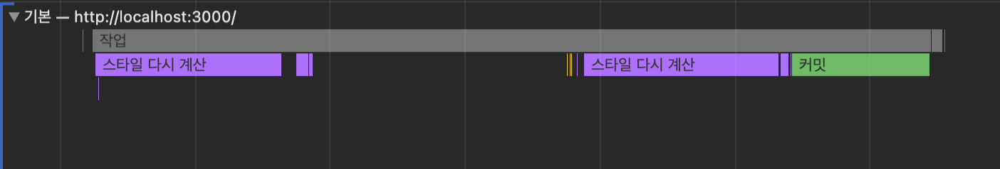
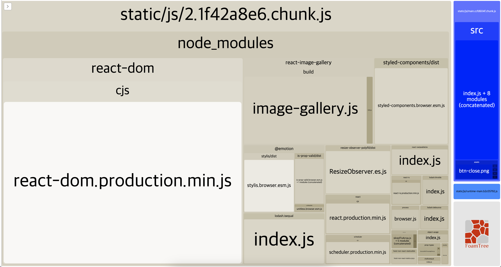
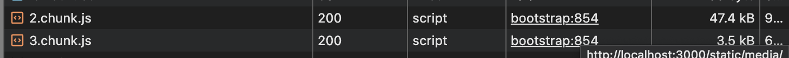
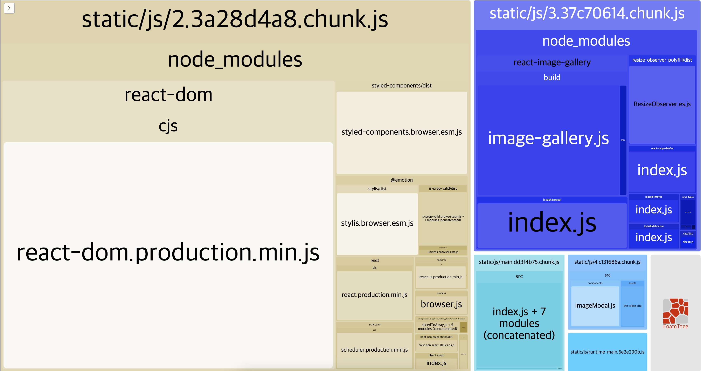
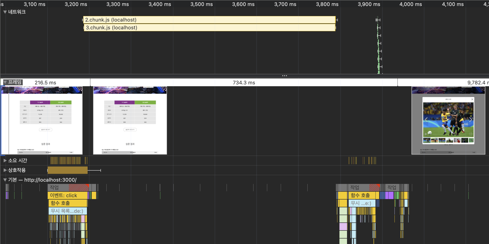
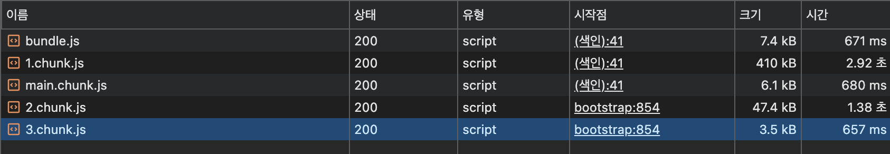

# 2️⃣ 올림픽 통계 서비스 최적화

## **2-1) 서비스 실행**

```bash
npm install
npm run start
```

> Node.js의 버전 문제로 `export NODE_OPTIONS=--openssl-legacy-provider`임시 환경 변수를 설정하여 실행하였습니다.

```bash
npm run server
```

### 최적화 포인트

1. 하단 올림픽 이미지 깨짐 현상
2. 설문 결과 애니메이션 끊김 현상

## **2-2) 애니메이션 최적화**

### 애니메이션 원리

일반적으로 사용하는 디스플레이는 주사율이 60Hz이기 때문에,
**브라우저도 최대 초당 60프레임(FPS)**으로 화면을 렌더링함.

**쟁크 현상?** <br/>
-> 브라우저가 정상적으로 60FPS을 그리지 못 할 때의 끊김 현상.

### 브라우저 렌더링 과정



#### 1. HTML 파싱 -> DOM 트리

- 파싱 : 렌더링 엔진이 HTML 문서를 토큰 token 으로 나누고 이를 바탕으로 문법적 의미와 구조 를 분석하여 파스 트리 생성
- DOM : 문서 객체 모델, HTML과 자바스크립트를 서로 이어줌
  - JS를 사용하여 DOM 요소 조작 할 수 있음

#### 2. CSS 파싱 -> CSSOM

- HTML 문서에 연결된 CSS 파일을 파싱해서 CSS 파일을 읽어 반영한 CSSOM 트리 생성
- 각 요소가 어떤 스타일을 포함하는지에 대한 정보

#### 3. DOM + CSSOM = Render Tree (렌더 트리)

- 렌더링에 필요한 노드만 object들만 모인 렌더트리 생성

#### 4. Layout / Reflow (페이지 레이아웃 계산)

- 렌더트리의 각 노드가 가지는 정확한 위치와 크기를 계산하고 배치하는 작업
- **리플로우 발생 원인 및 특징**
  - width, height, margin, padding, position 등이 변경
  - DOM 추가/삭제
  - 창 크기 변경
  - 주요 렌더링 경로를 모두 재실행함 (브라우저 리소스 매우 많이 사용)

#### 5. Paint

- 스타일과 위치 정보를 기반으로 요소들을 픽셀로 변환해서 그림
- **리페인트 발생 원인 및 특징**
  - color, background 등 색상 요소의 변경
  - 레이아웃을 제외한 주요 렌더링 경로 재실행 (리소스 많이 사용)

> **리플로우, 리페인트 개선 방법** <br />
> transform, opacity 등의 속성을 사용하여 해당 요소를 별도의 레이어로 분리하고 작업을 GPU에 위임하여 처리 (--> 레이아웃, 페인트 단계를 건너뛸 수 있음.)

#### 6. Composition

- 생성된 여러 레이어들을 하나로 합성

#### 🚨 하드웨어 가속 (GPU 가속)

- HTML 파싱, JS 실행, 레이아웃/스타일 계산 등 *CPU에서 처리하는 작업*을 **GPU에 위임**하여 작업을 빠르게 처리
- 요소를 별도의 레이어로 분리하여 GPU로 보내면 하드웨어 가속을 사용할 수 있음.

### 현재 상황



애니메이션 실행 시, width 값 변경으로 인해 리플로우 발생
리플로우 작업이 화면 갱신 시점을 넘어서 쟁크 현상이 발생하고 있음.

### 애니메이션 최적화

✅ 리플로우, 리페인트가 일어나는 속성을 사용하지 않고 GPU를 사용할 수 있도록 transform과 같은 속성으로 변경하기

- components/Bar.js

```js
const BarGraph = styled.div`
  position: absolute;
  left: 0;
  top: 0;

  width: 100%;
  transform: scaleX(${({ width }) => width / 100}); // 퍼센트 -> 실수값으로 사용
  transform-origin: center left; // 왼쪽 기준으로 변경
  transition: transform 1.5s ease;

  height: 100%;
  background: ${({ isSelected }) =>
    isSelected ? "rgba(126, 198, 81, 0.7)" : "rgb(198, 198, 198)"};
  z-index: 1;
`;
```

### 애니메이션 최적화 결과

- 최적화 전
  

- 최적화 후

  

  - 레이아웃, 페인트 작업 생략되어 작업 개수가 적어짐

## **2-3) 컴포넌트 지연 로딩**

### 번들 파일 분석

```bash
npm install --save-dev cra-bundle-analyzer
npx cra-bundle-analyzer
```



큰 사이즈를 가진 react-image-gallery 를 해당 라이브러리가 필요한 시점에 가져오도록 코드를 분할하고 지연로딩을 적용하는 것이 좋음.

### 모달 코드 분리

1. ImageModal 컴포넌트, import 함수를 lazy의 함수 인자로 넘김
2. Suspense 컴포넌트로 LazyImageModal 컴포넌트 감싸기
3. 기존 ImageModal를 직접 import 하는 코드 주석

```jsx
// import ImageModal from './components/ImageModal'

const LazyImageModal = lazy(() => import("./components/ImageModal"));
function App() {
  const [showModal, setShowModal] = useState(false);

  return (
    <div className="App">
      <Header />
      <InfoTable />
      <ButtonModal
        onClick={() => {
          setShowModal(true);
        }}
      >
        올림픽 사진 보기
      </ButtonModal>
      <SurveyChart />
      <Footer />
      {showModal ? (
        <Suspense fallback={<div>Loading...</div>}>
          <LazyImageModal
            closeModal={() => {
              setShowModal(false);
            }}
          />
        </Suspense>
      ) : null}
    </div>
  );
}
```

### 결과

- 필요한 시점에 해당 모듈을 가져오기 때문에 초기 로딩 속도, 자바스크립트의 실행 타이밍이 빨라짐
- '올림픽 사진 보기' 모달 클릭 시, 청크 파일이 2개로 로드
  
- 번들 파일에서 react-image-gallery 라이브러리 분리, ImageModal 컴포넌트 분리 (+ react-image-gallery 에서 참조하는 모든 라이브러리가 함께 묶여 분할)
  

## **2-4) 컴포넌트 사전 로딩**

### 지연 로딩 단점

- 초기 화면 로딩시에는 빠를 수 있지만, 해당 코드가 사용되는 시점에 네트워크를 통해 새롭게 코드를 로드해야 하고, 로드가 완료되어야만 해당 코드를 사용할 수 있음.

  

- 모달 컴포넌트 로드 -> 스크립트 평가 -> 모달 노출
  - 클릭 시점과 모달 노출 시점 차이가 있음

### 사전 로딩

- 필요한 모듈을 미리 로드하는 기법

### 버튼 이벤트에서 사전 로딩 고려 타이밍

#### 1) 사용자가 버튼에 마우스를 올려놨을 때 (mouseenter)

```jsx
function App() {
  const [showModal, setShowModal] = useState(false);
  const handleMouseEnter = () => {
    const component = import("./components/ImageModal");
  };

  return (
    <div className="App">
      <Header />
      <InfoTable />
      <ButtonModal
        onClick={() => {
          setShowModal(true);
        }}
        onMouseEnter={handleMouseEnter}
      >
        올림픽 사진 보기
      </ButtonModal>
      <SurveyChart />
      <Footer />
      {showModal ? (
        <Suspense fallback={<div>Loading...</div>}>
          <LazyImageModal
            closeModal={() => {
              setShowModal(false);
            }}
          />
        </Suspense>
      ) : null}
    </div>
  );
}
```

- onMouseEnter 이벤트를 통해 마우스가 버튼에 올라오면 ImageModal 컴포넌트를 import 하여 로드

**개선 결과**



- 버튼에 커서를 올려놓으면 모달 코드가 필요한 시점보다 먼저 모달 코드 로드

#### 2) 최초 페이지 로드 되고 모든 컴포넌트의 마운트가 끝났을 때

- 클래스형 컴포넌트
  - componentDidMount() 시점
- 함수형 컴포넌트
  - useEffect(() => { ... }, [])

> ### 📦 클래스형 컴포넌트 vs 함수형 컴포넌트
>
> |               | 클래스형 컴포넌트                            | 함수형 컴포넌트         |
> | ------------- | -------------------------------------------- | ----------------------- |
> | 문법          | `class` 키워드                               | `function` 키워드       |
> | 상태 관리     | `this.state`, `this.setState()`              | `useState()`            |
> | 생명주기 처리 | `componentDidMount`, `componentDidUpdate` 등 | `useEffect()`           |
> | `this` 키워드 | 필수                                         | 필요 없음               |
> | 최신 방식     | 구형 코드 유지보수                           | ✅ React 공식 권장 방식 |

**개선 결과**
