# 3장 홈페이지 최적화

## 서비스 실행

### Node.js 버전 설정

> Node.js 버전 호환이 안되어 버전 설정 필요합니다.

```bash
nvm install 16
nvm use 16
```

### 서비스 실행

```bash
npm install
npm run dev
```

### 서버 실행

```bash
npm run server
```

### 빌드된 파일 + 서버 실행

```bash
npm run build
npm run serve
```

### 도움 및 참고 사이트

- **squoosh**: https://squoosh.app/ 이미지 압축 툴
- **PurgeCSS**: https://purgecss.com/ 불필요한 CSS 제거 툴

## 이미지 지연 로딩

### 네트워크 쓰로틀링

> #### 네트워크 속도를 제한하여 테스트 진행
>
> Network > throttling > Custom add > 6000kb/s로 다운로드/업로드, Latency 20ms로 설정해서 테스트

- **문제점**: 바로 나와야 할 동영상 콘텐츠가 다른 이미지에 의해 지연되는 문제 발생
- **해결 방법**: 이미지를 지연 로드해서 동영상을 먼저 로드하도록 함
  - 이미지가 보이는 순간 / 보이는 직전에 로드
- **상세 방법**: `Intersection Observer` 브라우저 API 사용
  - 이유: 스크롤 이벤트로 감지하면 많은 이벤트가 발생하기 때문에 메인 스레드에 무리가 갈 수 있음.
  - 특정 관찰 요소가 화면에 들어온 시점 여부를 알수 있음.

> 코드 예시

```js
const options = {
  root: null, // 가시성을 확인할 때 사용되는 뷰포트 요소(기본값 null == 브라우저 뷰포트)
  rootMargin: "0px", // root 요소의 여백
  threshold: 1.0, // 가시성 퍼센티지 1.0 == 모두 보이는 경우, 0 == 1px이라도 보이는 경우 콜백 실행
};

// 가시성이 변경될 때마다 실행되는 함수
const callback = (entries, observer) => {
  // entries: 가시성이 변한 요소를 배열 형태로 전달 받음
  console.log("Entries", entries);
};

// Intersection Observer 객체 생성 (가시성이 변할 때마다 콜백 실행)
const observer = new IntersectionObserver(callback, options);

observer.observe(document.querySelector("#target-element1"));
observer.observe(document.querySelector("#target-element2"));
```

### Intersection Observer 적용하기

```js
import React, { useRef, useEffect } from "react";

function Card(props) {
  const imgRef = useRef(null);

  useEffect(() => {
    const options = {};
    const callback = (entries, observer) => {
      entries.forEach((entry) => {
        if (entry.isIntersecting) {
          console.log("is intersecting", entry.target.dataset.src);
          entry.target.src = entry.target.dataset.src;
          observer.unobserve(entry.target);
        }
      });
    };

    const observer = new IntersectionObserver(callback, options);
    observer.observe(imgRef.current);

    return () => observer.disconnect();
  }, []);

  return (
    <div className="Card text-center">
      
      <div className="p-5 font-semibold text-gray-700 text-xl md:text-lg lg:text-xl keep-all">
        {props.children}
      </div>
    </div>
  );
}

export default Card;
```

- img의 src 이미지 주소를 data-src에 넣으면, 이미지가 로드되지 않는다.
- 나중에 이미지가 뷰포트에 들어왔을 때, data-src에 있는 값을 src로 옮겨 이미지를 로드하도록 처리한다.
- `isIntersecting` 이 true인지 여부 확인해 src 값을 할당
- `unobserve`: observe 해제. 이미지 로드 후에는 더 이상 관찰할 필요가 없음.
- **정리**: 처음에 src 값 대신 data-src 값을 할당하고, 이미지가 뷰포트에 들어온 순간, 이미지 지연 로딩 기법을 통해 이미지를 로드하도록 처리

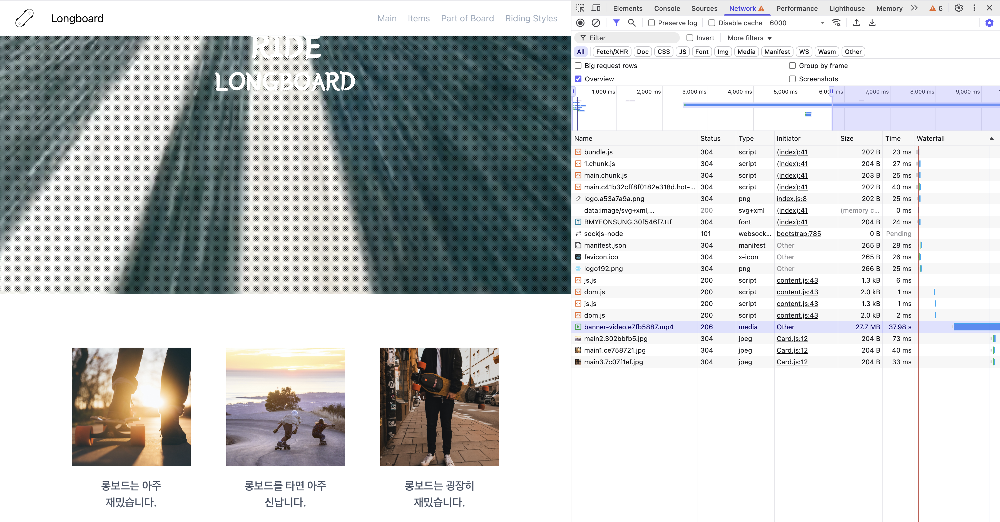

- **이미지 지연 로딩 결과**: `banner-video.mp4` 가 로드된 이후, `main1,2,3` 이미지가 로드되는 것을 확인할 수 있음.

## 이미지 사이즈 최적화

### 느린 이미지 로딩 분석

🚨 **이미지가 느리게 보이는 이유:**

- 스크롤에 도달하자마자 로드하기 때문에 전체 이미지가 보이지 않아서 잘려보이는 것 처럼 보임.
- 이미지 크기가 크기 때문에 로드 시간이 오래 걸림.

✅ **이미지 사이즈 최적화를 통해 UX 최적화**

### 이미지 포맷 종류

- PNG: 무손실 압축, 알파 채널 지원
- JPG: 손실 압축, 더 작은 파일 크기
- WebP: 무손실 압출, 손실 압축 모두 제공, 더 작은 파일 크기, 호환성 낮음
  - PNG 대비 26%, JPG 대비 25~34% 작은 파일 크기

### 이미지 포맷 비교

- 사이즈: PNG > JPG > WebP
- 화질: PNG = WebP > JPG
- 호환성: PNG = JPG > WebP

### WebP 포맷 호환성 표

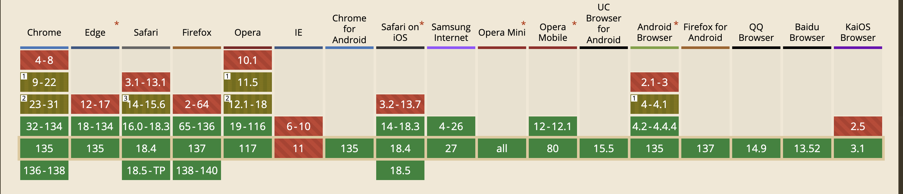

- IE를 제외하면 거의 모든 브라우저에서 지원하기 때문에 사용해도 괜찮을 것으로 보임.

### Squoosh를 사용하여 이미지 변환

- **squoosh**: https://squoosh.app/ - 구글에서 만든 이미지 압축 애플리케이션
  - 이미지 크기 조절: 너비 600px, 높이 600px (두 배 크기로 조절)
  - 압축 방식: `WebP`
  - 압축률: `75`


- 원본(6.39MB) 대비 압축률 100%로 14.7kB로 줄어들었음.

하지만, 특정 브라우저에서 렌더링이 제대로 동작하지 않을 수 있기 때문에, `picture` 태그를 사용하여 이미지를 렌더링 할 수 있도록 처리해야 함.

```html
# 뷰포트에 따라
<picture>
  <source media="(min-width:650px)" srcset="img_pink_flowers.jpg" />
  <source media="(min-width:465px)" srcset="img_white_flowers.jpg" />
  
</picture>

# 이미지 포맷에 따라
<picture>
  <source srcset="photo.avif" type="image/avif" />
  <source srcset="photo.webp" type="image/webp" />
  
</picture>
```

#### 이미지 최적화 코드

```js
// [MainPage.js]

<Card image={main1} webp={main1_webp}>
  롱보드는 아주 재밌습니다.
</Card>
<Card image={main2} webp={main2_webp}>
  롱보드를 타면 아주 신납니다.
</Card>
<Card image={main3} webp={main3_webp}>
  롱보드는 굉장히 재밌습니다.
</Card>
```

```js
// [Card.js]
import React, { useRef, useEffect } from "react";

function Card(props) {
  const imgRef = useRef(null);

  useEffect(() => {
    const options = {};
    const callback = (entries, observer) => {
      entries.forEach((entry) => {
        if (entry.isIntersecting) {
          const target = entry.target;
          const previousSibling = target.previousSibling;
          console.log("is intersecting", entry.target.dataset.src);
          target.src = target.dataset.src;
          previousSibling.srcset = previousSibling.dataset.srcset;
          observer.unobserve(entry.target);
        }
      });
    };

    const observer = new IntersectionObserver(callback, options);
    observer.observe(imgRef.current);

    return () => observer.disconnect();
  }, []);

  return (
    <div className="Card text-center">
      <picture>
        <source data-srcset={props.webp} type="image/webp" />
        
      </picture>
      <div className="p-5 font-semibold text-gray-700 text-xl md:text-lg lg:text-xl keep-all">
        {props.children}
      </div>
    </div>
  );
}

export default Card;
```

- webp 포맷을 사용하여 이미지를 렌더링 할 수 있도록 처리
- img 태그 대신 picture 태그를 사용해 source, img 태그 추가함.(webP 우선 로드 후 지원하지 못하면 source 태그를 무시함. img태그의 JPG 렌더링)
- picture 태그는 첫 번째 이미지를 로드하지 못하면 두 번째 이미지를 로드함.

```js
const target = entry.target; // 현재  태그
const previousSibling = target.previousSibling; // 바로 앞의 형제 요소인 <source> 태그
```

## 동영상 최적화

### 동영상 콘텐츠 분석

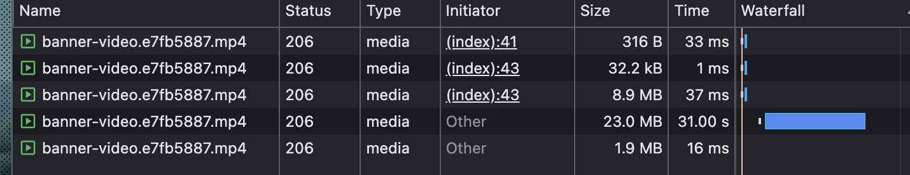

- 동영상은 하나의 요청으로 모든 영상을 다운로드하지 않는다.
- 재생이 필요한 앞부분을 먼저 다운로드한 뒤 순차적으로 나머지를 다운로드한다.

### 동영상 압축

- [Media.io](https://www.media.io/apps/converter/) 사이트에서 동영상 압축 툴 사용
  - 파일 크기: 54MB
  - 파일 포맷: WebM
  - 설정: Bitrate 512Kbps, Audio 체크 해제
  - 압축 결과: 16MB

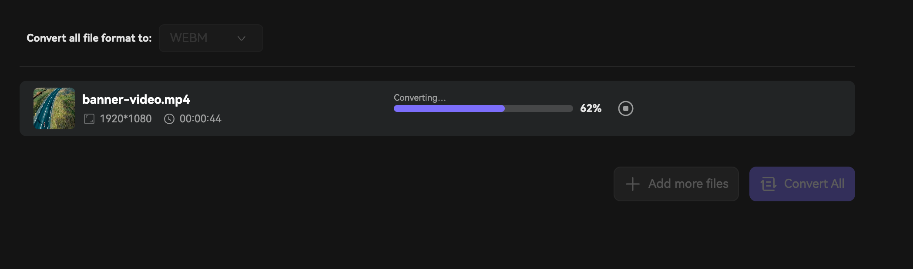

### 압축된 동영상 적용

WebM 파일을 지원하지 않는 브라우저를 위해 아래와 같이 `video` 태그 사용

```js
import video from "../assets/banner-video.mp4";
import video_webm from "../assets/_banner-video.webm";

<video src={video} autoPlay loop muted>
  <source src={video_webm} type="video/webm" />
  <source src={video} type="video/mp4" />
</video>;
```

### 최적화 전후 비교

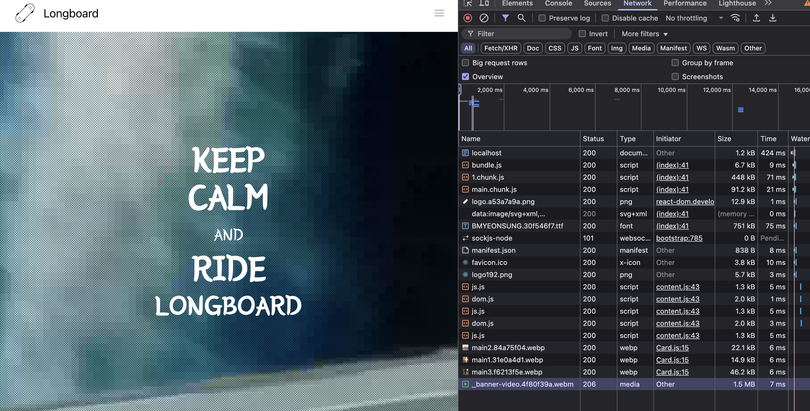

- 끊김 없이 영상이 빠르게 로드되어 재생 됨
- **_하지만, 동영상 너무 깨져서 나와서 이걸 쓸수가 있는가 싶음..._**

### 팁

- 동영상 압축 시에 저하된 화질을 보완하기 위해서 **패턴, 필터**를 씌워 보완할 수 있음.
- 블러처리: filter: blur(10px), 점 패턴 등등

## 폰트 최적화

### 문제 상황

- 텍스트가 보이는 시점에 폰트 다운로드가 완료되지 않으면 텍스트가 변하는 현상이 발생함.
- 동영상 부근의 폰트가 변함.

### FOUT, FOIT

: 폰트 변화로 발생하는 이 현상을 FOUT 또는 FOIT이라고 함.

- **FOUT**(Flash of Unstyled Text): 엣지 브라우저에서 폰트를 로드하는 방식으로, 폰트 다운로드 여부와 상관 없이 기본 시스템 폰트가 먼저 보였다가 웹폰트가 다운로드 되면 폰트를 적용하는 방식
- **FOIT**(Flash of Invisible Text): 크롬, 사파리, 파이어폭스 등에서 폰트를 로드하는 방식으로, 폰트가 완전히 다운로드되기 전까지 텍스트를 보여주지 않다가 다운로드가 완료되면 폰트가 적용된 텍스트를 띄움

> FOIT 방식은 3초만 기다리기 때문에, 3초가 지나지 않아도 폰트가 다운로드되지 않으면 기본 폰트로 텍스트를 보여줌.

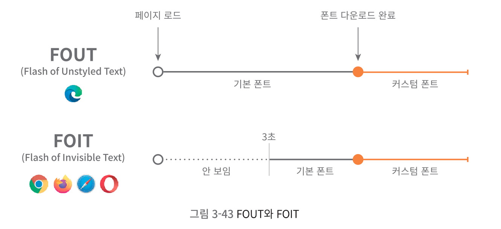

✅ 최적화를 위해서는 폰트 깜박임 현상을 최소화 해야 한다.

### 폰트 최적화 방법

#### 1. 폰트 적용 시점 제어하기

- CSS의 `font-display` 속성을 사용하여 폰트 적용 시점을 제어할 수 있다.

```css
/* App.css */

@font-face {
  font-family: BMYEONSUNG;
  src: url("./assets/fonts/BMYEONSUNG.ttf");
  font-display: block;
}
```

#### `font-display` 속성의 값

| 값         | 설명                                                                                                                           |
| ---------- | ------------------------------------------------------------------------------------------------------------------------------ |
| `auto`     | 브라우저 기본 동작을 따릅니다. 일반적으로 `block`과 비슷하지만 브라우저마다 다를 수 있습니다.                                  |
| `block`    | 폰트가 로드될 때까지 최대 3초 동안 텍스트를 숨깁니다. 이후 웹폰트가 로드되면 표시됩니다. (FOIT)                                |
| `swap`     | 텍스트를 시스템 폰트로 즉시 보여주고, 웹폰트가 로드되면 교체합니다. (FOUT)                                                     |
| `fallback` | `block`처럼 잠깐 기다리지만 시간은 더 짧습니다 (약 100ms). 이후 시스템 폰트를 사용하고, 웹폰트가 로드되어도 교체하지 않습니다. |
| `optional` | `fallback`과 비슷하지만, 네트워크 상황이 나쁘면 웹폰트를 아예 사용하지 않을 수도 있습니다.                                     |

- 예시에서는 block을 사용해서 FOIT 방식으로 폰트를 로드하도록 처리할 예정.

  - **이유**: 중요한 내용의 텍스트는 아니기 때문에 block으로 처리하되, fade-in 효과를 주어 자연스럽게 처리

- 폰트 다운로드 시점 확인

```bash
npm install --save fontfaceobserver
```

```js
import FontFaceObserver from "fontfaceobserver";

const font = new FontFaceObserver("BMYEONSUNG");

function BannerVideo() {
  useEffect(() => {
    // 20초 동안 폰트 로드 시도
    font.load(null, 20000).then(function () {
      console.log("font loaded"); // 폰트 로드 완료
    });
  }, []);
}
```

- 페이드인 효과 추가

```js
import React, { useState, useEffect } from "react";
import video from "../assets/banner-video.mp4";
import video_webm from "../assets/_banner-video.webm";
import FontFaceObserver from "fontfaceobserver";

const font = new FontFaceObserver("BMYEONSUNG");

function BannerVideo() {
  const [isFontLoaded, setIsFontLoaded] = useState(false);
  useEffect(() => {
    font.load(null, 20000).then(function () {
      console.log("font loaded");
      setIsFontLoaded(true);
    });
  }, []);

  return (
    <div className="BannerVideo w-full h-screen overflow-hidden relative bg-texture">
      {/* 생략 */}
      <div
        className="w-full h-full flex justify-center items-center"
        style={{
          opacity: isFontLoaded ? 1 : 0,
          transition: "opacity 0.3s ease",
        }}
      >
        <div className="text-white text-center">
          <div className="text-6xl leading-none font-semibold">KEEP</div>
          <div className="text-6xl leading-none font-semibold">CALM</div>
          <div className="text-3xl leading-loose">AND</div>
          <div className="text-6xl leading-none font-semibold">RIDE</div>
          <div className="text-5xl leading-tight font-semibold">LONGBOARD</div>
        </div>
      </div>
    </div>
  );
}

export default BannerVideo;
```

- 폰트 로드 상태에 따라 opacity 값을 조절하여 페이드인 효과 추가해 자연스럽게 보이도록 처리

#### 폰트 파일 크기 줄이기

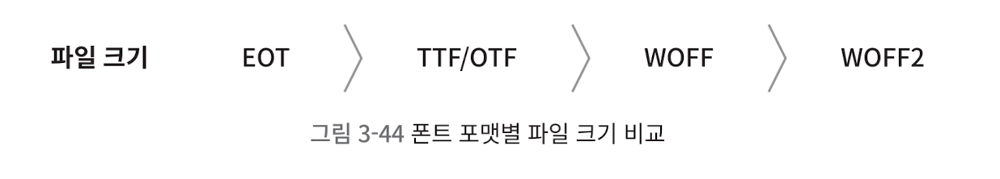

**`ttf` 포멧을 `WOFF`, `WOFF2` 포맷으로 변환하여 파일 크기를 줄임.**

- [Transfonter](https://transfonter.org/) 사이트에서 폰트 파일 크기 줄이기

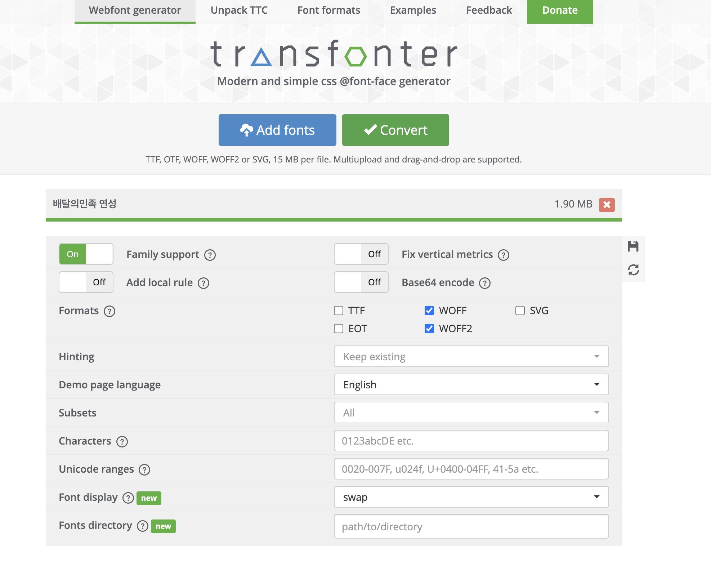

- Add fonts 버튼을 누르면 폰트 파일을 업로드 할 수 있다.
- Convert 버튼을 누르면 폰트 파일을 다운 받을 수 있다.

```css
@font-face {
  font-family: BMYEONSUNG;
  src: url("./assets/fonts/BMYEONSUNG.woff2") format("woff2"), url("./assets/fonts/BMYEONSUNG.woff")
      format("woff"), url("./assets/fonts/BMYEONSUNG.ttf") format("truetype");
  font-display: block;
}
```

#### 서브셋 폰트 사용

`KEEP CALM AND RIDE LONGBOARD` 텍스트만 폰트를 적용하기 위해 서브셋 폰트 사용.

- 일부 문자의 폰트 정보만 가지고 있는 것을 **"서브셋 폰트"** 라고 함.

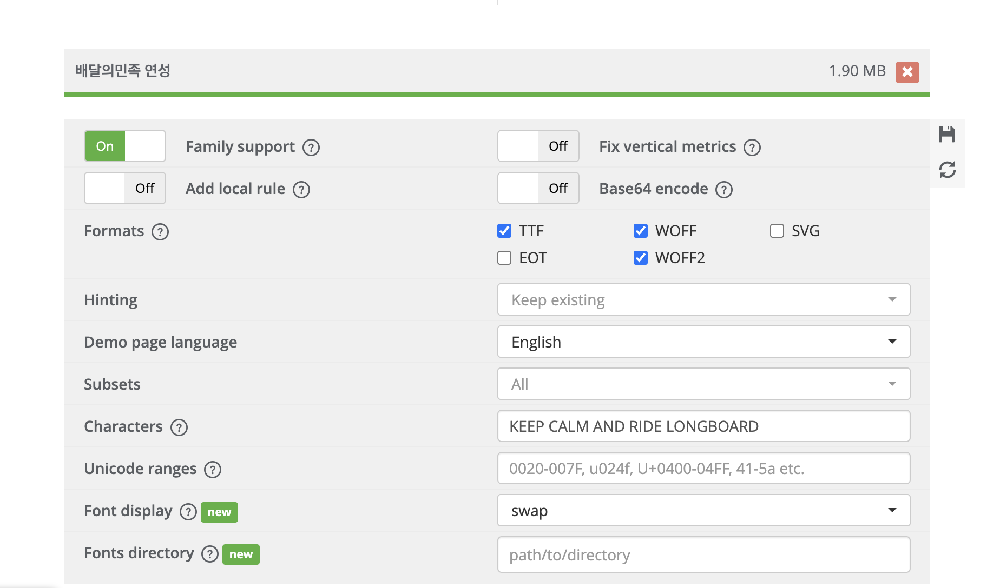

- TTF도 포함해서 서브셋 폰트로 변환해 다운로드

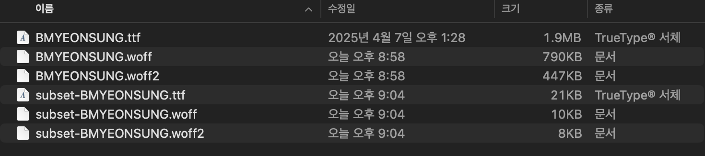

- 1.9MB -> 21KB로 파일 크기 줄임.

```css
@font-face {
  font-family: BMYEONSUNG;
  src: url("./assets/fonts/subset-BMYEONSUNG.woff2") format("woff2"), url("./assets/fonts/subset-BMYEONSUNG.woff")
      format("woff"),
    url("./assets/fonts/subset-BMYEONSUNG.ttf") format("truetype");
  font-display: block;
}
```

#### 폰트를 Data-URI 형태로 CSS 파일에 인라인으로 포함시키기

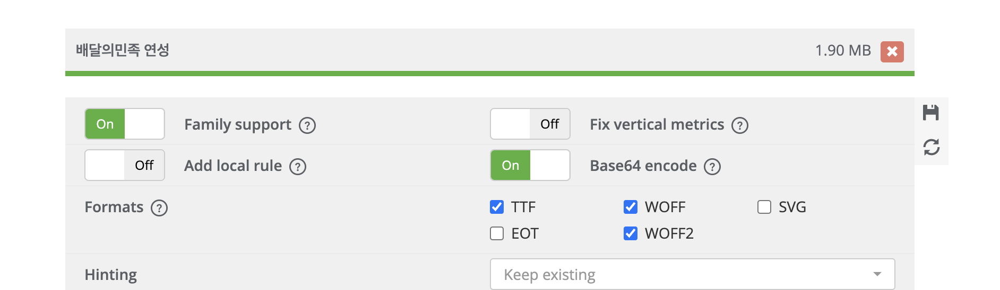

```css
@font-face {
  font-family: BMYEONSUNG;
  src: url("data:font/woff2;charset=utf-8;base64,d09GMgABAAAAAB7IAAwAA...")
    format("woff2");
}
```

- base64로 인코딩해서 받은 css 파일을 보면, 경로 대신 문자열이 들어가 있음.
- 이 문자열을 복사해서 폰트 파일을 대체할 수 있음.
- App.css에 폰트가 포함된 것이므로 App.css의 다운로드 속도도 고려해야 함. Data-URI 형태로 폰트가 포함된 만큼 App.css 파일의 다운로드는 느려짐.(매우 큰 파일을 Data-URI 형태로 포함한다면 또 다른 병목을 발생시킬 수 있음)

## 캐시 최적화

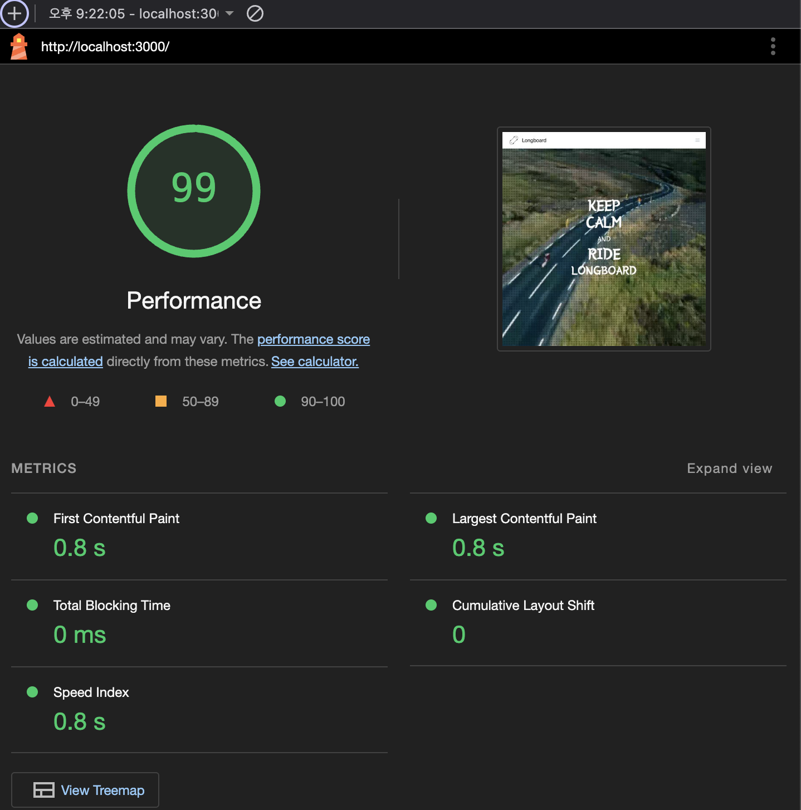
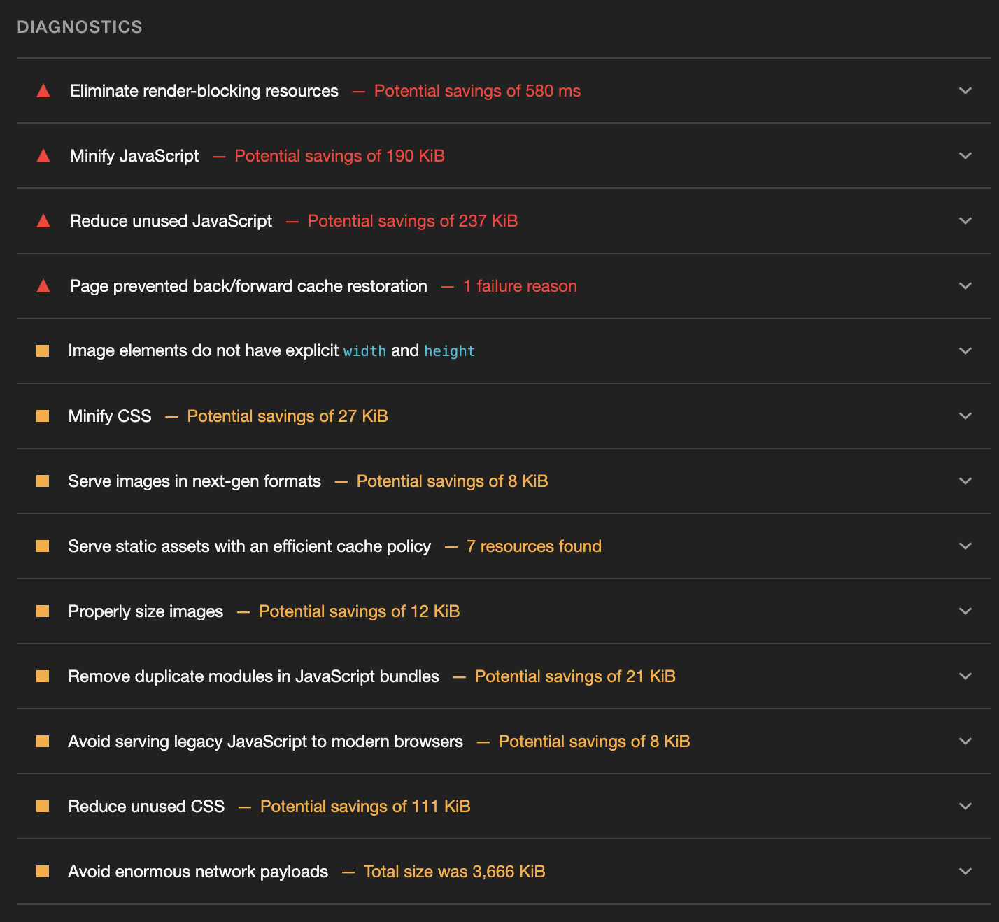

Lighthouse 점수는 99로 높지만, 네트워크를 통해 다운로드하는 리소스에 캐시를 적용하라는 의미의 `Serve static assets with an efficient cache policy` 항목이 있음.

`Cache-Control` 헤더를 추가하여 캐시를 적용할 수 있음.

### 캐시란?

: 자주 사용하는 데이터나 값을 미리 복사해 둔 임시 저장 공간 또는 저장하는 동작.

### 캐시 종류

- **메모리 캐시**: 메모리에 저장하는 캐시
  - 브라우저 종료 시 사라짐
- **디스크 캐시**: 디스크에 저장하는 캐시
  - 브라우저 종료 시 사라지지 않음

### Cache-Control

- `no-cache`: 캐시를 사용하기 전 **서버에 검사 후 사용**
- `no-store`: 캐시 **사용 안함**
- `public`: 모든 환경에서 캐시 사용 가능
- `private`: 브라우저 환경에서만 캐시 사용, 외부 캐시 서버에서는 사용 불가
- `max-age`: 캐시 유효 시간(초 단위)

**예시**: `Cache-Control: private, max-age=600`

- 브라우저 환경에서만 캐시 사용
- 캐시 유효 시간은 10분

### 캐시 적용

```js
// server.js

const header = {
  setHeaders: (res, path) => {
    res.setHeader("Cache-Control", "max-age=10");
  },
};
```

```bash
npm run build
npm run serve # http://localhost:5000
```

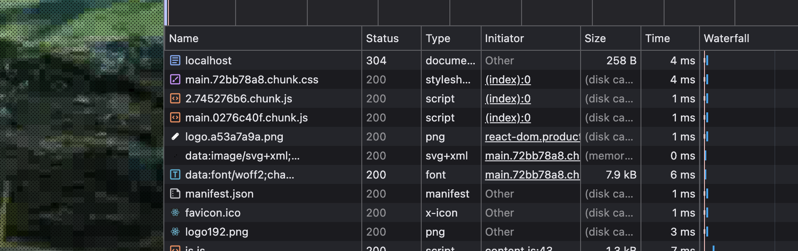

- 캐시 유효 시간은 10초
- 새로고침 시, 캐시가 된 것을 확인할 수 있다.
- 캐시 유효 시간이 만료된 후 새로고침 시, 브라우저는 기존에 캐시된 리소스를 그대로 사용할지, 리소스를 새로 다운로드해야 할지 서버에서 확인을 함.

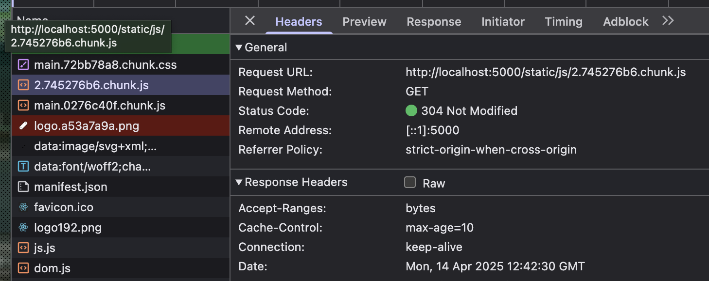

- **변경되지 않은 경우 304 Not Modified 응답 코드를 반환하여 캐시된 리소스를 사용함.**
- cached 대신, size 값이 보이는 이유는 캐시를 사용해도 되는지 확인하기 위해 네트워크 요청을 보내고 응답을 받았기 때문!

### 🤔 캐시된 리소스와 서버의 최신 리소스가 같은지 다른지 어떻게 체크할까?

- 서버에서는 캐시된 리소스의 응답 헤더에 있는 Etag 값과 서버에 있는 최신 리소스의 Etag 값을 비교하여 최신 리소스인지 판단.
- 만약, 서버에 있는 리소스가 변했다면 Etag 값이 달라지고, 서버는 새로운 Etag 값과 함께 최신 리소스를 브라우저로 다시 보내줌

### 적절한 캐시 유효 시간

- 일반적으로 **HTML** 파일은 no-cache 설정을 적용함.
  - 항상 최신 버전 파일을 제공하기 위해서!
- **JS**, **CSS** 파일은 파일명에 해시 값을 가지고 있음.
  - 코드가 변경되면 해시도 변경되어서 새로운 파일이 되어버림.

## 불필요한 CSS 제거

- lighthouse 검사에 `Reduce unused CSS` 항목이 있음.
- `More tools > Coverage` 탭에서 사용되지 않는 CSS를 확인할 수 있음.

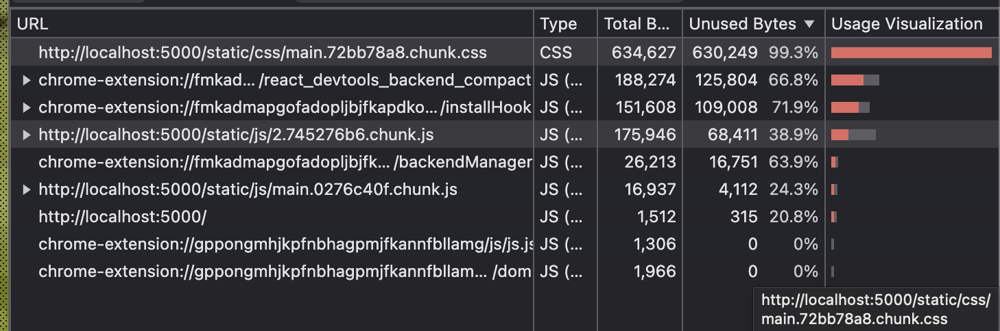

- 사용되지 않는 CSS(오른쪽 하단 빨간색 바가 사용하지 않은 CSS를 의미)
- 99% 사용하지 않는 CSS의 경우 Tailwind CSS 라이브러리에서 제공하는 유틸리티 클래스들이 원인임.

### PurgeCSS

- [PurgeCSS](https://purgecss.com/)는 파일에 들어 있는 모든 키워드를 추출하여 해당 키워드를 이름으로 갖는 CSS 클래스만 보존하고 나머지 매칭되지 않은 클래스는 모두 지우는 방식으로 CSS를 최적화 함.

```bash
npm install --save-dev purgecss
```

```bash
npx purgecss --css ./build/static/css/*.css --output ./build/static/css/ --content ./build/index.html ./build/static/js/*.js
```

- `-css`: 불필요한 클래스를 제거할 CSS 파일 선택
- `--output`: 동일한 위치를 지정함으로써 기존 파일에 덮어 씌움
- `--content`: 빌드된 HTML과 JS 파일을 추가해 HTML, JS 파일의 텍스트 키워드도 모두 추출하여 빌드된 CSS 파일의 클래스와 비교하여 최적화 함

**PurgeCSS 적용 전**


**PurgeCSS 적용 후**


- PurgeCSS 적용 후 사용하지 않는 CSS가 제거되어 사용하지 않은 코드 비율이 변함.

> 🚨 **PurgeCss 주의점**
>
> `:` 문자를 인식하지 못하고 잘못 제거할 수 있음.
>
> 이를 해결하기 위해서는 `purgecss.config.js` 파일을 생성하고 아래와 같이 설정해야 함.

```js
// purgecss.config.js

module.exports = {
  defuaultExtrator: (content) => content.match(/[\w\:\-]+/g) || [],
};
```

```bash
npx purgecss --css ./build/static/css/*.css --output ./build/static/css/ --content ./build/index.html ./build/static/js/*.js --config purgecss.config.js
```

하지만 책에 나온걸로 제대로 동작하지 않아서 수정해줬음

```js
// purgecss.config.js

module.exports = {
  defaultExtractor: (content) => content.match(/[^<>"'`\s]*[^<>"'`\s:]/g) || [],
  safelist: [
    /^hover:/,
    /^focus:/,
    /^active:/,
    /^disabled:/,
    /^group-hover:/,
    /^sm:/,
    /^md:/,
    /^lg:/,
    /^xl:/,
  ],
};
```

- `safelist`: 동적으로 생성되는 반응형 클래스들과 상태 클래스들이 제거되지 않도록 보호
- `defaultExtractor`: 사용하지 않는 CSS 클래스를 제거하도록 설정

```bash
npm run build
npm run purge
npm run serve # http://localhost:5000
```

> 🧐 PurgeCSS로 사용하지 않는 스타일을 지웠는데도 왜 사용하지 않는 코드 비율이 75%나 될까?
>
> CSS 파일도 if 문 분기처럼 아직 표지되지 않은 요소들이 있기 때문에 처음부터 모든 CSS 코드가 실행되지 않습니다. 즉, 코드의 실행 비율은 사용자가 서비스를 이용하면서 조금씩 증가합니다.
