# 3️⃣ 홈페이지 최적화

## **3-1) 서비스 실행**

```bash
npm install
npm run start
```

> Node.js의 버전 문제로 `export NODE_OPTIONS=--openssl-legacy-provider`임시 환경 변수를 설정하여 실행하였습니다.

```bash
npm run server
```

## **3-2) 이미지 지연 로딩**

### 네트워크 분석

> throttling > Add.. > Network Throttling Profiles > Add Custom.. > **6000kb/s**로 다운로드/업로드 속도 설정

🚨 사용자에게 처음으로 보여지는 banner-video 콘텐츠가 가장 나중에 로드 되고 있음.

✅ 지연로드 : 당장 사용되지 않는 이미지를 나중에 다운로드되도록 하기.

- 이미지 로드 시점 :
  - 이미지가 화면에 보이는 순간 / 이미지가 화면에 보여지기 직전
  - == 뷰포트에 이미지가 표시될 위치까지 **스크롤**되었을 때 판단

### Intersection Observer

```js
window.addEventListener("scroll", () => console.log("스크롤 이벤트!"));
```

를 콘솔창에 실행하면 스크롤이 이동하는 중에 해당 이벤트가 계속 발생하기 때문에 많은 로그가 찍히고 복잡한 로직이 추가된다면 메인 스레드에 무리가 갈 수 있는 문제가 있음.

`Inetersection Observer` 는 웹 페이지의 특정 요소를 관찰하면 페이지 스크롤시, 해당 요소가 화면에 들어왔는지 여부를 알려줌. (화면에 해당 요소가 들어왔을 때만 함수 호출)

- 비동기적으로 실행
- reflow를 발생시키지 않음

```js
const options = {
  root: null, // 대상 객체의 가시성을 확인할 때 사용하는 뷰포트 요소
  rootMargin: "0px", // root 요소의 여백
  threshold: 1.0, // 가시성 퍼센티지 : 1.0 - 모두 보이는 경우, 0 - 1px이라도 보이는 경우
};

// 가시성이 변경될 때마다 실행되는 함수
const callback = (entries, observer) => {
  console.log("Entries", entries);
};

// Intersection Observer 객체 생성 (가시성이 변할 때마다 콜백 실행)
const observer = new IntersectionObserver(callback, options);

observer.observe(document.querySelector("#target-element1"));
observer.observe(document.querySelector("#target-element2"));
```

### Intersection Observer 적용하기

```js
import React, { useRef, useEffect } from "react";

function Card(props) {
  const imgRef = useRef(null);

  useEffect(() => {
    const options = {};
    const callback = (entries, observer) => {
      console.log("entries", entries);
    };
    const observer = new IntersectionObserver(callback, options);
    observer.observe(imgRef.current);

    return () => observer.disconnect();
  }, []);

  return (
    <div className="Card text-center">
      
      <div className="p-5 font-semibold text-gray-700 text-xl md:text-lg lg:text-xl keep-all">
        {props.children}
      </div>
    </div>
  );
}

export default Card;
```

Card 컴포넌트에서 img 컴포넌트 관찰


> #### Intersection Observer 속성
>
> - boundingClientRect :
>   관찰 대상 요소의 뷰포트 내 위치, 크기 정보 사각형 객체
>   == `element.getBoundingClientRect()`
> - intersectionRect :
>   요소와 root가 실제로 겹치는 부분의 영역 정보
> - intersectionRatio :
>   요소가 root와 얼마나 겹쳤는지를 나타내는 비율 (0 ~ 1) 값
> - **`isIntersecting`** :
>   해당 요소가 root 영역(뷰포트)에 들어온 경우 true, 그렇지 않으면 false
> - isVisible :
>   해당 요소가 실제로 사용자에게 보이는지 여부
> - rootBounds :
>   IntersectionObserver에서 설정한 root 요소의 크기와 위치 정보
> - target :
>   observe()로 등록한 **관찰 대상 요소 (DOM 요소)**
> - time :
>   교차 상태가 바뀐 시간

---

콜백이 실행되는 순간(화면에 이미지가 보이는 순간)에 이미지를 로드해야함.

이미지 로딩은 img 태그에 src 값이 할당 되는 순간 발생함.

최초에 src 값을 할당 하지 않고 `콜백이 실행 되는 순간에 src 를 할당`하여 지연로딩 적용.

```js
import React, { useRef, useEffect } from "react";

function Card(props) {
  const imgRef = useRef(null);

  useEffect(() => {
    const options = {};
    const callback = (entries, observer) => {
      entries.forEach((entry) => {
        if (entry.isIntersecting) {
          console.log("is intersecting", entry.target.dataset.src);
          entry.target.src = entry.target.dataset.src;
          observer.unobserve(entry.target);
        }
      });
    };

    const observer = new IntersectionObserver(callback, options);
    observer.observe(imgRef.current);

    return () => observer.disconnect();
  }, []);

  return (
    <div className="Card text-center">
      
      <div className="p-5 font-semibold text-gray-700 text-xl md:text-lg lg:text-xl keep-all">
        {props.children}
      </div>
    </div>
  );
}

export default Card;
```

- img 의 src 이미지 주소를 data-src에 넣었기 때문에 값이 할당 되지 않고 **나중에 이미지가 뷰포트에 들어왔을 때, data-src 의 값을 src로 옮겨 이미지를 로드**함
- 콜백 함수에서 `isIntersecting 이 true 인 경우`에 이미지의 src에 dataset.src 값을 넣음
- `observer.unobserve(entry.target)` 를 통해 이미지가 로드 되면 다시 호출할 필요가 없기 때문에 해당 요소의 observe를 해제함

### 이미지 지연 로딩 결과


- 최초 페이지 로딩 시에 이미지 3개가 로드 되지 않다가 스크롤이 해당 이미지가 보여지는 영역에 도달하면 로그와 함께 이미지를 지연 로딩 하고 있음.
- 최초 페이지 로딩 때 사용하지 않는 이미지를 지연 로딩 처리하여 최초 로딩 시 필요한 우선순위가 높은 콘텐츠의 로딩을 방해하지 않음.

### 메인 페이지 이미지 지연 로딩 처리

```js
import React, { useRef, useEffect } from "react";
import BannerVideo from "../components/BannerVideo";
import ThreeColumns from "../components/ThreeColumns";
import TwoColumns from "../components/TwoColumns";
import Card from "../components/Card";
import Meta from "../components/Meta";
import main1 from "../assets/main1.jpg";
import main2 from "../assets/main2.jpg";
import main3 from "../assets/main3.jpg";
import main_items from "../assets/main-items.jpg";
import main_parts from "../assets/main-parts.jpg";
import main_styles from "../assets/main-styles.jpg";

function MainPage(props) {
  const img1 = useRef(null);
  const img2 = useRef(null);
  const img3 = useRef(null);

  useEffect(() => {
    const options = {};
    const callback = (entries, observer) => {
      entries.forEach((entry) => {
        if (entry.isIntersecting) {
          console.log("is intersecting", entry.target.dataset.src);
          entry.target.src = entry.target.dataset.src;
          observer.unobserve(entry.target);
        }
      });
    };

    let observer = new IntersectionObserver(callback, options);
    observer.observe(img1.current);
    observer.observe(img2.current);
    observer.observe(img3.current);

    return () => observer.disconnect();
  }, []);

  return (
    <div className="MainPage -mt-16">
      <BannerVideo />
      <div className="mx-auto">
        <ThreeColumns
          columns={[
            <Card image={main1}>롱보드는 아주 재밌습니다.</Card>,
            <Card image={main2}>롱보드를 타면 아주 신납니다.</Card>,
            <Card image={main3}>롱보드는 굉장히 재밌습니다.</Card>,
          ]}
        />
        <TwoColumns
          bgColor={"#f4f4f4"}
          columns={[
            ,
            <Meta
              title={"Items"}
              content={
                "롱보드는 기본적으로 데크가 크기 때문에 입맛에 따라 정말 여러가지로 변형된 형태가 나올수 있습니다. 실제로 데크마다 가지는 모양, 재질, 무게는 천차만별인데, 본인의 라이딩 스타일에 맞춰 롱보드를 구매하시는게 좋습니다."
              }
              btnLink={"/items"}
            />,
          ]}
        />
        <TwoColumns
          bgColor={"#fafafa"}
          columns={[
            <Meta
              title={"Parts of Longboard"}
              content={
                "롱보드는 데크, 트럭, 휠, 킹핀, 베어링 등 여러 부품들로 구성됩니다. 롱보드를 타다보면 조금씩 고장나는 부품이 있기 마련인데, 이럴때를 위해 롱보들의 부품들에 대해서 알고 있으면 큰 도움이 됩니다."
              }
              btnLink={"/part"}
            />,
            ,
          ]}
          mobileReverse={true}
        />
        <TwoColumns
          bgColor={"#f4f4f4"}
          columns={[
            ,
            <Meta
              title={"Riding Styles"}
              content={
                "롱보드 라이딩 스타일에는 크게 프리스타일, 다운힐, 프리라이딩, 댄싱이 있습니다. 보통 롱보드는 라이딩 스타일에 따라 데크의 모양이 조금씩 달라집니다. 많은 롱보드 매니아들이 각 쓰임새에 맞는 보드들을 소유하고 있습니다."
              }
              btnLink={"/riding-styles"}
            />,
          ]}
        />
      </div>
    </div>
  );
}

export default MainPage;
```

## **3-3) 이미지 사이즈 최적화**

### 느린 이미지 로딩 분석

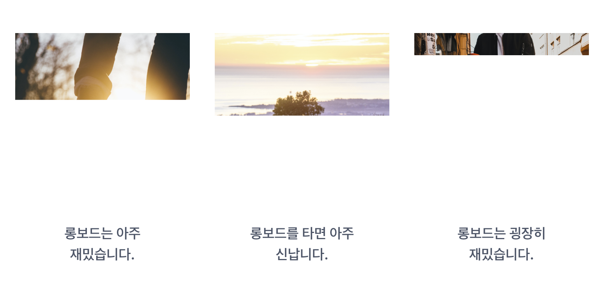
이미지 사이즈가 크기 때문에 다운로드에 시간도 많이 걸리고 지연로딩을 적용하여 사용자가 사진이 완벽하게 로드 되지 않은 상태로 이용하게 되는 문제가 있음.

### 이미지 포맷 종류

| 포맷           | 압축 방식          | 투명도 지원       | 장점                                                                    | 단점                                        | 용도                               |
| -------------- | ------------------ | ----------------- | ----------------------------------------------------------------------- | ------------------------------------------- | ---------------------------------- |
| **PNG**        | 무손실             | ✅ 알파 채널 지원 | - 원본 손상 없이 고화질 유지<br>- 투명 배경 사용 가능                   | - 파일 크기가 큼                            | 아이콘, 로고, 투명 이미지, UI 요소 |
| **JPG (JPEG)** | 손실               | ❌                | - 파일 크기가 작음<br>- 사진에 적합                                     | - 압축 시 품질 손실 발생<br>- 투명도 미지원 | 실사 이미지, 사진, 썸네일          |
| **WebP**       | 무손실 & 손실 지원 | ✅                | - 품질 대비 용량이 매우 작음<br>- 애니메이션 가능<br>- 다양한 압축 지원 | - 일부 구형 브라우저에서 미지원             | 웹 최적화 이미지, 썸네일, 배너     |

- **사이즈** : PNG > JPG > WebP
- **화질** : PNG == WebP > JPG
- **호환성** : PNG == JPG > WebP

### Squoosh를 사용하여 이미지 변환

[Squoosh](https://squoosh.app/) : 구글에서 만든 이미지 컨버터를 사용하여 jpg 를 변환

- Resize : Width, Height 600으로 설정
- Compress : 압축 방식 (WebP), 압축률 (75) 로 설정, Effort(CPU 리소스 사용)

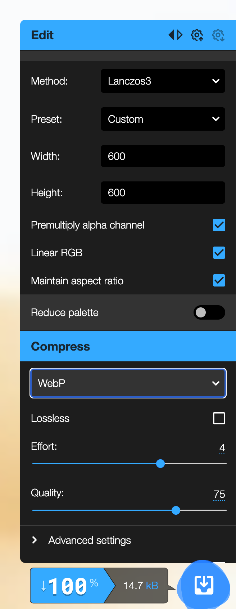

-> 원본 대비 크기가 많이 줄어들었음.
-> 모든 이미지를 WebP으로 변환하여 import

```js
import main1 from "../assets/_main1.webp";
import main2 from "../assets/_main2.webp";
import main3 from "../assets/_main3.webp";
import main_items from "../assets/_main-items.webp";
import main_parts from "../assets/_main-parts.webp";
import main_styles from "../assets/_main-styles.webp";
```

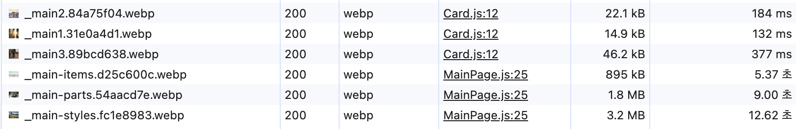

- 이미지 사이즈와 다운로드 시간이 크게 감소함.

🚨 WebP으로만 이미지를 렌더링 할 경우에 특정 브라우저에서 제대로 렌더링 되지 않을 수 있음.
`<picture>` 태그는 다양한 타입의 이미지 렌더링 컨테이너로 사용할 수 있음.

```html
# 뷰포트에 따라
<picture>
  <source media="(min-width:650px)" srcset="img_pink_flowers.jpg" />
  <source media="(min-width:465px)" srcset="img_white_flowers.jpg" />
  
</picture>

# 이미지 포맷에 따라
<picture>
  <source srcset="photo.avif" type="image/avif" />
  <source srcset="photo.webp" type="image/webp" />
  
</picture>
```

---

[ MainPage.js ]

```js
<ThreeColumns
  columns={[
    <Card image={main1} webp={main1_webp}>
      롱보드는 아주 재밌습니다.
    </Card>,
    <Card image={main2} webp={main2_webp}>
      롱보드를 타면 아주 신납니다.
    </Card>,
    <Card image={main3} webp={main3_webp}>
      롱보드는 굉장히 재밌습니다.
    </Card>,
  ]}
/>
```

[ Card.js ]

```js
import React, { useRef, useEffect } from "react";

function Card(props) {
  const imgRef = useRef(null);

  useEffect(() => {
    const options = {};
    const callback = (entries, observer) => {
      entries.forEach((entry) => {
        if (entry.isIntersecting) {
          const target = entry.target;
          const previousSibling = target.previousSibling;

          console.log("is intersecting", entry.target.dataset.src);
          target.src = entry.target.dataset.src;
          previousSibling.srcset = previousSibling.dataset.srcset;
          observer.unobserve(entry.target);
        }
      });
    };

    const observer = new IntersectionObserver(callback, options);
    observer.observe(imgRef.current);

    return () => observer.disconnect();
  }, []);

  return (
    <div className="Card text-center">
      <picture>
        <source data-srcset={props.webp} type="image/webp" />
        
      </picture>
      <div className="p-5 font-semibold text-gray-700 text-xl md:text-lg lg:text-xl keep-all">
        {props.children}
      </div>
    </div>
  );
}

export default Card;
```

1. Card 컴포넌트에 webp props 추가
2. img 태그 -> picture 태그로 변경하여 source와 img 태그 추가 (WebP 우선 로드 -> 브라우저가 지원하지 않으면 img 태그의 JPG 렌더링)
3. 이미지 지연로딩을 위해 img 태그에서 data-src로 임시 저장 후 -> 콜백이 실행 될 때 src에 옮김
4. source 태그도 마찬가지로 data-srcset에 임시 저장 후 -> 콜백에서 srcset으로 옮김

---

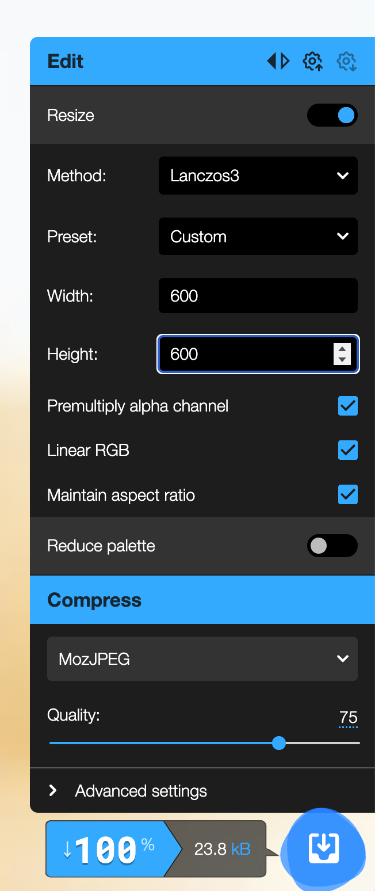
JPG 최적화 옵션 적용하여 코드 수정

```js
import React, { useRef, useEffect } from "react";
import BannerVideo from "../components/BannerVideo";
import ThreeColumns from "../components/ThreeColumns";
import TwoColumns from "../components/TwoColumns";
import Card from "../components/Card";
import Meta from "../components/Meta";
import main1 from "../assets/_main1.jpg";
import main2 from "../assets/_main2.jpg";
import main3 from "../assets/_main3.jpg";
import main_items from "../assets/_main-items.jpg";
import main_parts from "../assets/_main-parts.jpg";
import main_styles from "../assets/_main-styles.jpg";

import main_items_webp from "../assets/_main-items.webp";
import main_parts_webp from "../assets/_main-parts.webp";
import main_styles_webp from "../assets/_main-styles.webp";

import main1_webp from "../assets/_main1.webp";
import main2_webp from "../assets/_main2.webp";
import main3_webp from "../assets/_main3.webp";

function MainPage(props) {
  const img1 = useRef(null);
  const img2 = useRef(null);
  const img3 = useRef(null);

  useEffect(() => {
    const options = {};
    const callback = (entries, observer) => {
      entries.forEach((entry) => {
        if (entry.isIntersecting) {
          const sourceEl = entry.target.previousSibling;
          sourceEl.src = sourceEl.dataset.src;
          sourceEl.srcset = sourceEl.dataset.srcset;
          observer.unobserve(entry.target);
        }
      });
    };

    let observer = new IntersectionObserver(callback, options);
    observer.observe(img1.current);
    observer.observe(img2.current);
    observer.observe(img3.current);

    return () => observer.disconnect();
  }, []);

  return (
    <div className="MainPage -mt-16">
      <BannerVideo />
      <div className="mx-auto">
        <ThreeColumns
          columns={[
            <Card image={main1} webp={main1_webp}>
              롱보드는 아주 재밌습니다.
            </Card>,
            <Card image={main2} webp={main2_webp}>
              롱보드를 타면 아주 신납니다.
            </Card>,
            <Card image={main3} webp={main3_webp}>
              롱보드는 굉장히 재밌습니다.
            </Card>,
          ]}
        />
        <TwoColumns
          bgColor={"#f4f4f4"}
          columns={[
            <picture>
              <source srcset={main_items_webp} type="image/webp" />
              
            </picture>,
            <Meta
              title={"Items"}
              content={
                "롱보드는 기본적으로 데크가 크기 때문에 입맛에 따라 정말 여러가지로 변형된 형태가 나올수 있습니다. 실제로 데크마다 가지는 모양, 재질, 무게는 천차만별인데, 본인의 라이딩 스타일에 맞춰 롱보드를 구매하시는게 좋습니다."
              }
              btnLink={"/items"}
            />,
          ]}
        />
        <TwoColumns
          bgColor={"#fafafa"}
          columns={[
            <Meta
              title={"Parts of Longboard"}
              content={
                "롱보드는 데크, 트럭, 휠, 킹핀, 베어링 등 여러 부품들로 구성됩니다. 롱보드를 타다보면 조금씩 고장나는 부품이 있기 마련인데, 이럴때를 위해 롱보들의 부품들에 대해서 알고 있으면 큰 도움이 됩니다."
              }
              btnLink={"/part"}
            />,
            <picture>
              <source srcset={main_parts_webp} type="image/webp" />
              
            </picture>,
          ]}
          mobileReverse={true}
        />
        <TwoColumns
          bgColor={"#f4f4f4"}
          columns={[
            <picture>
              <source srcset={main_styles_webp} type="image/webp" />
              
            </picture>,
            <Meta
              title={"Riding Styles"}
              content={
                "롱보드 라이딩 스타일에는 크게 프리스타일, 다운힐, 프리라이딩, 댄싱이 있습니다. 보통 롱보드는 라이딩 스타일에 따라 데크의 모양이 조금씩 달라집니다. 많은 롱보드 매니아들이 각 쓰임새에 맞는 보드들을 소유하고 있습니다."
              }
              btnLink={"/riding-styles"}
            />,
          ]}
        />
      </div>
    </div>
  );
}

export default MainPage;
```

### 결과

- 이미지 최적화 전
  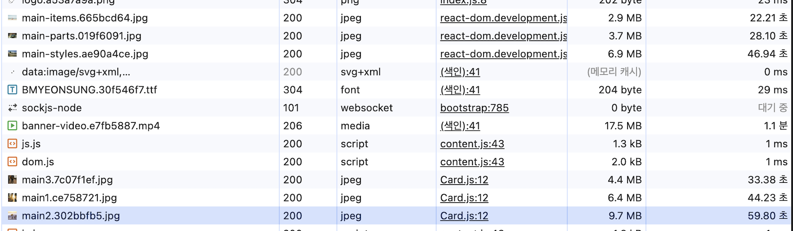

- 이미지 최적화 후
  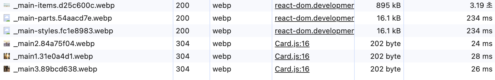

## **3-3) 동영상 최적화**

### 동영상 컨텐츠 분석

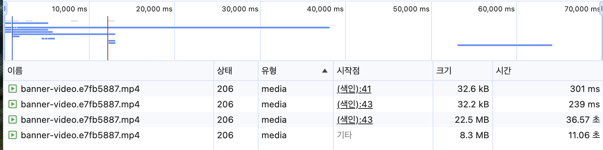
큰 파일 크기(54MB) 때문에 재생이 필요한 앞부분을 먼저 다운로드 한 뒤 -> 순차적으로 다음 내용 다운로드

### 동영상 압축

> 동영상 압축은 동영상 화질이 낮아지기 때문에 영상이 메인 콘텐츠인 서비스에서는 주의해서 사용해야 함.

<br/>

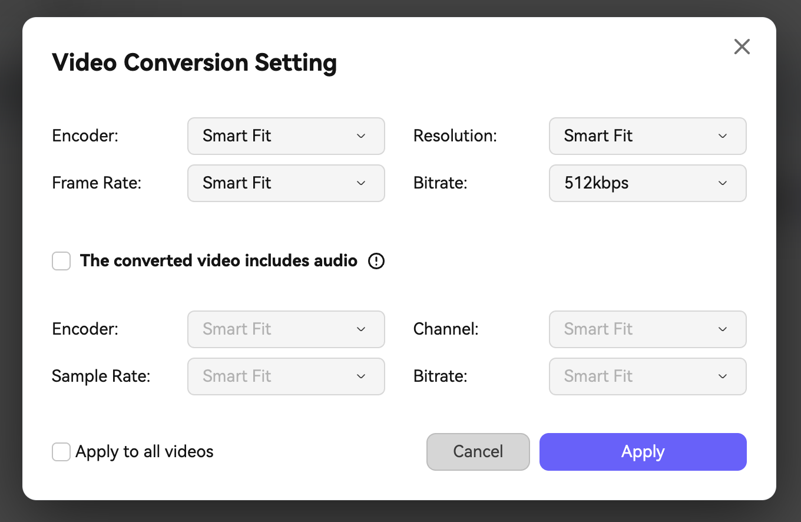
[Media.io](https://www.media.io/) 사이트에서 **Bitrate 512Kbps, Audio 체크 해제** 후 동영상 압축 (12MB로 압축)

### 압축된 동영상 적용

브라우저 호환성을 위해 `video` 태그 사용

```js
<video
  src={video}
  className="absolute translateX--1/2 h-screen max-w-none min-w-screen -z-1 bg-black min-w-full min-h-screen"
  autoPlay
  loop
  muted
>
  <source src={video_webm} type="video/webm" />
  <source src={video} type="video/mp4" />
</video>
```

### 최적화 결과

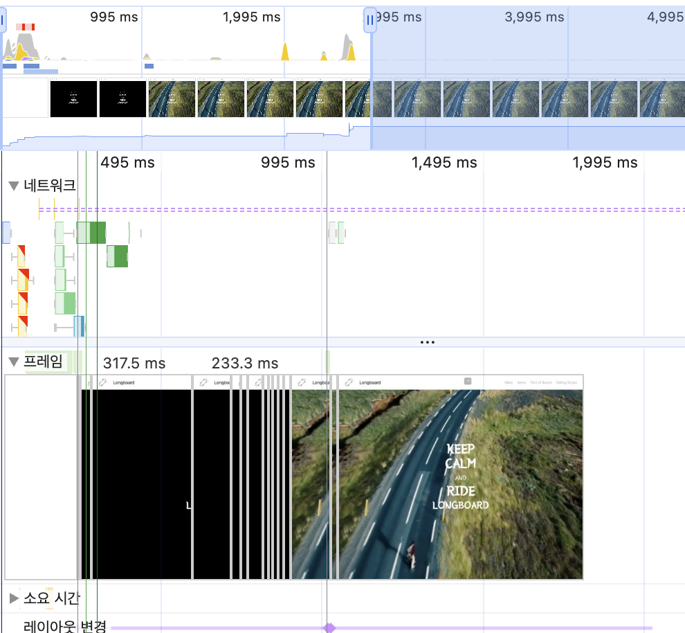
끊김 없이 영상이 빠르게 로드되어 재생 되고 있음.

### 팁

동영상 압축 시에 저하된 화질을 보완하기 위해 패턴과 필터를 이용하면 보완할 수 있음.

ex : blur, 디블로킹 필터, 샤프닝 필터, 노이즈 제거 ..

## **3-4) 폰트 최적화**

### 문제 상황

> Network > throttle > 3G 설정

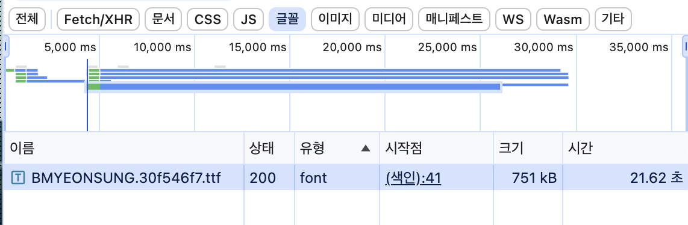
페이지가 로드되고 대략 21초가 지난 후에 폰트가 적용 되었음.

### FOUT, FOIT

- **FOUT**(Flash of Unstyled Text)
  - 폰트 다운로드 여부와 상관 없이 기본 시스템 폰트가 먼저 보였다가 웹폰트가 다운로드 되면 폰트를 적용하는 방식 (브라우저에서 폰트를 로드)
- **FOIT**(Flash of Invisible Text)
  - 폰트가 완전히 다운로드되기 전까지 텍스트를 보여주지 않다가 다운로드가 완료되면 폰트가 적용된 텍스트를 띄움 (크롬, 사파리 등에서 폰트를 로드)

<br/>

현재 서비스는 3초만 기다리는 FOIT이기 때문에 3초 동안 폰트가 다운로드 되기를 기다리다가 3초가 지나도 다운로드 되지 않으면 시스템 기본 폰트로 텍스트를 띄움. 폰트가 다운로드 완료 되면 해당 폰트를 적용함. 폰트를 최적화 하여 폰트 적용시 발생하는 깜박임 현상을 최소화 하는 것이 중요함.

### 폰트 최적화 방법

#### 1) 폰트 적용 시점 제어

- font-display 속성을 사용하여 폰트 적용 시점 제어

> ##### 🎨 `font-display` 속성
>
> | 옵션       | 설명                                                 | 렌더링 동작                           | 사용자 경험                 |
> | ---------- | ---------------------------------------------------- | ------------------------------------- | --------------------------- |
> | `auto`     | 브라우저 기본 동작                                   | 브라우저마다 다름 (보통 FOIT 발생)    | ❓ 예측 불가, 권장되지 않음 |
> | `block`    | 최대 3초 동안 웹폰트 기다림. 이후 fallback 폰트 표시 | 텍스트 **숨김** 상태 (FOIT 발생)      | ❌ 텍스트 지연 노출         |
> | `swap`     | fallback 폰트 **즉시 표시**, 웹폰트 도착 시 교체     | 텍스트 **바로 보임 → 웹폰트로 전환**  | ✅ 사용자에게 빠른 피드백   |
> | `fallback` | 0.1초 fallback 사용 후 웹폰트 로드되면 교체          | 빠르게 fallback 사용 후 교체 시도     | ✅ 빠름, 깜빡임 거의 없음   |
> | `optional` | 느린 네트워크에서는 웹폰트 로드 생략 가능            | 조건부 로딩 (사용자 환경에 따라 다름) | ✅ 성능 최우선 환경에 적합  |
>
> ---
>
> - `fallback`, `optional` 속성은 FOIT보다는 FOUT에 가까운 방식이며,
>   텍스트가 숨겨지는 시간은 매우 짧고 (약 100ms 이하), 이후에는 fallback 폰트가 표시됨.
>
> - `fallback`: 웹폰트 다운로드가 **3초를 초과**해도 도착하지 않으면 폰트를 **적용하지 않고
>   캐시**만 수행
> - `optional`: 네트워크 환경이 느리거나 절전 모드일 경우, **웹폰트 자체를 로드하지 않음**

<br/>

```css
@font-face {
  font-family: BMYEONSUNG;
  src: url("./assets/fonts/BMYEONSUNG.ttf");
  font-display: fallback;
}
```

---

`block` 속성을 사용하면 사용자 경험상 어색할 수 있기 때문에 fade-in 애니메이션으로 해결.
폰트 다운로드가 완료되면 페이드인 효과 + 폰트가 적용된 텍스트를 보여주어야 함.
`fontfaceobserver` 라이브러리를 통해 폰트 다운로드 시점을 알 수 있음.

```bash
npm install --save fontfaceobserver
```

```js
import React, { useEffect } from 'react'
import video from '../assets/banner-video.mp4'
import video_webm from '../assets/_banner-video.webm'
import FontFaceObserver from 'fontfaceobserver'

const font = new FontFaceObserver('BMYEONSUNG');

function BannerVideo() {

	useEffect(() => {
		font.load(null, 20000).then(function () {
			console.log('font loaded');
		})
	}, []);
```

new 연산자를 사용하여 인스턴스 생성. load 메소드를 통해 폰트 다운로드 시점을 알 수 있음.
테스트 문자열, 타임아웃 값을 인자로 받고 Promise 객체 반환. 지정 시간 내에 폰트가 다운로드되지 않으면 Promise에서 에러 발생.

<br />

```js
import React, { useEffect, useState } from "react";
import video from "../assets/banner-video.mp4";
import video_webm from "../assets/_banner-video.webm";
import FontFaceObserver from "fontfaceobserver";

const font = new FontFaceObserver("BMYEONSUNG");

function BannerVideo() {
  const [isFontLoaded, setIsFontLoaded] = useState(false);
  useEffect(() => {
    font.load(null, 20000).then(function () {
      console.log("font loaded");
      setIsFontLoaded(true);
    });
  }, []);

  return (
    <div className="BannerVideo w-full h-screen overflow-hidden relative bg-texture">
      <div className="absolute h-screen w-full left-1/2">
        <video
          src={video}
          className="absolute translateX--1/2 h-screen max-w-none min-w-screen -z-1 bg-black min-w-full min-h-screen"
          autoPlay
          loop
          muted
        >
          <source src={video_webm} type="video/webm" />
          <source src={video} type="video/mp4" />
        </video>
      </div>
      <div
        className="w-full h-full flex justify-center items-center"
        style={{ opacity: isFontLoaded ? 1 : 0, transition: "opacity 0.3s" }}
      >
        <div className="text-white text-center">
          <div className="text-6xl leading-none font-semibold">KEEP</div>
          <div className="text-6xl leading-none font-semibold">CALM</div>
          <div className="text-3xl leading-loose">AND</div>
          <div className="text-6xl leading-none font-semibold">RIDE</div>
          <div className="text-5xl leading-tight font-semibold">LONGBOARD</div>
        </div>
      </div>
    </div>
  );
}

export default BannerVideo;
```

배너 텍스트의 opacity를 폰트 로드 상태에 따라 0 -> 1로 바꾸고, trasition 속성을 설정하여 폰트가 로드될 때 애니메이션 효과를 주었음.

#### 2) 폰트 파일 크기 줄이기

1. 폰트 포맷 변경하기
   - 파일 크기 : EOT > TTF/OTF > WOFF > WOFF2
   - 🔺 WOFF, WOFF2는 버전이 낮은 브라우저에서 포맷을 지원하지 않을 수 있음. WOFF2를 우선 적용하고 브라우저가 WOFF2를 지원하지 않으면 WOFF, WOFF를 지원하지 않으면 TTF를 적용

| 브라우저                 | TTF / OTF | WOFF | WOFF2       |
| ------------------------ | --------- | ---- | ----------- |
| **Chrome**               | ✅        | ✅   | ✅          |
| **Firefox**              | ✅        | ✅   | ✅          |
| **Safari**               | ✅        | ✅   | ✅ _(v10+)_ |
| **Edge (Chromium)**      | ✅        | ✅   | ✅          |
| **Internet Explorer 11** | ✅        | ✅   | ❌          |

<br />

[Transfonter](https://transfonter.org/) 서비스를 이용하여 TTF -> WOFF/WOFF2로 변환.

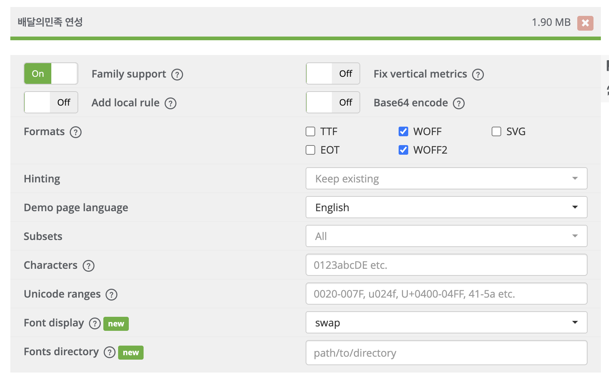
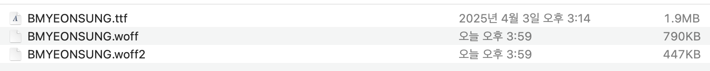
파일 크기가 줄어들었음.

<br/>

```css
@font-face {
  font-family: BMYEONSUNG;
  src: url("./assets/fonts/BMYEONSUNG.woff2") format("woff2"), url("./assets/fonts/BMYEONSUNG.woff")
      format("woff"), url("./assets/fonts/BMYEONSUNG.ttf") format("truetype");
  font-display: block;
}
```

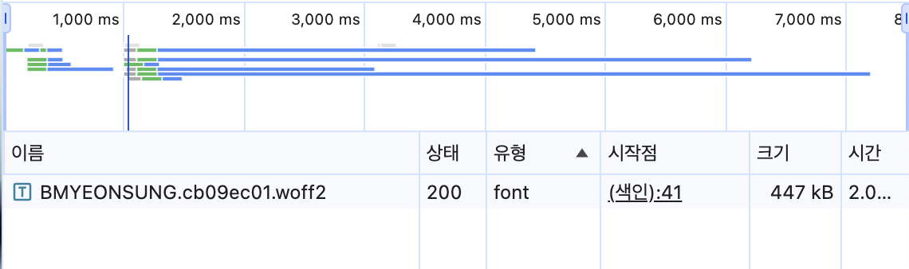
최적화 시킨 WOFF2 포맷의 폰트가 로드되고 있음.

2. 서브셋 폰트 사용

서비스에서 웹 폰트를 사용하는 곳이 배너 영역밖에 없기 때문에 모든 문자의 폰트 정보를 가지고 있을 필요 없이 해당 문자의 폰트 정보만 가지고 있으면 됨. (`서브셋 폰트`)

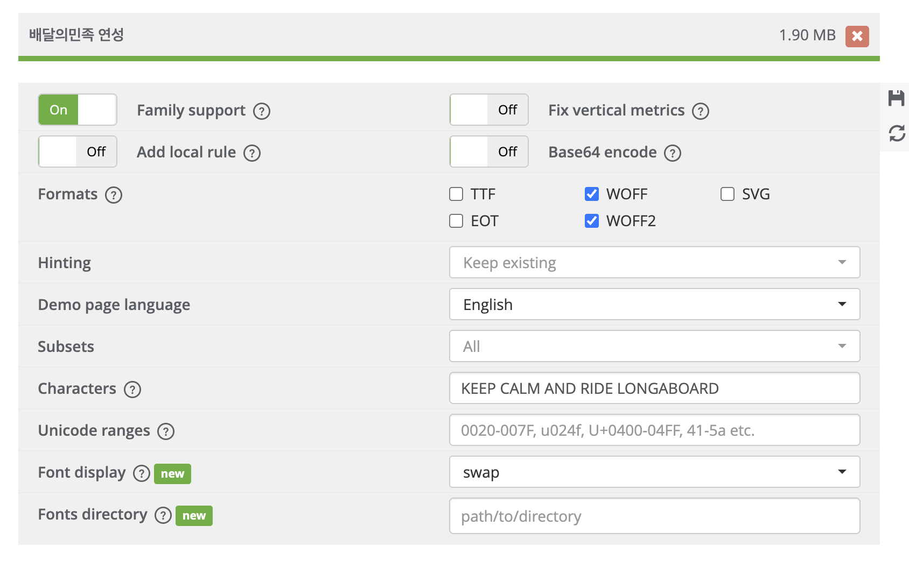
폰트 포맷 시, Characters에 'KEEP CALM AND RIDE LONGABOARD' 를 넣으면 해당 문자에 대한 서브셋 폰트를 생성함.

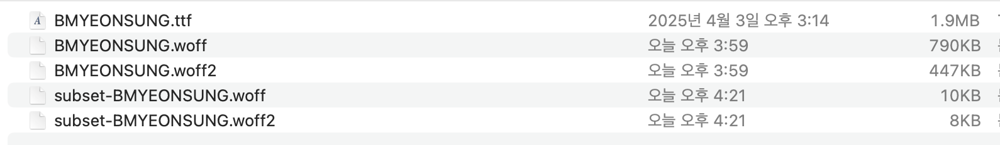
일부 영문자를 제외했기 때문에 파일 크기가 매우 작아짐.

```css
@font-face {
  font-family: BMYEONSUNG;
  src: url("./assets/fonts/subset-BMYEONSUNG.woff2") format("woff2"), url("./assets/fonts/subset-BMYEONSUNG.woff")
      format("woff"),
    url("./assets/fonts/subset-BMYEONSUNG.ttf") format("truetype");
  font-display: block;
}
```

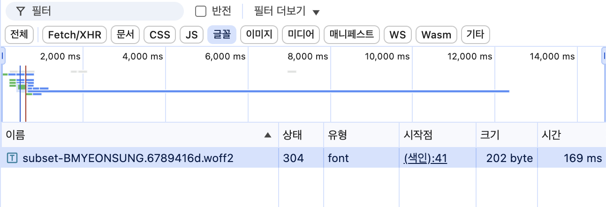
폰트가 매우 빠르게 로드 되었음.

`Data URI` : 리소스(예: 폰트, 이미지 등)를 **문자열 형태(Base64 등)**로 변환하여 HTML이나 CSS에 **인라인으로 삽입**

특징

- `data:` 스킴을 접두어로 사용하여 리소스를 인코딩된 문자열로 표현
- 별도의 네트워크 로드 없이도 폰트를 사용할 수 있음.

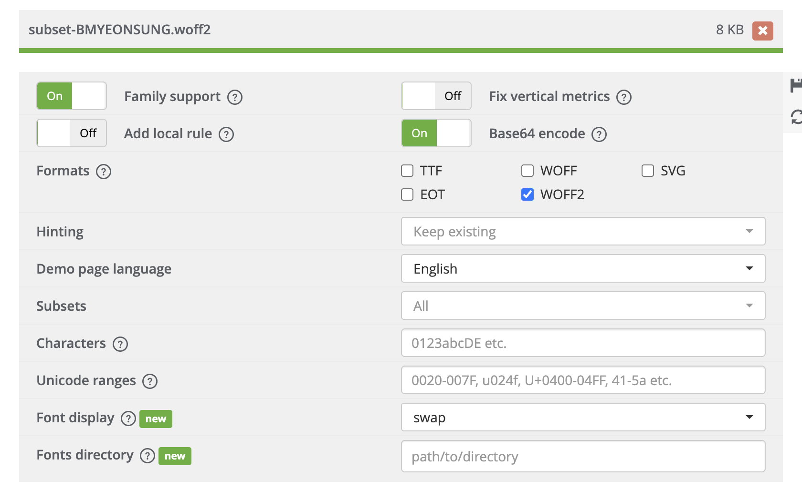
Base64 encode 모드로 Data-URI 형태로 폰트 추출하고 해당 파일의 stylesheet.css 파일에서 src 경로 복사.

```css
@font-face {
  font-family: BMYEONSUNG;
    src: url('data:font/woff2;charset=utf-8;base64,d09GMgABAAAAAB9gAA0AAA.....')
```


기본적으로 브라우저에서 Data-URI를 네트워크 트래픽으로 인식하지만 실제로 이미 다른 파일 내부에 임베드되어 있어서 별도 다운로드 시간이 필요하지 않음.

> ### 🤔 <br/>
>
> 실제 폰트 내용은 App.css 에 포함되어 있기 때문에 css 파일의 다운로드 속도도 고려해야 함. 매우 큰 파일을 Data-URI 형태로 포함한다면 포함한 파일 크기가 커져 또 다른 병목을 발생시킬 수 있기 때문에 충분히 고려하여 사용해야 함.

## **3-5) 캐시 최적화**

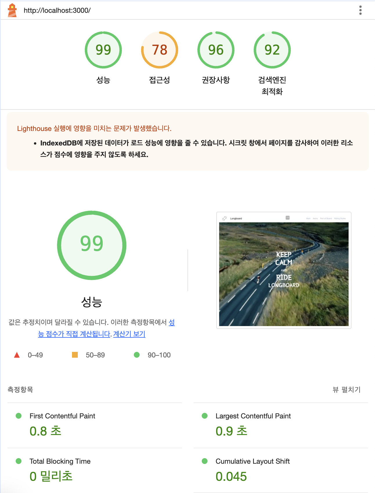
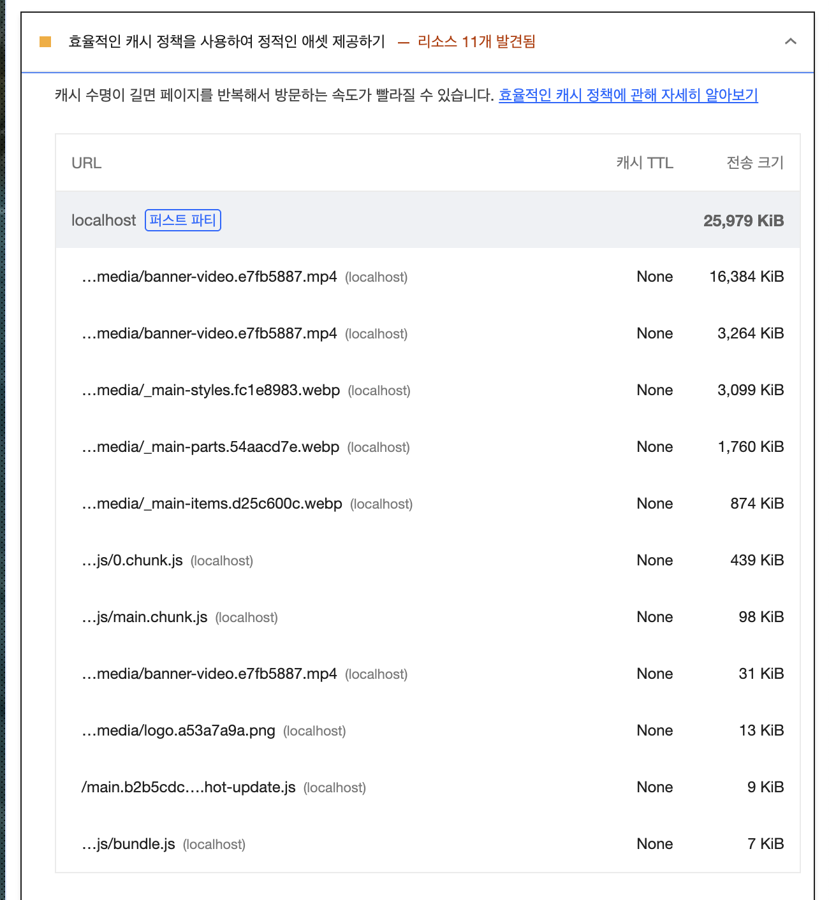
현재 페이지의 Lighthouse를 검사해보면 점수는 높지만 두번째 사진과 같이 네트워크를 통해 다운로드 하는 리소스에 캐시를 적용하라는 제안이 있음.

### 캐시란?

자주 사용하는 데이터나 값을 임시로 저장해두는 공간, 또는 그 저장 행위를 의미함.
웹에서는 자주 사용하는 리소스를 매번 네트워크를 통해 불러오는 대신, 최초 한 번만 다운로드하여 캐시에 저장하고, 이후에는 저장된 리소스를 재사용함으로써 성능을 향상시킴.

💡 실제 Network 패널에서 리소스를 확인해보면, 응답 헤더에 캐시 관련 설정이 누락되어 있는 경우가 많음.

### 캐시의 종류

- `메모리 캐시`
  - 브라우저가 리소스를 RAM에 직접 저장해두는 방식.
  - 접근 속도가 빠름. (페이지를 재방문 하거나, 뒤로가기로 되돌아왔을 때 즉시 로딩 가능)
  - 브라우저를 종료하면 사라짐. (휘발성)
- `디스크 캐시`
  - 리소스를 파일 형태로 디스크에 저장함.
  - 접근 속도는 메모리 캐시에 비해 느림.
  - 이미지 폰트, JS, CSS 가 주로 디스크 캐시에 저장.

### Cache-Control

리소스 응답 헤더에 설정되는 헤더. 브라우저나 중간 캐시 서버(프록시 등)가 리소스를 어떻게 캐싱해야 할지 제어함. 리소스마다 캐시 정책을 달리 설정해서, 필요한 리소스는 오래 저장하고 자주 바뀌는 리소스는 새로 받아오게 만들 수 있음.

| 디렉티브          | 설명                                                                 |
| ----------------- | -------------------------------------------------------------------- |
| `no-cache`        | 캐시에 저장은 되지만, 매 요청마다 서버에 유효성 검사 요청함          |
| `no-store`        | 캐시에 **아예 저장하지 않음**, 민감한 정보에 사용                    |
| `public`          | 모든 환경에서 캐시 사용 가능                                         |
| `private`         | **개인 브라우저 캐시**에만 저장, 외부 캐시 서버에서 사용 불가        |
| `max-age=초`      | 캐시 유효 시간                                                       |
| `s-maxage=초`     | `max-age`와 유사하지만 **공용 캐시 서버에만 적용** (브라우저는 무시) |
| `must-revalidate` | 캐시가 만료되면 **반드시 서버 확인 후 사용**                         |

### 캐시 적용

```bash
npm run build
npm run serve
```

프로젝트 빌드 후 실행 (http://localhost:5001)

```js
const header = {
  setHeaders: (res, path) => {
    res.setHeader("Cache-Control", "max-age=10");
  },
};
```

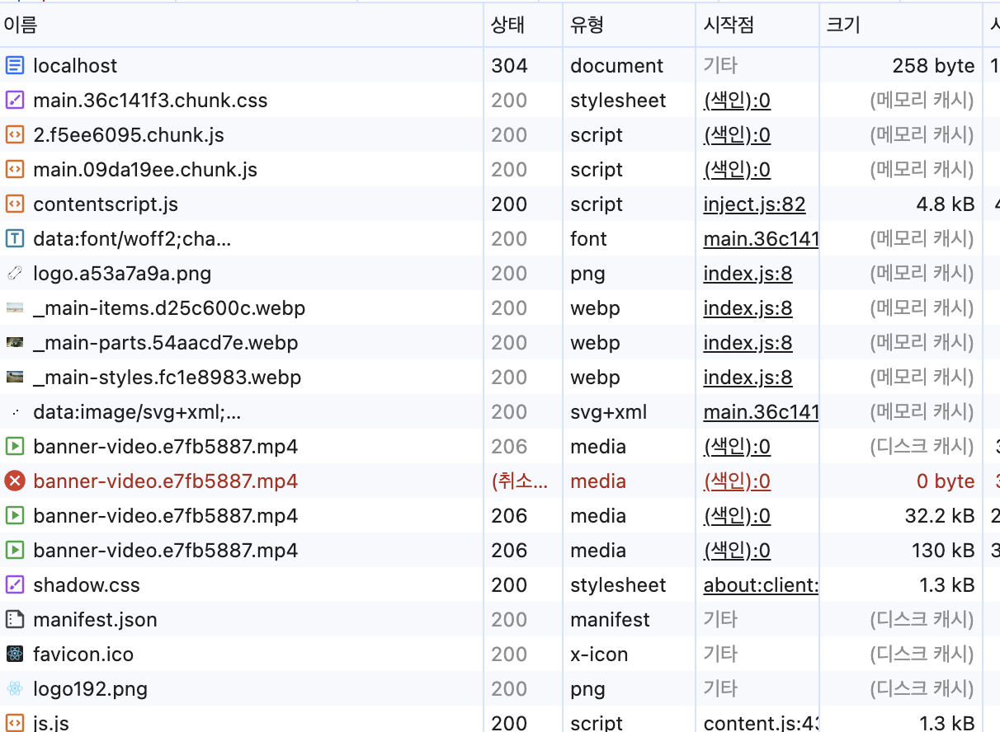
홈페이지에서 사용하는 리소스들이 캐시되어 있음.

캐시 유효 시간이 만료되는 경우에 <br/>
-> 브라우저는 **기존 캐시된 리소스를 그대로 사용**할지 <br/>
-> **새로 다운로드** 해야할지 서버에 확인

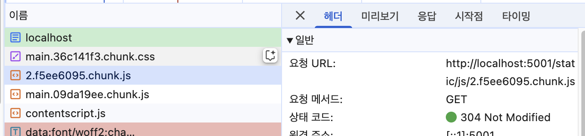
서비스의 각 리소스가 변경되지 않아서 브라우저에 캐시된 리소스를 그대로 사용하여도 상관 없음.
서버는 변경되지 않았다는 의미의 `304 Not Modified` 응답 코드를 보냄.

> ### 💭 캐시된 리소스와 서버의 최신 리소스의 동일 여부 판단 방법
>
> 서버에서는 캐시된 리소스의 응답 헤더에 있는 Etag 값과 서버에 있는 최신 리소스의 Etag 값을 비교하여 최신 리소스인지 판단.
> 만약 서버의 리소스가 최신 리소스라면, 새로운 Etag 값과 함께 최신 리소스를 브라우저에 전송함.

### 적절한 캐시 유효 시간

[ 일반적인 HTML 파일 ]

- 항상 최신 버전의 웹 서비스를 제공하기 위해 `no cache` 설정 적용
- HTML이 캐시되면 이전 버전의 JS나 CSS를 로드하기 때문에 캐시 시간 동안 최신 버전을 제공하지 못 함
- 최신 버전을 제공하면서, 변경 사항이 없을 때만 캐시를 사용

[ JavaScript, CSS ]

- 파일명에 해시 값을 가지고 있음. 코드가 변경되면 해시도 변경되어서 새로운 파일이 되어버림.
- 캐시를 오래 적용해도 HTML만 최신 상태라면 JS와 CSS는 최신 리소스를 로드함

_**리소스 별로 캐시를 다르게 적용하는 것이 중요함**_

```js
const header = {
  setHeaders: (res, path) => {
    if (path.includes("html")) {
      res.setHeader("Cache-Control", "no-cache");
    } else if (
      path.endsWith(".js") ||
      path.endsWith(".css") ||
      path.endsWith(".webp")
    ) {
      res.setHeader("Cache-Control", "max-age=31536000");
    } else {
      res.setHeader("Cache-Control", "no-store");
    }
  },
};
```

- HTML : no-cache
- JS, CSS, WebP : 캐시 적용
- 그 외 : no-store

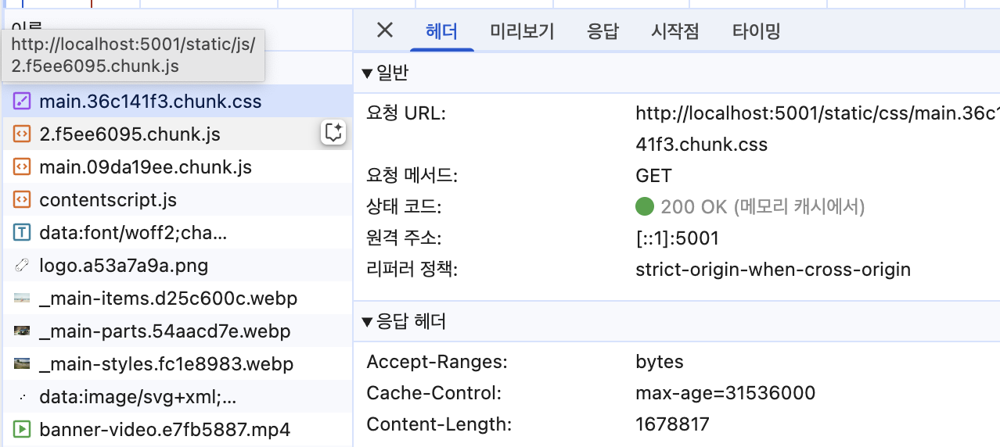

## **3-6) 불필요한 CSS 제거**

`npm run serve` 스크립트로 실행한 서비스의 Lighthouse 검사 결과는 아래와 같음.
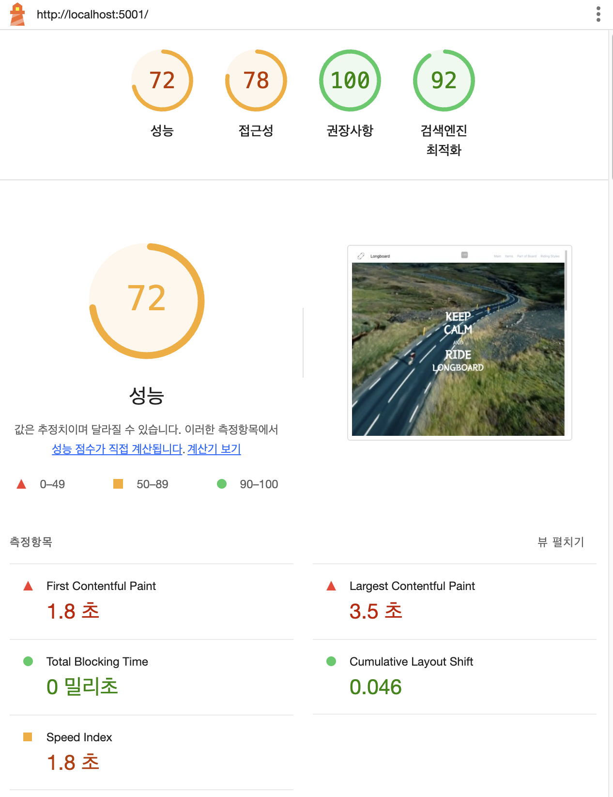
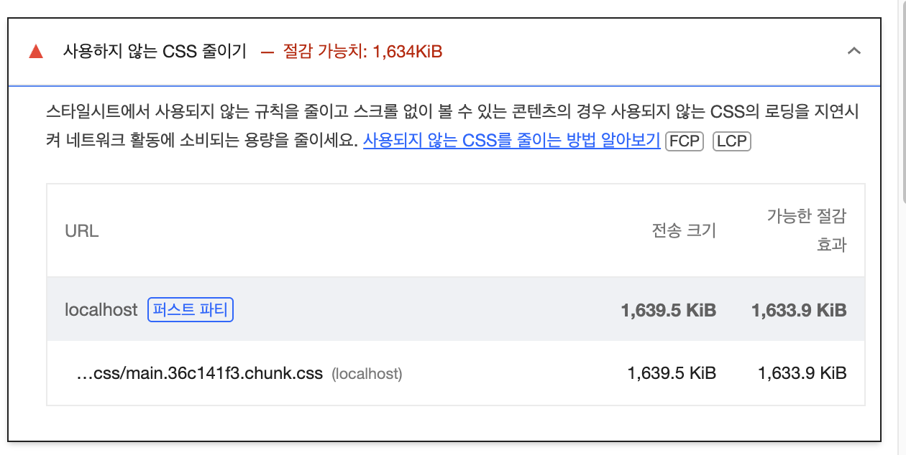

페이지에서 사용되지 않는 자바스크립트 및 CSS 리소스가 존재함.
More tools > Coverage 패널을 활용하면, 각 리소스 중 실제로 실행되는 코드의 비율을 확인할 수 있음.

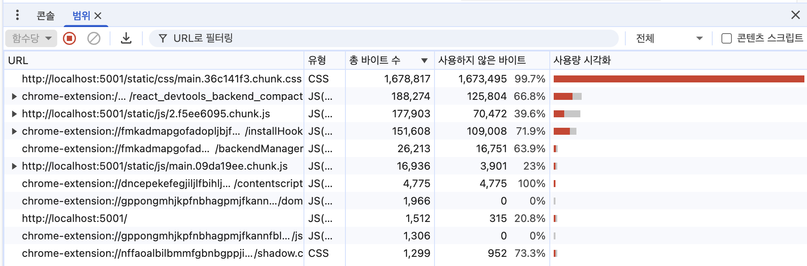

JavaScript는 조건 분기 코드가 많아, 초기에는 실행되지 않다가도 특정 동작에 의해 나중에 실행되는 경우가 많음.
따라서 JavaScript 코드의 커버리지는 이런 특성을 감안해서 해석해야 함.

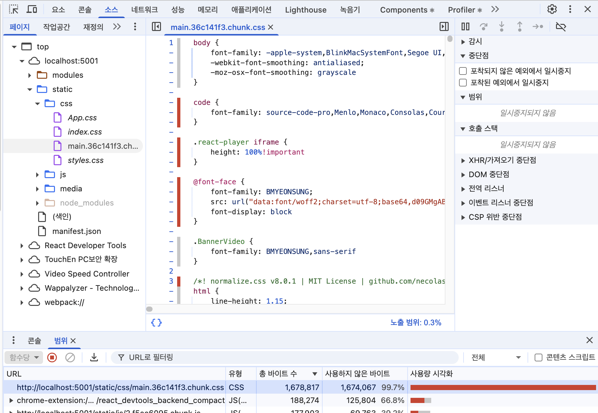(빨강 - 아직 실행되지 않음. 회색 - 이미 실행되어 적용되었음.)

해당 소스를 클릭하면 실제로 적용된 CSS 코드를 볼 수 있음. 현재 많은 유틸리티 클래스들이 실제로 적용되지 않았음.

이는 Tailwind CSS 라이브러리에서 미리 제공하는 유틸 클래스들 때문인데,
개발 단계에서는 빠르게 스타일을 적용할 수 있어 유용하지만,
빌드 시 사용하지 않는 클래스까지 포함되면서 CSS 파일 크기가 불필요하게 커지는 문제가 발생함. <br/>

### PurgeCSS

[PurgeCSS](https://purgecss.com/)는 파일에 들어 있는 모든 키워드를 추출하여 해당 키워드를 이름으로 갖는 CSS 파일만 보존하고 나머지 매칭되지 않은 클래스는 모두 지우는 방식으로 CSS를 최적화 함.

```bash
npm install --save-dev purgecss
```

키워드를 추출하고자 하는 파일과 불필요한 클래스를 제거할 CSS 파일을 지정.

```bash
npx purgecss --css ./build/static/css/*.css --output ./build/static/css/ --content ./build/index.html ./build/static/js/*.js
```

`-css` 로 불필요한 클래스를 제거할 CSS 파일 선택

`--output` 을 통해 동일한 위치를 지정함으로써 기존 파일 덮어 씌움

`--content` 를 통해 빌드된 HTML과 JS 파일의 텍스트 키워드를 추출하여 빌드된 CSS 파일의 클래스와 비교하여 최적화 함

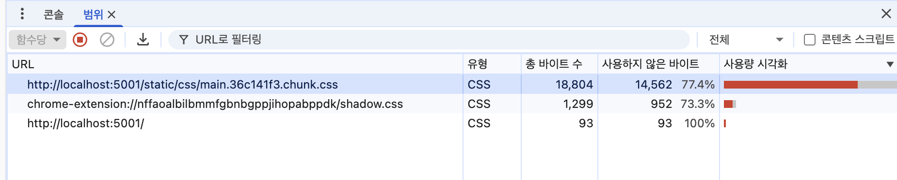
서비스 재시작 후, 다시 Coverage 탭을 살펴보면 CSS 파일 사이즈와 사용되지 않은 코드의 비율이 줄어들었음.

하지만 서비스를 살펴보면 PurgeCSS가 텍스트 키워드를 추출할 때 콜론 문자를 인식하지 못 하고 자르게 되어 일부 스타일이 적용되지 않았음. PurgeCSS의 defaultExtractor 옵션을 통해 키워드를 어떤 기준으로 추출할지 정의함.

purgecss.config.js

```js
module.exports = {
  defaultExtractor: (content) => {
    return content.match(/[\w\:\-]+/g) || [];
  },
};
```

대상 파일의 전체 코드를 넘겨 받고 문자열 배열을 반환함. match 메서드를 통해 정규식에 만족하는 키워드를 배열형태로 추출함.

```bash
npx purgecss --css ./build/static/css/*.css --output ./build/static/css/ --content ./build/index.html ./build/static/js/*.js --config ./purgecss.config.js
```
