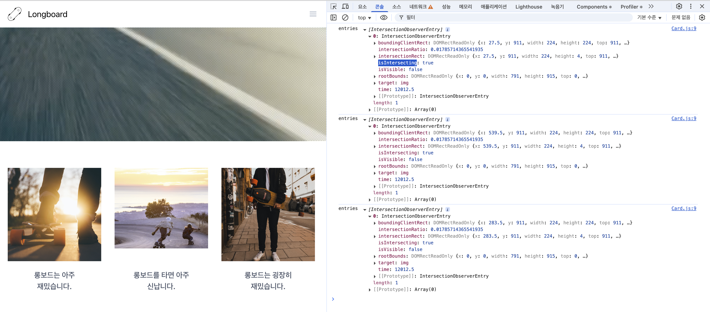
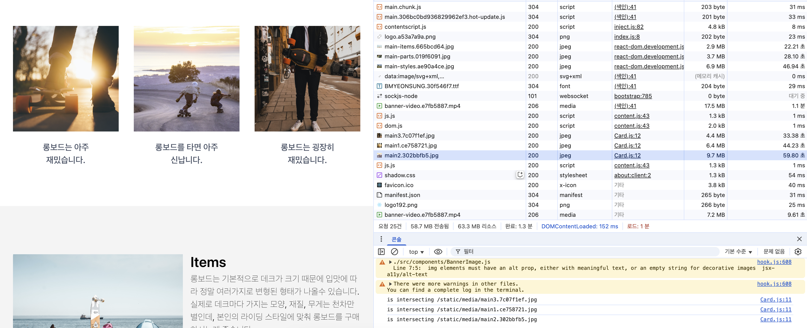

# 3️⃣ 홈페이지 최적화

## **3-1) 서비스 실행**

```bash
npm install
npm run start
```

> Node.js의 버전 문제로 `export NODE_OPTIONS=--openssl-legacy-provider`임시 환경 변수를 설정하여 실행하였습니다.

```bash
npm run server
```

## **3-2) 이미지 지연 로딩**

### 네트워크 분석

> throttling > Add.. > Network Throttling Profiles > Add Custom.. > **6000kb/s**로 다운로드/업로드 속도 설정

🚨 사용자에게 처음으로 보여지는 banner-video 콘텐츠가 가장 나중에 로드 되고 있음.

✅ 지연로드 : 당장 사용되지 않는 이미지를 나중에 다운로드되도록 하기.

- 이미지 로드 시점 :
  - 이미지가 화면에 보이는 순간 / 이미지가 화면에 보여지기 직전
  - == 뷰포트에 이미지가 표시될 위치까지 **스크롤**되었을 때 판단

### Intersection Observer

```js
window.addEventListener("scroll", () => console.log("스크롤 이벤트!"));
```

를 콘솔창에 실행하면 스크롤이 이동하는 중에 해당 이벤트가 계속 발생하기 때문에 많은 로그가 찍히고 복잡한 로직이 추가된다면 메인 스레드에 무리가 갈 수 있는 문제가 있음.

`Inetersection Observer` 는 웹 페이지의 특정 요소를 관찰하면 페이지 스크롤시, 해당 요소가 화면에 들어왔는지 여부를 알려줌. (화면에 해당 요소가 들어왔을 때만 함수 호출)

- 비동기적으로 실행
- reflow를 발생시키지 않음

```js
const options = {
  root: null, // 대상 객체의 가시성을 확인할 때 사용하는 뷰포트 요소
  rootMargin: "0px", // root 요소의 여백
  threshold: 1.0, // 가시성 퍼센티지 : 1.0 - 모두 보이는 경우, 0 - 1px이라도 보이는 경우
};

// 가시성이 변경될 때마다 실행되는 함수
const callback = (entries, observer) => {
  console.log("Entries", entries);
};

// Intersection Observer 객체 생성 (가시성이 변할 때마다 콜백 실행)
const observer = new IntersectionObserver(callback, options);

observer.observe(document.querySelector("#target-element1"));
observer.observe(document.querySelector("#target-element2"));
```

### Intersection Observer 적용하기

```js
import React, { useRef, useEffect } from "react";

function Card(props) {
  const imgRef = useRef(null);

  useEffect(() => {
    const options = {};
    const callback = (entries, observer) => {
      console.log("entries", entries);
    };
    const observer = new IntersectionObserver(callback, options);
    observer.observe(imgRef.current);

    return () => observer.disconnect();
  }, []);

  return (
    <div className="Card text-center">
      
      <div className="p-5 font-semibold text-gray-700 text-xl md:text-lg lg:text-xl keep-all">
        {props.children}
      </div>
    </div>
  );
}

export default Card;
```

Card 컴포넌트에서 img 컴포넌트 관찰



> #### Intersection Observer 속성
>
> - boundingClientRect :
>   관찰 대상 요소의 뷰포트 내 위치, 크기 정보 사각형 객체
>   == `element.getBoundingClientRect()`
> - intersectionRect :
>   요소와 root가 실제로 겹치는 부분의 영역 정보
> - intersectionRatio :
>   요소가 root와 얼마나 겹쳤는지를 나타내는 비율 (0 ~ 1) 값
> - **`isIntersecting`** :
>   해당 요소가 root 영역(뷰포트)에 들어온 경우 true, 그렇지 않으면 false
> - isVisible :
>   해당 요소가 실제로 사용자에게 보이는지 여부
> - rootBounds :
>   IntersectionObserver에서 설정한 root 요소의 크기와 위치 정보
> - target :
>   observe()로 등록한 **관찰 대상 요소 (DOM 요소)**
> - time :
>   교차 상태가 바뀐 시간

---

콜백이 실행되는 순간(화면에 이미지가 보이는 순간)에 이미지를 로드해야함.

이미지 로딩은 img 태그에 src 값이 할당 되는 순간 발생함.

최초에 src 값을 할당 하지 않고 `콜백이 실행 되는 순간에 src 를 할당`하여 지연로딩 적용.

```js
import React, { useRef, useEffect } from "react";

function Card(props) {
  const imgRef = useRef(null);

  useEffect(() => {
    const options = {};
    const callback = (entries, observer) => {
      entries.forEach((entry) => {
        if (entry.isIntersecting) {
          console.log("is intersecting", entry.target.dataset.src);
          entry.target.src = entry.target.dataset.src;
          observer.unobserve(entry.target);
        }
      });
    };

    const observer = new IntersectionObserver(callback, options);
    observer.observe(imgRef.current);

    return () => observer.disconnect();
  }, []);

  return (
    <div className="Card text-center">
      
      <div className="p-5 font-semibold text-gray-700 text-xl md:text-lg lg:text-xl keep-all">
        {props.children}
      </div>
    </div>
  );
}

export default Card;
```

- img 의 src 이미지 주소를 data-src에 넣었기 때문에 값이 할당 되지 않고 **나중에 이미지가 뷰포트에 들어왔을 때, data-src 의 값을 src로 옮겨 이미지를 로드**함
- 콜백 함수에서 `isIntersecting 이 true 인 경우`에 이미지의 src에 dataset.src 값을 넣음
- `observer.unobserve(entry.target)` 를 통해 이미지가 로드 되면 다시 호출할 필요가 없기 때문에 해당 요소의 observe를 해제함

### 이미지 지연 로딩 결과



- 최초 페이지 로딩 시에 이미지 3개가 로드 되지 않다가 스크롤이 해당 이미지가 보여지는 영역에 도달하면 로그와 함께 이미지를 지연 로딩 하고 있음.
- 최초 페이지 로딩 때 사용하지 않는 이미지를 지연 로딩 처리하여 최초 로딩 시 필요한 우선순위가 높은 콘텐츠의 로딩을 방해하지 않음.

### 메인 페이지 이미지 지연 로딩 처리

```js
import React from "react";
import BannerVideo from "../components/BannerVideo";
import ThreeColumns from "../components/ThreeColumns";
import TwoColumns from "../components/TwoColumns";
import Card from "../components/Card";
import Meta from "../components/Meta";
import main1 from "../assets/main1.jpg";
import main2 from "../assets/main2.jpg";
import main3 from "../assets/main3.jpg";
import main_items from "../assets/main-items.jpg";
import main_parts from "../assets/main-parts.jpg";
import main_styles from "../assets/main-styles.jpg";

function MainPage(props) {
  const img1 = useRef(null);
  const img2 = useRef(null);
  const img3 = useRef(null);

  useEffect(() => {
    const options = {};
    const callback = (entries, observer) => {
      entries.forEach((entry) => {
        if (entry.isIntersecting) {
          console.log("is intersecting", entry.target.dataset.src);
          entry.target.src = entry.target.dataset.src;
          observer.unobserve(entry.target);
        }
      });
    };

    let observer = new IntersectionObserver(callback, options);
    observer.observe(img1.current);
    observer.observe(img2.current);
    observer.observe(img3.current);

    return () => observer.disconnect();
  }, []);

  return (
    <div className="MainPage -mt-16">
      <BannerVideo />
      <div className="mx-auto">
        <ThreeColumns
          columns={[
            <Card image={main1}>롱보드는 아주 재밌습니다.</Card>,
            <Card image={main2}>롱보드를 타면 아주 신납니다.</Card>,
            <Card image={main3}>롱보드는 굉장히 재밌습니다.</Card>,
          ]}
        />
        <TwoColumns
          bgColor={"#f4f4f4"}
          columns={[
            ,
            <Meta
              title={"Items"}
              content={
                "롱보드는 기본적으로 데크가 크기 때문에 입맛에 따라 정말 여러가지로 변형된 형태가 나올수 있습니다. 실제로 데크마다 가지는 모양, 재질, 무게는 천차만별인데, 본인의 라이딩 스타일에 맞춰 롱보드를 구매하시는게 좋습니다."
              }
              btnLink={"/items"}
            />,
          ]}
        />
        <TwoColumns
          bgColor={"#fafafa"}
          columns={[
            <Meta
              title={"Parts of Longboard"}
              content={
                "롱보드는 데크, 트럭, 휠, 킹핀, 베어링 등 여러 부품들로 구성됩니다. 롱보드를 타다보면 조금씩 고장나는 부품이 있기 마련인데, 이럴때를 위해 롱보들의 부품들에 대해서 알고 있으면 큰 도움이 됩니다."
              }
              btnLink={"/part"}
            />,
            ,
          ]}
          mobileReverse={true}
        />
        <TwoColumns
          bgColor={"#f4f4f4"}
          columns={[
            ,
            <Meta
              title={"Riding Styles"}
              content={
                "롱보드 라이딩 스타일에는 크게 프리스타일, 다운힐, 프리라이딩, 댄싱이 있습니다. 보통 롱보드는 라이딩 스타일에 따라 데크의 모양이 조금씩 달라집니다. 많은 롱보드 매니아들이 각 쓰임새에 맞는 보드들을 소유하고 있습니다."
              }
              btnLink={"/riding-styles"}
            />,
          ]}
        />
      </div>
    </div>
  );
}

export default MainPage;
```
