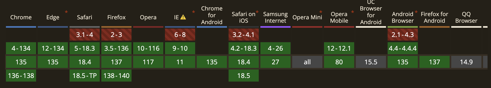
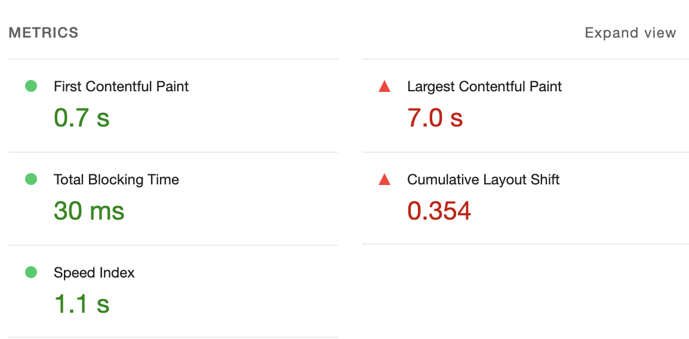
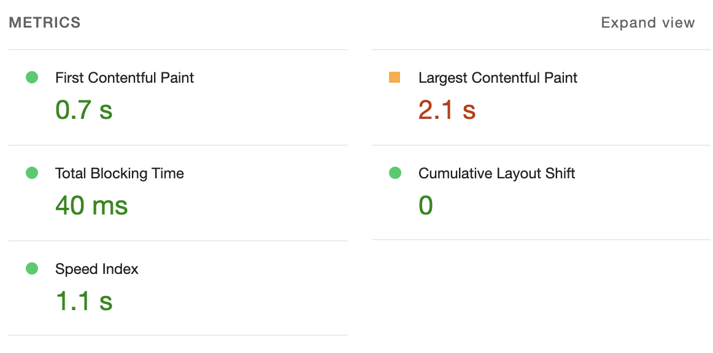

# 4장 이미지 갤러리 최적화

- **이미지 지연 로딩**: 이미지 지연 로딩 라이브러리 사용
- **레이아웃 이동 피하기**
- **리덕스 렌더링 최적화**
- **병목 코드 최적화**: 메모이제이션 적용

## 서비스 실행

### Node.js 버전 설정

> Node.js 버전 호환 문제 해결을 위해 버전 설정 필요합니다.

```bash
nvm install 16
nvm use 16
```

### 서비스 실행

```bash
npm install
npm run start # 프론트엔드 시작
npm run server # 백엔드 시작

# localhost:3000 접속
```

## 레이아웃 이동 피하기

### 레이아웃 이동이란?

CLS: 레이아웃 이동은 위치를 순간적으로 변경시키면서 의도와 다른 클릭을 유발함. 사용자 경험 나쁨.

- 0~1까지의 값: 0 나쁨, 1 좋음

### 레이아웃 이동의 원인

- 사이즈가 미리 정의되지 않은 이미지 요소
- 사이즈가 미리 정의되지 않은 광고 요소
- 동적으로 삽입된 콘텐츠
- 웹 폰트(FOIT, FOUT)

### 레이아웃 이동 해결

💡 핵심: 레이아웃 이동을 일으키는 요소의 사이즈를 지정하자.

#### 이미지 크기를 비율로 설정하는 방법 두가지

1. padding-top 사용

```html
<div class="wrapper">
  
</div>
```

```css
.wrapper {
  position: relative;
  width: 160px;
  padding-top: 56.25%; /* 16:9 비율 */
}

.image {
  position: absolute;
  width: 100%;
  height: 100%;
  top: 0;
  left: 0;
}
```

2. aspect-ratio 사용

```css
.wrapper {
  width: 100%;
  aspect-ratio: 16 / 9;
}

.image {
  width: 100%;
  height: 100%;
}
```

> 호환성 확인: https://caniuse.com/css-aspect-ratio



> LightHouse 결과



> 레이아웃 이동 해결 후(0으로 감소, 즉 레이아웃 이동이 발생하지 않음)



## 이미지 지연 로딩

Intersection Observer API 대신, `react-lazyload` 라이브러리 사용

```bash
npm install react-lazyload
```

```js
import LazyLoad from "react-lazyload";

function Component() {
  return (
    <div>
      <LazyLoad>
        
      </LazyLoad>
    </div>
  );
}
```

**react-lazyload 라이브러리 장점**

- 단순히 이미지뿐만 아니라 일반 컴포넌트도 지연 로드할 수 있다.

photoItem.js 컴포넌트에서 지연 로드 적용

```tsx
import LazyLoad from "react-lazyload";

function PhotoItem({ photo: { urls, alt } }) {
  // 생략

  return (
    <ImageWrap>
      <LazyLoad>
        <Image
          src={urls.small + "&t=" + new Date().getTime()}
          alt={alt}
          onClick={openModal}
        />
      </LazyLoad>
    </ImageWrap>
  );
}
```

기본적으로 지연 로드 적용된 이미지는 화면에 보이지 않을 때 로드되지 않음.

스크롤을 내릴 시, 이미지가 로드되는 것을 확인할 수 있음.

스크롤 내릴 때 미리 이미지를 로드하고 싶다면, `offset` 속성을 사용하면 됨.

```tsx
<LazyLoad offset={100}>
  
</LazyLoad>
```


