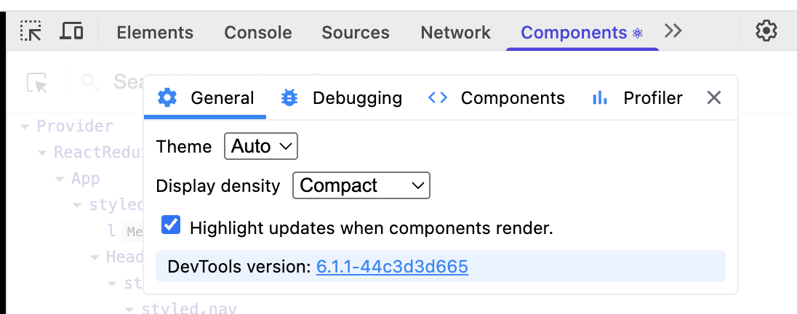

# 4장 이미지 갤러리 최적화

- **이미지 지연 로딩**: 이미지 지연 로딩 라이브러리 사용
- **레이아웃 이동 피하기**
- **리덕스 렌더링 최적화**
- **병목 코드 최적화**: 메모이제이션 적용

## 서비스 실행

### Node.js 버전 설정

> Node.js 버전 호환 문제 해결을 위해 버전 설정 필요합니다.

```bash
nvm install 16
nvm use 16
```

### 서비스 실행

```bash
npm install
npm run start # 프론트엔드 시작
npm run server # 백엔드 시작

# localhost:3000 접속
```

## 레이아웃 이동 피하기

### 레이아웃 이동이란?

CLS: 레이아웃 이동은 위치를 순간적으로 변경시키면서 의도와 다른 클릭을 유발함. 사용자 경험 나쁨.

- 0~1까지의 값: 0 나쁨, 1 좋음

### 레이아웃 이동의 원인

- 사이즈가 미리 정의되지 않은 이미지 요소
- 사이즈가 미리 정의되지 않은 광고 요소
- 동적으로 삽입된 콘텐츠
- 웹 폰트(FOIT, FOUT)

### 레이아웃 이동 해결

💡 핵심: 레이아웃 이동을 일으키는 요소의 사이즈를 지정하자.

#### 이미지 크기를 비율로 설정하는 방법 두가지

1. padding-top 사용

```html
<div class="wrapper">
  
</div>
```

```css
.wrapper {
  position: relative;
  width: 160px;
  padding-top: 56.25%; /* 16:9 비율 */
}

.image {
  position: absolute;
  width: 100%;
  height: 100%;
  top: 0;
  left: 0;
}
```

2. aspect-ratio 사용

```css
.wrapper {
  width: 100%;
  aspect-ratio: 16 / 9;
}

.image {
  width: 100%;
  height: 100%;
}
```

> 호환성 확인: https://caniuse.com/css-aspect-ratio


> LightHouse 결과


> 레이아웃 이동 해결 후(0으로 감소, 즉 레이아웃 이동이 발생하지 않음)


## 이미지 지연 로딩

Intersection Observer API 대신, `react-lazyload` 라이브러리 사용

```bash
npm install react-lazyload
```

```js
import LazyLoad from "react-lazyload";

function Component() {
  return (
    <div>
      <LazyLoad>
        
      </LazyLoad>
    </div>
  );
}
```

**react-lazyload 라이브러리 장점**

- 단순히 이미지뿐만 아니라 일반 컴포넌트도 지연 로드할 수 있다.

photoItem.js 컴포넌트에서 지연 로드 적용

```tsx
import LazyLoad from "react-lazyload";

function PhotoItem({ photo: { urls, alt } }) {
  // 생략

  return (
    <ImageWrap>
      <LazyLoad>
        <Image
          src={urls.small + "&t=" + new Date().getTime()}
          alt={alt}
          onClick={openModal}
        />
      </LazyLoad>
    </ImageWrap>
  );
}
```

기본적으로 지연 로드 적용된 이미지는 화면에 보이지 않을 때 로드되지 않음.

스크롤을 내릴 시, 이미지가 로드되는 것을 확인할 수 있음.

스크롤 내릴 때 미리 이미지를 로드하고 싶다면, `offset` 속성을 사용하면 됨.

```tsx
<LazyLoad offset={100}>
  
</LazyLoad>
```

## 리덕스 렌더링 최적화

### 리액트의 렌더링

렌더링이 오래 걸리는 코드, 렌더링하지 않아도 되는 컴포넌트에서 불필요하게 리렌더링이 발생하는지 등 React Developer Tools에서 확인할 수 있음.



`Highlights updates when components render` 를 켜면 리렌더링이 발생한 컴포넌트에 테두리를 띄움.

#### 문제점

이미지를 클릭해서 모달을 띄울 때/모달 배경 변경/모달 닫을 때, 모달만 렌더링되지 않고 이미지 리스트 컴포넌트까지 리렌더링 발생함.

#### 리렌더링의 원인

: 결론부터 말하면 리덕스 때문에 발생함. 컴포넌트들이 리덕스 상태를 구독하고 있기 때문에 리덕스 상태가 변경될 때마다 불필요한 리렌더링이 발생함.

```tsx
const { photos, loading } = useSelector((state) => ({
  photos:
    state.category.category === "all"
      ? state.photos.data
      : state.photos.data.filter(
          (photo) => photo.category === state.category.category
        ),
  loading: state.photos.loading,
}));
```

현재 코드는 매번 객체를 새로 만들어서 새로운 참조 값을 반환하는 형태이므로 `useSelector`는 구독한 값이 변했다고 판단함.

#### useSelector 문제 해결

새로운 객체를 만들지 않도록 반환 값을 나누고, Equality Function을 사용하여 참조 값이 변경되지 않도록 함.

- **객체를 새로 만들지 않도록 반환 값 나누기**

```tsx
// 기존 코드
const { modalVisible, bgColor, src, alt } = useSelector((state) => ({
  modalVisible: state.imageModal.modalVisible,
  bgColor: state.imageModal.bgColor,
  src: state.imageModal.src,
  alt: state.imageModal.alt,
}));
```

```tsx
// 새로운 코드
const modalVisible = useSelector((state) => state.imageModal.modalVisible);
const bgColor = useSelector((state) => state.imageModal.bgColor);
const src = useSelector((state) => state.imageModal.src);
const alt = useSelector((state) => state.imageModal.alt);
```

객체로 묶어서 한번에 반환하던 것을 단일 값으로 반환하도록 수정함. 다른 상태 변화에 영향을 받지 않도록 함.

```tsx
// 이전 코드
const { category } = useSelector((state) => ({
  category: state.category.category,
}));

// 새로운 코드
const category = useSelector((state) => state.category.category);
```

Header 컴포넌트에서 사용하는 코드도 객체로 묶어서 반환하던 것을 단일 값으로 반환하도록 수정함.

객체를 생성하지 않고 원시값(primitive value)을 직접 반환함. useSelector는 이전 값과 새로운 값을 비교할 때 값 자체를 비교하게 되므로, 실제로 category 값이 변경되었을 때만 리렌더링이 발생.

- **새로운 Equality Function 사용**

이전 반환 값과 현재 반환 값을 비교하여 값이 변경되었을 때만 리렌더링 발생하는 방식이다.

리덕스 useSelector 훅에서 옵션으로 `shallowEqual` 을 넣으면 작동한다.

```tsx
import { useSelector, shallowEqual } from "react-redux";

const { modalVisible, bgColor, src, alt } = useSelector(
  (state) => ({
    modalVisible: state.imageModal.modalVisible,
    bgColor: state.imageModal.bgColor,
    src: state.imageModal.src,
    alt: state.imageModal.alt,
  }),
  shallowEqual
);
```

```tsx
// PhotoListContainer.js
const { photos, loading } = useSelector(
  (state) => ({
    photos:
      state.category.category === "all"
        ? state.photos.data
        : state.photos.data.filter(
            (photo) => photo.category === state.category.category
          ),
    loading: state.photos.loading,
  }),
  shallowEqual // 메인 이미지 리스트 리렌더링 막아줌
);
```

#### 추가 문제: All 말고 다른 카테고리에서는 여전히 리렌더링 발생

useSelector에서 filter를 사용하다보니 리렌더링 발생.

**해결 방법**

```tsx
const { category, allPhotos, loading } = useSelector(
  (state) => ({
    category: state.category.category,
    allPhotos: state.photos.data,
    loading: state.photos.loading,
  }),
  shallowEqual
);

const photos =
  category === "all"
    ? allPhotos
    : allPhotos.filter((photo) => photo.category === category);
```

전체 이미지에서 나중에 filter를 사용하여 필요한 이미지만 추려내는 방식으로 리렌더링 문제 해결.
