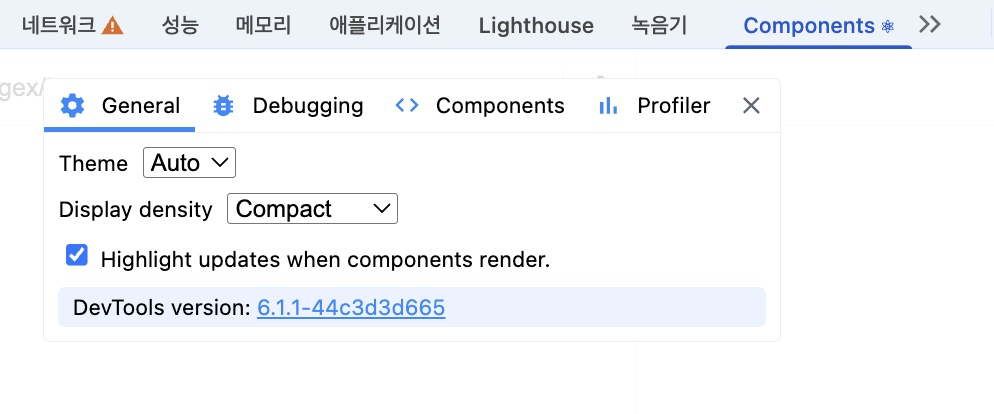

# 4️⃣ 이미지 갤러리 최적화

## 4-1) 서비스 실행 및 코드 분석

```bash
npm install
npm run start
```

```bash
npm run server
```

### 모달 작동 방식

    1. 사용자가 이미지를 클릭

    2.	Redux에 SHOW_MODAL 액션이 dispatch됨 → modalVisible 값을 true로 변경

    3.	해당 상태를 구독 중이던 ImageModal 컴포넌트가 모달을 열고 이미지를 표시

    4.	이미지가 완전히 로드되면, getAverageColorOfImage 함수로 평균 색상을 계산

    5.	계산된 평균 색상은 Redux 스토어에 저장되고, 해당 상태가 변경되면서 ImageModal 컴포넌트의 배경색도 자동으로 업데이트됨

## 4-2) 레이아웃 이동 피하기

### 레이아웃 이동(Cumulative Layout Shift)이란?

레이아웃 이동은 웹 페이지의 요소 위치나 크기가 렌더링 이후에 변경되면서 다른 콘텐츠를 밀어내는 현상을 의미합니다.
(이미지가 늦게 로드되면서 아래 콘텐츠가 밀려나는 경우)

이 현상은 사용자 경험을 해치는 주요 원인 중 하나로, Google Lighthouse의 CLS 항목으로 측정되며 성능 점수에 직접 반영됩니다.

> ✅ CLS (Cumulative Layout Shift) 점수 기준
>
> • 좋은 점수: 0.1 이하
> <br>
> • 나쁜 점수: 0.25 이상

현재 서비스의 CLS 점수는 0.599로, 권장 기준보다 훨씬 높은 상태임.


Performance 패널에서 결과 부분을 보면 레이아웃 이동이 시각화 되어있음.


### 레이아웃 이동의 원인

1. 사이즈가 미리 정의되지 않은 이미지 요소
2. 사이즈가 미리 정의되지 않은 광고 요소
3. 동적으로 삽입된 콘텐츠
4. 웹 폰트(FOIT, FOUT)

이미지가 로드되기 전까지는 브라우저가 해당 이미지의 크기를 알 수 없음.
이로 인해 처음에는 **이미지 영역의 너비/높이가 0**으로 인식되고, 이미지가 로드되면 크기가 갑자기 늘어나면서 아래 콘텐츠를 밀어내는 현상이 발생함.

-> 이미지 로딩 시점과 레이아웃 구성 시점이 다르기 때문에 브라우저는 미리 공간 확보를 못 하고, 레이아웃 이동이 생김.

### 레이아웃 이동 해결

현재 발생하는 레이아웃 이동은 이미지 요소의 크기가 미리 정의되지 않아 생기는 문제임.
브라우저는 이미지를 다운로드하기 전까지 그 크기를 알 수 없기 때문에 공간을 확보하지 못하고, 이미지가 로드되면서 콘텐츠가 밀려나는 현상이 발생함.

따라서 **이미지의 크기를 미리 확보**해두면 레이아웃 이동을 방지할 수 있음.

이미지 갤러리는 브라우저 가로 너비에 따라 크기가 달라지기 때문에, 단순 width, height 고정보다 **비율 기반으로 영역을 확보**해주는 방식이 적절함.

1. padding 방식 + absolute 포지셔닝

- div에 padding-top을 줘서 원하는 비율의 공간을 확보
- 이미지 요소는 position: absolute로 띄워서 해당 공간에 맞춤

> ✅ 장점: 대부분 브라우저에서 잘 작동함 <br/>
> ⚠️ 단점: 퍼센트 계산이 필요하고 코드가 직관적이지 않음

2. aspect-ratio 속성

- CSS 속성으로 이미지 비율을 간단하게 설정 가능함

```css
.wrapper {
  aspect-ratio: 16/9;
}
```


> ✅ 장점: 코드가 간결하고 직관적임 <br/>
> ⚠️ 단점: 일부 구형 브라우저에서는 지원하지 않음

### 코드 수정

PhotoItem.jsx

```jsx
const ImageWrap = styled.div`
  width: 100%;
  padding-bottom: 56.25%;
  position: relative;
`;

const Image = styled.img`
  cursor: pointer;
  width: 100%;
  height: 100%;
  position: absolute;
  top: 0;
  left: 0;
`;

export default PhotoItem;
```

#### [ 최적화 후 Lighthouse 검사 결과 ]


CLS 값이 0이 되었음. (== 레이아웃 이동이 발생하지 않음.)

## 4-3) 이미지 지연 로딩

```bash
npm install --save react-lazyload
```

react-lazyload 라이브러리를 사용하면 해당 LazyLoad 자식으로 들어간 요소들은 화면에 표시되기 전까지는 렌더링되지 않다가 스크롤을 통해 화면에 들어오는 순간 로드됨.

```jsx
import LazyLoad from "react-lazy-load";

function Component() {
  return (
    <div>
      <LazyLoad>
        
      </LazyLoad>
    </div>
  );
}
```

### PhotoItem 코드에 지연로딩 + offset 적용

offset을 통해 이미지가 화면에 들어오는 시점보다 더 미리 이미지를 불러오는 작업 수행 가능함. 아래 코드는 화면에 들어오기 1000px만큼 미리 로드하도록 설정함.

```jsx
import LazyLoad from "react-lazy-load";

function PhotoItem({ photo: { urls, alt } }) {
  const dispatch = useDispatch();

  const openModal = () => {
    dispatch(showModal({ src: urls.full, alt }));
  };

  return (
    <ImageWrap>
      <LazyLoad offset={1000}>
        <Image
          src={urls.small + "&t=" + new Date().getTime()}
          alt={alt}
          onClick={openModal}
        />
      </LazyLoad>
    </ImageWrap>
  );
}
```

## 4-4) 리덕스 렌더링 최적화

### 리액트 렌더링

리액트는 상태(state)나 props가 변경되면, 변경 사항을 UI에 반영하기 위해 렌더링(Rendering) 과정을 다시 수행함.
이때, 모든 컴포넌트가 렌더링되는 건 아니고, 변경된 부분부터 시작해 **Virtual DOM에서 차이를 비교(diff)**하고 실제 DOM에 최소한의 변경만 적용함.

이 과정을 통해 효율적인 렌더링이 가능하지만, 렌더링이 오래 걸리는 연산이 포함돼 있거나, 불필요한 컴포넌트까지 리렌더링되는 경우,
메인 스레드 리소스를 불필요하게 사용하게 되고 결과적으로 성능 저하로 이어짐.

> #### ⚙️ 리액트 렌더링 과정
>
> 1. 상태 변경 발생
> 2. 해당 컴포넌트 함수 재실행 (함수 컴포넌트 기준)
> 3. JSX가 다시 평가되고 Virtual DOM 트리가 새로 생성됨
> 4. 이전 Virtual DOM과 새 Virtual DOM을 비교(diff)
> 5. 실제 DOM에서 변경이 필요한 부분만 업데이트됨

> #### 🫧 React Developer Tools
>
> **Components** : 리액트 컴포넌트를 계층 구조로 탐색할 수 있는 툴
>
> **Profiler** : 리액트 렌더링이 어느 시점에 일어났는지 분석

Components 패널의 설정 > Highlight updates when components render 항목 체크



이미지 갤러리의 헤더 버튼을 클릭하면
헤더뿐만 아니라 이미지까지 테두리가 표시됨 → 이는 이미지 컴포넌트도 리렌더링되었다는 의미임.

어떤 컴포넌트가 어느 시점에 리렌더링되었는지 알 수 있고, 렌더링이 필요없는 경우에 최대한 렌더링하지 않도록하여 성능을 최적화함.

현재 서비스에서는 모달이 열릴 때,
모달과 관련이 없는 다른 컴포넌트들까지 함께 리렌더링되고 있음.
이는 불필요한 렌더링으로 성능 저하를 유발할 수 있음.

### 리렌더링 원인

컴포넌트는 리덕스 상태를 구독하여 상태가 변했을 때를 감지하고 리렌더링하는데 리덕스 상태를 구독하고 있는 컴포넌트는 리덕스 상태 변화에 따라 불필요하게 리렌더링 될 수 있음.

컴포넌트는 Redux의 상태를 구독하고 있음.
이 상태가 변경되면 React는 해당 컴포넌트를 다시 렌더링함.
(실제로 영향받지 않는 컴포넌트도 리렌더링될 수 있다는 문제가 있음.)

리덕스 상태를 구독하고 있는 컴포넌트는 불필요한 리렌더링이 발생할 수 있으며, 메인 스레드의 리소스를 낭비하고 전체 성능 저하로 이어질 수 있음.

---

### `useSelector` 동작 방식

```js
const value = useSelector((state) => state.someValue);
```

- useSelector는 함수의 반환값을 기준으로 상태 변경 여부 판단

  - ✅ 반환값이 같음 → 영향 없음 → 렌더링 X

  - ❌ 반환값이 다름 → 영향 있음 → 렌더링 O

- useSelector는 **얕은 비교(shallowEqual)** 를 사용
  - 객체나 배열 같은 참조 타입을 리턴할 경우 항상 새로운 참조가 되기 때문에
    이전 값과 같아도 리렌더링이 발생할 수 있음

---

```jsx
const { photos, loading } = useSelector((state) => ({
  photos:
    state.category.category === "all"
      ? state.photos.data
      : state.photos.data.filter(
          (photo) => photo.category === state.category.category
        ),
  loading: state.photos.loading,
}));
```

현재 서비스의 코드에서 객체를 새로 만들어서 새로운 참조 값을 반환하는 형태이므로 useSelector는 리덕스를 통해 구독한 값이 변했다고 판단하여 관련 없는 상태 변화에도 리렌더링이 발생함.

### useSelector 문제 해결

#### 1) 객체를 새로 만들지 않도록 반환 값 나누기

단일 값으로 반환하도록 코드를 수정함. 참조 값이 바뀌는 것이 아니기 때문에 다른 상태 변화에 영향을 받지 않아 리렌더링이 발생하지 않을 것임.

ImageModal-Container

```jsx
const modalVisible = useSelector((state) => state.imageModal.modalVisible);
const bgColor = useSelector((state) => state.imageModal.bgColor);
const src = useSelector((state) => state.imageModal.src);
const alt = useSelector((state) => state.imageModal.alt);
```

Header

```jsx
const category = useSelector((state) => state.category.category);
```

#### 2) 새로운 Equality Function 사용

리덕스 상태가 변했을 때, useSelector가 반환해야 하는 값에도 영향을 미쳤는지 함수.
(== 이전 반환 값과 현재 반환 값을 비교하는 함수)
