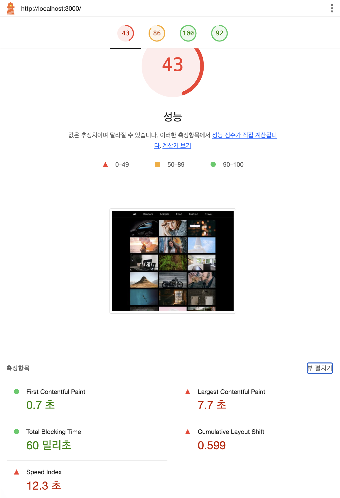
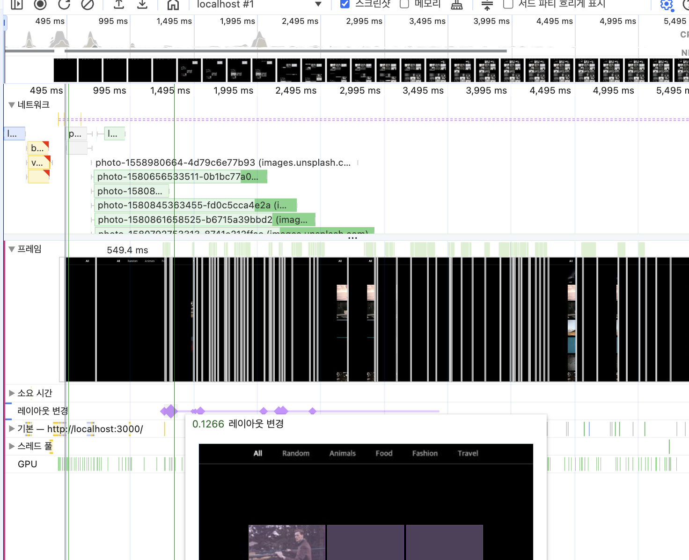
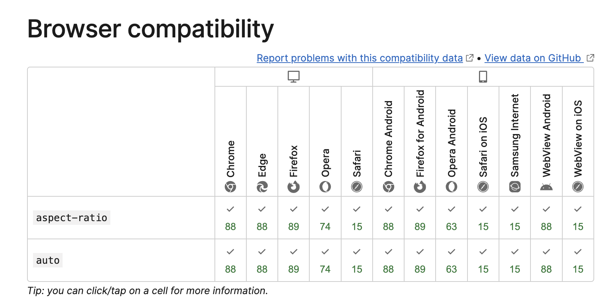
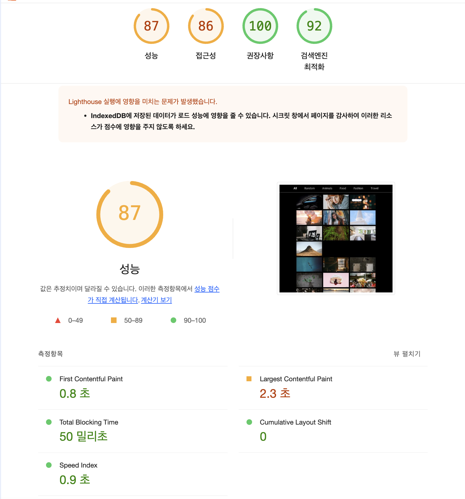

# 4️⃣ 이미지 갤러리 최적화

## 4-1) 서비스 실행 및 코드 분석

```bash
npm install
npm run start
```

```bash
npm run server
```

### 모달 작동 방식

    1. 사용자가 이미지를 클릭

    2.	Redux에 SHOW_MODAL 액션이 dispatch됨 → modalVisible 값을 true로 변경

    3.	해당 상태를 구독 중이던 ImageModal 컴포넌트가 모달을 열고 이미지를 표시

    4.	이미지가 완전히 로드되면, getAverageColorOfImage 함수로 평균 색상을 계산

    5.	계산된 평균 색상은 Redux 스토어에 저장되고, 해당 상태가 변경되면서 ImageModal 컴포넌트의 배경색도 자동으로 업데이트됨

## 4-2) 레이아웃 이동 피하기

### 레이아웃 이동(Cumulative Layout Shift)이란?

레이아웃 이동은 웹 페이지의 요소 위치나 크기가 렌더링 이후에 변경되면서 다른 콘텐츠를 밀어내는 현상을 의미합니다.
(이미지가 늦게 로드되면서 아래 콘텐츠가 밀려나는 경우)

이 현상은 사용자 경험을 해치는 주요 원인 중 하나로, Google Lighthouse의 CLS 항목으로 측정되며 성능 점수에 직접 반영됩니다.

> ✅ CLS (Cumulative Layout Shift) 점수 기준
>
> • 좋은 점수: 0.1 이하
> <br>
> • 나쁜 점수: 0.25 이상

현재 서비스의 CLS 점수는 0.599로, 권장 기준보다 훨씬 높은 상태임.



Performance 패널에서 결과 부분을 보면 레이아웃 이동이 시각화 되어있음.


### 레이아웃 이동의 원인

1. 사이즈가 미리 정의되지 않은 이미지 요소
2. 사이즈가 미리 정의되지 않은 광고 요소
3. 동적으로 삽입된 콘텐츠
4. 웹 폰트(FOIT, FOUT)

이미지가 로드되기 전까지는 브라우저가 해당 이미지의 크기를 알 수 없음.
이로 인해 처음에는 **이미지 영역의 너비/높이가 0**으로 인식되고, 이미지가 로드되면 크기가 갑자기 늘어나면서 아래 콘텐츠를 밀어내는 현상이 발생함.

-> 이미지 로딩 시점과 레이아웃 구성 시점이 다르기 때문에 브라우저는 미리 공간 확보를 못 하고, 레이아웃 이동이 생김.

### 레이아웃 이동 해결

현재 발생하는 레이아웃 이동은 이미지 요소의 크기가 미리 정의되지 않아 생기는 문제임.
브라우저는 이미지를 다운로드하기 전까지 그 크기를 알 수 없기 때문에 공간을 확보하지 못하고, 이미지가 로드되면서 콘텐츠가 밀려나는 현상이 발생함.

따라서 **이미지의 크기를 미리 확보**해두면 레이아웃 이동을 방지할 수 있음.

이미지 갤러리는 브라우저 가로 너비에 따라 크기가 달라지기 때문에, 단순 width, height 고정보다 **비율 기반으로 영역을 확보**해주는 방식이 적절함.

1. padding 방식 + absolute 포지셔닝

- div에 padding-top을 줘서 원하는 비율의 공간을 확보
- 이미지 요소는 position: absolute로 띄워서 해당 공간에 맞춤

> ✅ 장점: 대부분 브라우저에서 잘 작동함 <br/>
> ⚠️ 단점: 퍼센트 계산이 필요하고 코드가 직관적이지 않음

2. aspect-ratio 속성

- CSS 속성으로 이미지 비율을 간단하게 설정 가능함

```css
.wrapper {
  aspect-ratio: 16/9;
}
```



> ✅ 장점: 코드가 간결하고 직관적임 <br/>
> ⚠️ 단점: 일부 구형 브라우저에서는 지원하지 않음

### 코드 수정

PhotoItem.jsx

```jsx
const ImageWrap = styled.div`
  width: 100%;
  padding-bottom: 56.25%;
  position: relative;
`;

const Image = styled.img`
  cursor: pointer;
  width: 100%;
  height: 100%;
  position: absolute;
  top: 0;
  left: 0;
`;

export default PhotoItem;
```

#### [ 최적화 후 Lighthouse 검사 결과 ]


CLS 값이 0이 되었음. (== 레이아웃 이동이 발생하지 않음.)
